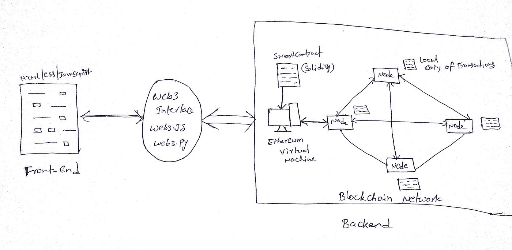

# 逐步分权

> 原文：<https://medium.com/coinmonks/progressive-decentralization-1ae67d656a90?source=collection_archive---------10----------------------->

构建加密应用程序指南

加密货币的创造者面临着一个独特的挑战。除了创建人们想要的产品，他们还需要考虑该产品如何以分散的方式成功工作，也就是说，作为由用户社区拥有和管理的协议。

这是一个挑战，因为从一开始就构建成功产品所需的许多东西——产品领先、快速迭代、有管理的市场进入——使得公共所有权和确保长期健康的合规性变得更加困难。。

我与几位致力于解决这一矛盾的加密货币创始人交谈过。在这里，我提出了一个三步过程，可以作为如何通过逐渐分散来实现这一点的指南，在这个过程中，创始团队随着时间的推移逐渐失去控制。一步一步地做这些可以让团队专注于法规遵从性，并为法规遵从性铺平道路，包括发行有希望不会与证券法规冲突的令牌。

请记住，这个过程是针对某些在智能合约平台上构建应用程序的加密初创公司的。它对区块链计算平台本身没什么用处，因为它们需要从一开始就足够的去中心化。

鉴于围绕社群拥有的网络的监管框架仍不确定，这一场景的最后阶段仅指向可能的解决方案，而不是确定已被证明的制胜策略。把它当成一条可能的路径。

# 成功秘诀的三个组成部分

**将** [**产品匹配到**](https://pmarchive.com/guide_to_startups_part4.html) **市场的需求显而易见。**

没有一个人们想要的产品，就没有用户，没有生意，一个社区也很难长久维持。社区参与和分散控制对传统创业公司不太适用，但对加密创业公司至关重要。为什么它们如此重要？

答案是社区[的参与和控制](https://www.wired.com/story/how-blockchain-can-wrest-the-internet-from-corporations/)导致有限的平台风险——平台规则违背用户意愿而改变的风险。Web 2.0 平台已经证明了这种不一致性的可能性，例如，通过破坏创新的应用程序生态系统，或者通过牺牲用户隐私或福祉来获利。相比之下，用户拥有的网络可以受益于合作经济模式，这有助于确保加密服务更好地与用户保持一致，即使在它们扩大规模的时候。

实现分散社区控制的另一个重要原因是法规遵从性。根据 SEC 使用的监管框架 [Howey 测试](https://a16z.com/2018/05/04/considerations-for-regulating-cryptonetworks/)，促进经济整合的加密令牌可以被视为证券。对于一家初创公司来说，管理向大型用户社区分发证券可能很复杂，成本也很高——甚至 Airbnb 和优步[都还没有想出如何去做](https://www.pillsburylaw.com/en/news-and-insights/rule-701-revision-uber-airbnb.html)。但对最近 SEC 评论和执法行动的分析表明，如果团队能够充分分散运营，消除信息不对称或依赖创始团队创造价值的努力，真正的分散化可以让初创公司令牌从安全转变为非安全。一项投资能否被视为证券的关键标准之一是投资者是否依赖他人的努力来期待回报。

正如[Andre essen Horowitz 的管理合伙人 Scott Kupor 以前写的](https://a16z.com/2019/10/22/mutability-sec-recent-cases/):“在联网前阶段，根据豪威测试，代币通常被定性为‘依赖他人努力’的证券。然而，一旦网络建立并运行起来——假设网络足够分散——令牌的性质可能会改变为安全，因为令牌持有者不再依赖他人的努力。”

因此，记住这些去中心化的原因，让我们看一个框架来解决这个问题，作为创建一个可持续的、可互操作的、社区拥有的产品的过程。

## 任务 1:产品符合市场要求

在创建加密应用程序的最早阶段，一个典型的初创公司的所有要素都是必需的:优秀的团队、精益开发、清晰的执行和快速的学习。在这个阶段，唯一重要的是产品适合市场。为了快速找到它，避免由委员会(或社区)开发是很重要的！).产品需要持久的指导来快速测试假设和更新假设。在实践中，这可能意味着智能合约的管理员权限，允许产品的快速迭代和管理，包括更新、关闭或快速参数调整。

在这个阶段，不应该有权力下放的借口——核心团队根据需要做出所有产品决策，以便找到适合市场的产品。不建议在此阶段运行令牌。

核心团队控制项目所有方面的想法可能会让一些首次用户感到恐慌，但创始人不应该害怕这一点。如果用户抱怨你的控制，那真是一个好问题！这意味着有人关心你建立了什么。然而，在存在控制的情况下，清楚地沟通是很重要的。模仿自主是破坏信任的快速方式，而透明是加强信任的方式。

## 任务 2:社区参与

在产品受欢迎的第一个迹象——不断增长的用户群、开发者生态系统和网络效应——是时候开始投入更多的周期来加强被动用户、更积极的贡献者和核心团队之间的和谐。

首先，创始人可以投资更多:投资好的文档；公开发展；为外部开发人员提供奖励、资助或其他激励措施；雇用社区领导来帮助管理开放开发；并在决策中引入[近似共识](https://tools.ietf.org/html/rfc7282)。

展望未来，通过施加技术约束来消除平台风险可能是有意义的。例如，在 Compound v2.2 中，[更新在发送后 48 小时生效](/compound-finance/upgrading-compound-governance-c56b55a2996c)，给用户时间注销或查看和提出异议。

对于核心团队来说，放弃控制权让你有机会开始将责任移交给社区。但是当你要让社区成员参与进来时，重新思考激励机制是很重要的。为什么社区成员会不断地为产品开发做出贡献？

**奖励(费用)。**

经济激励是鼓励社区贡献的一种方式。但是经济学从何而来？加密服务的务实和熟悉的商业模式是挑战费，类似于 Twilio 或 Stripe 等微服务 API。将这种费用流分配给积极的参与者可以使社区团结在项目的成功周围。

然而，版税在项目开始时并不总是有意义的。鉴于加密服务是开源的，只有在网络效应很强的情况下才引入费用可能会更好，[以交换成本为代价导致保护](https://a16z.com/2018/12/13/16-metrics-network-effects/)。

Uniswap ，一个分散的交易所，是一个付费加密货币应用如何通过其网络效应的力量得到保护的例子。在 Uniswap 中，越多的用户向交易所提供流动性，交易者的价格就越好。为了在免佣金的分叉中提供相同的价格，您需要协调所有流动性提供商和与原始服务集成的第三方服务，以开始使用分叉。协调所有这些的成本是转换成本。虽然这些转换成本在数据公开的加密中较低，但它们仍然存在。然而，在密码学中，[协议必须保持最低限度的提取性](https://www.placeholder.vc/blog/2019/10/6/protocols-as-minimally-extractive-coordinators)(换句话说，它们覆盖所涉及的成本，而不是寻求利润最大化)，以鼓励社区贡献。

**分发(代币)**

代币是一种有效分配项目基本价值的工具，包括支付流。虽然分发令牌可以鼓励参与并提高安全性，但重要的是要考虑如何建立公平高效的分发。

许多 ico 和 airdrops 都是次优的，因为它们吸引了不感兴趣的社区和监管机构。专注于产品/市场合规性的加密应用有机会通过向已经活跃的用户群分发令牌来做得更好。

首先，团队可以用一组可管理的和授权的社区成员来测试发行版。许多团队已经选择通过向早期采用者分配一些未来令牌来做到这一点，例如通过测试网络程序，独立社区成员可以注册参与节点管理。向做出有价值贡献的用户分发债务和托管令牌有助于消除社区对创始团队工作的依赖。

然后，团队需要计划如何将剩余的令牌分配给参与者，既公平地补偿过去的贡献，又有效地作为未来继续参与的激励。

## 任务 3:充分的权力下放

如果你是一个 crypto 创始人，并准备好了这一步，这意味着你已经在早期实现了产品/市场的契合，建立了一个可以成功支持应用程序的强大社区，并概述了一个适当激励可持续运营的模型。

充分去中心化道路上的最后一步:广泛的标记化。

在实践中，我假设团队将"[进入社区](https://hackernoon.com/startups-need-a-new-option-exit-to-community-ig12v2z73)"，根据前面任务中概述的计划向用户和参与者分发令牌。这将在智能合约被触发以铸造和分发令牌时发生。最理想的情况是，当这个功能被触发时，应该发生几件事情
——核心团队将放弃对应用程序的控制权(佣金和控制权)，并通过确保产品由社区拥有和运营来降低平台风险。
—考虑到服务现在相当分散，即独立于可能具有不对称信息的单个实体的努力，该标记可以转换为不安全。
——这家公司很有弹性，持有足够多的代币，从佣金和增长中获利。
-用户所有者获得了越来越大的规模回报，因为服务的合作经济允许更好的合作和增加的价值(由用户而不是股东决定)。

这一目标的实质是标志着一家加密公司完成从传统产品集团到可持续、社区所有和运营的网络的旅程的特定时刻。(进行代币分配总是需要仔细的尽职调查，我所描述的情况几乎没有先例，所以先咨询一下律师！)

# 如何不被卡住

许多团队被困在以错误的顺序解决这些问题，“模仿”分散化，或者试图一次做所有的事情。

例如，试图首先拥有社区(从广泛的令牌分发开始)的应用团队有可能产生投机者社区，而不是真正的用户。没有工作产品，所有权是没有用的。许多这样做的团队无法回到产品/市场的契合度，结果他们很难开始完全参与到社区中。

精简的另一个风险是从产品/市场适合的最初迹象跳到分散的社区所有权(跳过目标 2，社区参与)。未能使实际的社区参与正式化，可能会使项目停留在权力下放的令人毛骨悚然的山谷中。在这种情况下，正式控制(例如通过授权)可能是建立信任的最佳方式，而隐藏在权力下放的幌子下则是破坏信任的捷径。

另一个陷入困境的方法是努力同时做这三件事。缺乏专注是大多数创业公司的死穴，加密应用也是如此。每一个目标都是重叠的，应该作为一个思想迷宫的一部分整体考虑，但是执行应该有先后顺序和优先次序，而不是一次完成。

最后，值得注意的是，即使您按顺序执行步骤，一旦您切换到完全的社区所有权，您在管理应用程序方面就处于一个相当未知的领域。扩大有效的社区决策是一个挑战，但如果在线社区可以完成像维基百科这样的壮举，我乐观地认为，实验和游戏中的皮肤(通过有价值的所有权)可以导致前所未有规模的协作决策。

到目前为止，我们还没有看到一个加密应用程序始终如一地执行每一项任务，但是我交谈过的最有希望的项目团队已经在推进这一方案。通过这些对话，我得出的结论是，渐进的分散化为团队提供了找到产品市场适应性、财务可持续性、社区参与和法规遵从性的最有利的途径——就按这个顺序。

就这些，谢谢大家的关注！不久后见😉

> 交易新手？试试[加密交易机器人](/coinmonks/crypto-trading-bot-c2ffce8acb2a)或者[复制交易](/coinmonks/top-10-crypto-copy-trading-platforms-for-beginners-d0c37c7d698c)