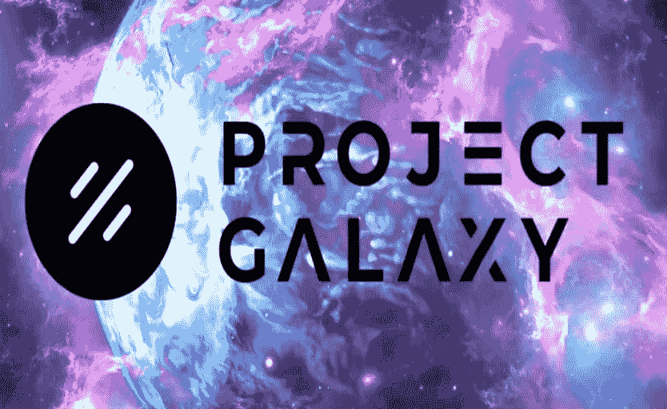

# 银河计划(GAL):回顾、分析、细节

> 原文：<https://medium.com/coinmonks/project-galaxy-gal-review-analysis-details-f7ccc26752c5?source=collection_archive---------46----------------------->

什么是银河计划？
[**Project Galaxy**](https://bit.ly/BinanceRegistation)是世界上最大的 web3 网络凭证之一，建立在开放和协作的基础设施之上。

Project Galaxy 帮助开发者和组织使用 NFTs 和数字证书在 Web3 上构建更好的产品和社区。

**银河计划有什么特别之处？**
了解 Galaxy 项目的事情之一 Web3 网络凭据最重要的事情是弄清楚什么是“数字凭据”或数字凭据？

**什么是数字身份证？**你在该协议首次推出时对其流动性池的贡献或你的在线投票历史就是凭证。

你在 Web2 中的所有行为数据都会被登录，像谷歌和脸书这样的公司使用登录算法，这样他们就可以向你发送有针对性的广告。

凭证很重要，因为它们提供了高度的用途。

随着 Web3 和 DAO 的发展，新一波用户产生的行为数据将出现爆炸式增长。这将提供必要的基础设施，帮助这些新用户创建至关重要的数字证书。

**当前凭据系统的问题**
如今，凭据存储在由应用程序、政府机构和金融机构拥有和授权的封闭数据库中。

需要拥有数据或应用程序的个人将受到影响。卡拉狄加计划旨在通过使用开放和协作的凭证网络来解决这个问题。这个网络将帮助 Web3 开发者使用他们的证书来创造更好的产品和更吸引人的社区。

**银河计划的证书系统解决方案**
银河计划为社区成员提供基础设施，以管理数字证书并将其传输到项目的数据网络。

[**项目银河**](https://bit.ly/BinanceRegistation) 基础设施支持多数据源的凭证管理:

为了进入网络，管理人员可以使用子图查询或静态快照进行贡献。对于离线登录，Project Galaxy 集成了 Snapshot.org、Twitter 和 Github 等数据源。
通过为银河证书数据网络做出贡献，当证书用于银河应用模块、证书 Oracle 引擎和证书 API 时，策展人将获得奖励。

由于在 Project Galaxy 生态系统中有使用(按使用付费)数据的用户，这鼓励了更多的用户来管理数据网络。

**Project Galaxy 团队**
联合创始人兼项目负责人 GARRY CHANG:在创办 Project Galaxy 之前，Harry 是 Lino Network 的联合创始人兼首席运营官，d live . TV(2019 年并入 BitTorrent 生态系统)的联合创始人。在 Lino 和 DLive，Harry 带领团队开发了一款产品，每月活跃用户超过 1000 万。

查尔斯·韦恩(CHARLES WAYNE)，联合创始人兼战略主管:在创办 Project Galaxy 之前，查尔斯是 DLive.tv 的联合创始人兼首席执行官。在 2019 年 DLive 与 BitTorrent 合并之后，查尔斯成为了 BitTorrent 的互动娱乐副总裁。

**银河项目合作伙伴**
到目前为止，已有超过 110 家合作伙伴将银河项目作为其社区参与和增长黑客的主要平台，包括领先的 DeFi 协议，如 Year Finance、Alfa Finance vàPerpetual Protocol。

此外，项目银河平台可在 7 区块链，包括:以太坊，多边形，币安智能电网，雪崩，幻影，vàSolana Arbitum。

诸如 Snapshot.org、MetaFactory、Collab Land、NFTrade、CyberConnect 等流行的 Web3 产品也与 Project Galaxy 集成，以充分利用凭证网络。

**【银河】项目成果**
从 5 月 5 日团队启动银河项目到现在已经快 9 个月了。在此期间，项目

来自 6 个不同区块链生态系统的 15 万独立在线用户。
银河凭证网络目前拥有超过 500 套数字凭证，包括超过 300 万的 Web3 用户。
100 多个项目和组织使用银河数字证书开展了 500 多项活动。

**GAL Tokenomics**
关键指标
股票代码:GAL。
区块链:更新、…
契约:更新、…
令牌标准:更新、…
令牌类型:效用、控制。
流通中:更新，…
总供应量:200，000，000 加仑。

**分布令牌**
生态系统:6%。
早期采用奖励:2%。公开销售:5%。
第一轮增长支持者:10.63%。
第 2 轮增长支持者:10.14%。顾问和合伙人:6.23%。营销:15%。
基础:10%。
团队:15%。国库税:20%。

**令牌用例**
**治理:** GAL 用于 Galaxy DAO 项目中的投票和治理。GAL 令牌持有者有能力控制协议收取的平台费用的数量，并控制项目银河社区金库中持有的资金。

**应用模块付费:**希望通过应用模块使用 Galaxy 凭证的开发人员将支付以 GAL 计算的平台费用。

Galaxy Oracle 引擎和 Galaxy Credential API 的计费:开发人员为通过 Galaxy Oracle 引擎和 Galaxy Credential API 请求凭据支付全球地址列表。在 beta 测试期间，所有申请费用目前都是免费的。

**数字证书管理:**管理者可以使用全球地址列表来表示一组证书的含义。每组凭证将包括将在凭证持有者之间按比例分配的收入流。

**哪里是获得银河计划(GAL)令牌最好、最安全的地方？**

获得项目银河令牌最好最安全的地方是[T5 这里 ](https://bit.ly/BinanceRegistation)

> 交易新手？尝试[加密交易机器人](/coinmonks/crypto-trading-bot-c2ffce8acb2a)或[复制交易](/coinmonks/top-10-crypto-copy-trading-platforms-for-beginners-d0c37c7d698c)