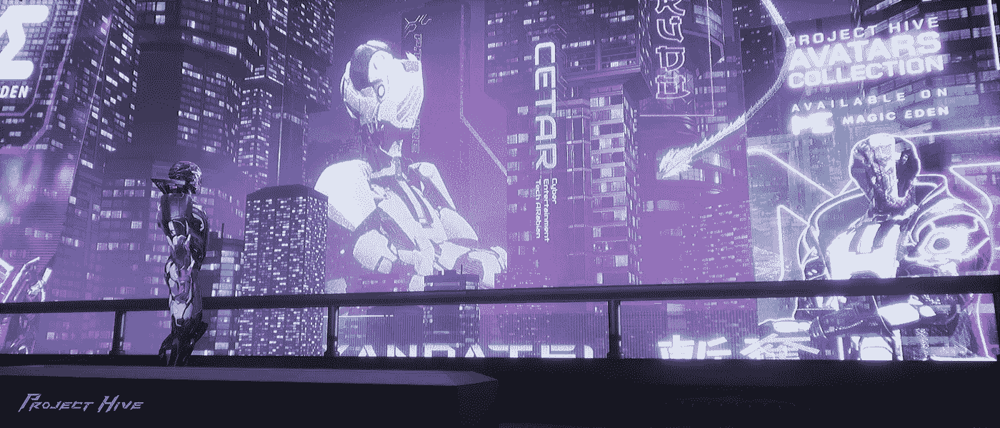
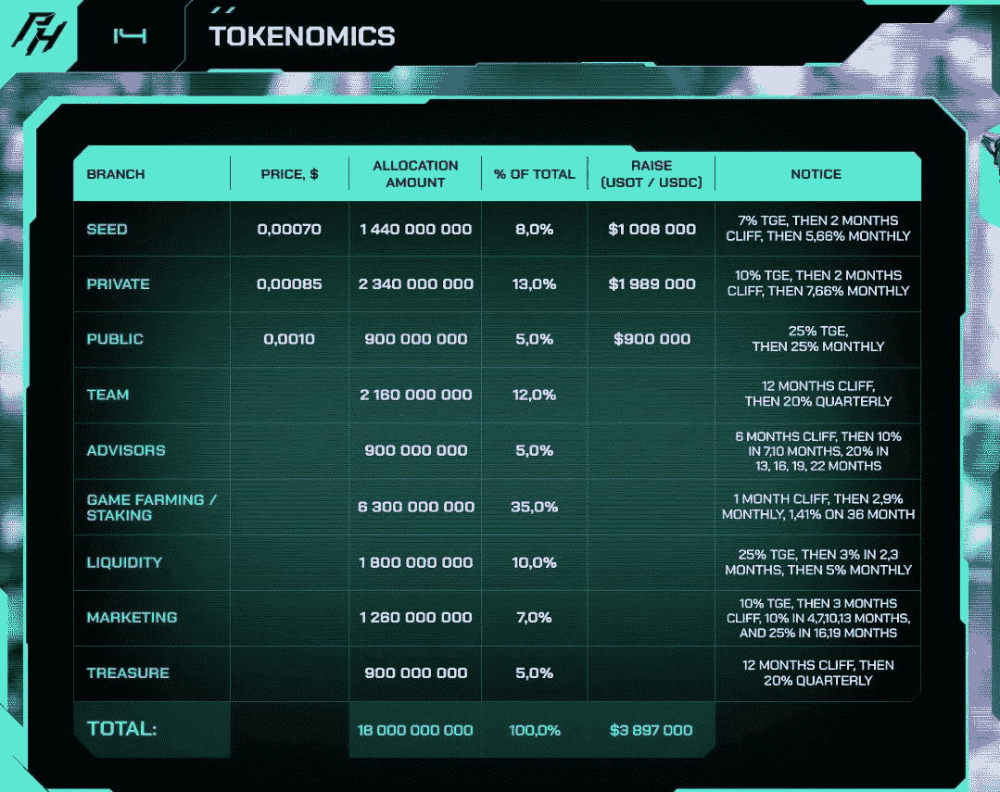
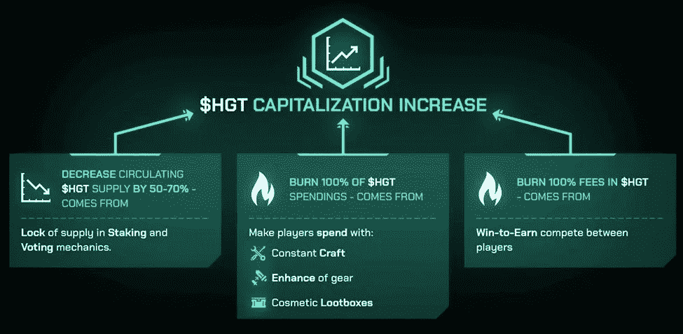

# 项目配置单元—令牌组学

> 原文：<https://medium.com/coinmonks/project-hive-tokenomics-a652eebd4fa5?source=collection_archive---------11----------------------->

鉴于我们在更长的时间框架内仍处于熊市，我一直在花时间研究新项目。在 GameFi 领域，Project Hive 最近引起了我的注意。

建立在索拉纳区块链，蜂巢项目是一个结合非金融交易和分散融资的游戏。

虽然这并不完全是突破性的，因为有大量的游戏或即将推出区块链游戏，以赚取即将起飞的收入，但引起我注意的是令牌组学。

## **基础知识**

项目 Hive 被组织成一个具有双令牌系统的 DAO—$ HGT(Hive 治理令牌)& $IGT(游戏令牌)。

$HGT 很难通过游戏获得，因为$IGT 是奖励的主要象征。这意味着治理令牌$HGT 将是通货紧缩的，而$IGT 将是通货膨胀的。

## **总供给&分配**

蜂巢治理令牌项目$HGT 将会有 180 亿枚硬币的最高供应量。虽然这是一个很大的数字，但是查看令牌分配是很重要的。大体上:

*   35%是最大的一块，以每月 2.9%(年化 34.8%)的供应率进入游戏农场/赌注准备金。但是，高额的赌注回报会减少 HGT 的流通供应量；
*   HGT 分配总额的 26%用于种子期、私募和公开融资。代币生成活动(TGE)的累计发行额为 42%，其余按月解锁。可能会有一些早期投资者以账面利润退出他们的头寸；
*   HGT 分配的 17%用于团队和顾问，在 TGE 之后锁定 6 个月到 1 年。接下来是 1.5 年的归属时间表。同样，随着利润的实现，一些头寸可能会被卖出，增加流通供应。
*   10%的 HGT 配置用于流动性&本质上是支持交易。可以认为是资本储备。这也有一个锁定和缓慢释放时间表，对循环供应的影响有限。
*   7%的拨款用于 TGE 会议后 1.5 年的市场营销。这可能会增加流通中的供应量，但在此之前，营销活动已经增加了对 HGT 美元的需求；
*   5% $HGT 是道国库，在 TGE 锁定一年后再次开始归属。这是一项长期资本储备，不会增加流通供给。

## **$HGT 公用事业&网络效应**

项目蜂巢治理令牌$HGT 被设计成通货紧缩&吹嘘效用。这是智能令牌组学，它依赖于在项目和令牌之间建立网络效应。这些实用程序/机制包括:

*   赌注将激励长期持有者赚取被动收入&提供投票权。项目团队预计，通过这一价值 1000 美元的 HGT 公用事业公司，循环供应量将减少 50%-70%；
*   Make 玩家可以使用$HGT 为游戏制作新的#NFT 角色，使用$HGT 作为战利品进行#PVP，并拥有大量需要$HGT 的赌博盒子和增强战利品。该协议将烧掉 HGT 通过这条路线赚来的所有美元；
*   最后，与其他 P2E 游戏不同,《蜂巢计划》允许玩家以氏族成员的身份参与大型多人对战。赢得一场战争的奖励是作为赌注奖励形成的，赌注奖励是在由道选择的外部赌注池中累积的。这进一步激励持有$HGT，因为游戏者可以投票，例如，竞争第三个令牌，如$BNB 或$DOT 等。

## **结论**

简而言之:

*   并不是所有的供应都会马上进入市场；
*   打桩将有助于减少循环供应；
*   有些分配不会增加流通供应量；
*   $HGT 燃烧机制和公用事业将继续紧缩流通供应，促进需求。

如你所见，最终结果是需求增加，供应减少。

我相信在这方面已经进行了很多思考&令牌经济学是聪明的。

现在一切都取决于底层协议的成功及其吸引忠实用户群的能力。来自游戏协议的这种需求将推动令牌性能并产生积极的网络效应。

到目前为止，游戏的先睹为快让人印象深刻。舞台已经准备好了。让我们看看这是如何展开的。

> **和**
> 
> **记住！**
> 
> **#NFA #DYOR**

## 想了解更多？

有关 Project Hive 的更多详情，请访问[网站](https://project-hive.io/)或订阅他们的社交媒体频道:

*   [推特](https://twitter.com/project_hive_io)
*   [电报](https://t.me/project_hive_official)
*   [Youtube](https://www.youtube.com/channel/UClJkFpuELmTyPBUt8Jj26iw)
*   [抖音](https://www.tiktok.com/@project_hive_io)
*   [中等](https://project-hive.medium.com/)
*   Instagram
*   [不和](https://discord.gg/6tj3VcyrWd))
*   [脸书](https://www.facebook.com/projecthiveio)

# project hive # P2E # p2e game # GameFi # NFTs # block chain gaming # win 2 earn $ HGT $ IGT

> **免责声明**:文中观点仅代表作者个人观点&不代表其雇主的观点，也不代表财务建议。在投资或使用帖子中提到的任何产品之前，请做好自己的研究。作者可能会也可能不会投资于任何特定的产品。

> 交易新手？试试[密码交易机器人](/coinmonks/crypto-trading-bot-c2ffce8acb2a)或者[复制交易](/coinmonks/top-10-crypto-copy-trading-platforms-for-beginners-d0c37c7d698c)