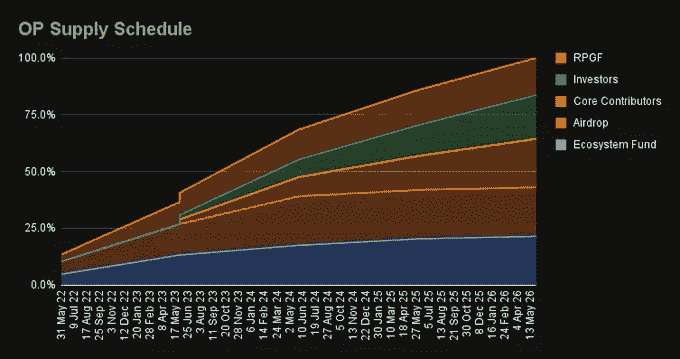
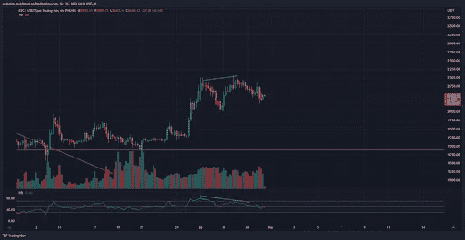
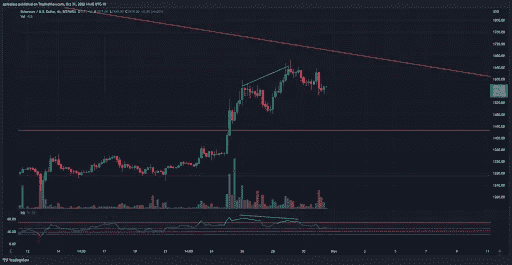
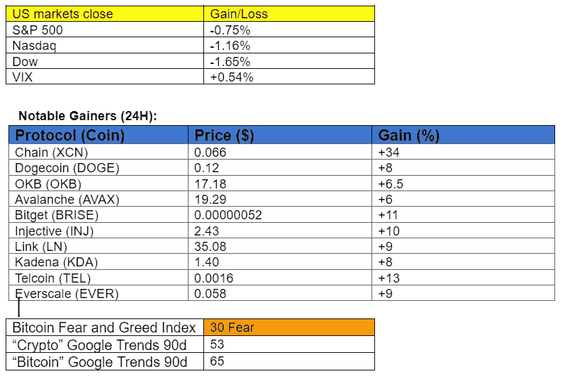

# 在神秘的冬天蓬勃发展的项目

> 原文：<https://medium.com/coinmonks/projects-that-are-flourishing-during-crypto-winter-d2bc8d4649d6?source=collection_archive---------5----------------------->

## 每日征服#115

最好的每日新闻、见解和阿尔法信息来源。

Photo by [Flash Dantz](https://unsplash.com/@flashdantz?utm_source=medium&utm_medium=referral) on [Unsplash](https://unsplash.com?utm_source=medium&utm_medium=referral)

*密码市场是一个狂野、奇妙而令人生畏的地方；不要一个人跋涉！订阅加密征服者，让我们成为您的向导。*

订阅这份每日时事通讯，永不错过任何一期。(零成本)

**概述**

*   哪些项目在熊市中持续增长？
*   比特币 RSI 预示着可能的低迷。
*   埃隆马斯克张贴狗穿着推特标志顶部。
*   比特币基地申请加入瑞普案。
*   斯蒂芬·库里为 Curryverse 申请商标。
*   生日快乐，比特币白皮书。

早上好，家人，

熊市对心理和图表都很艰难。当流动性离开市场时，大量的酒肉投资者和炒作也会离开。

另一方面，熊市打开了机会之门。严冬淘汰了糟糕的项目，并提供了对未来可持续项目的洞察力。

因此，今天我们将探索几个项目，它们不仅熬过了冬天，还继续建设，并在最近的市场上升期间显示出繁荣的迹象。

**法克斯金融公司(FXS FRAX)**

最初是一个分散的 stablecoin 项目，现已扩展到 DeFi 的其他部分。例如，Frax Finance 最近推出了一项贷款服务(FraxLend ),上周[推出了](https://twitter.com/DAdvisoor/status/1560391302688161793?s=20&t=DhV-Ry6wMVjGSyVSr3VJLw)一项流动性 ETH staking 服务。

该协议在 TVL 持有 11 亿美元，而 FXS 的市值仍然保持在 4.6 亿美元。通过在曲线战争中的成功战役，该团队有效地将[FRAX 稳定币作为 DeFi 流动性斗争中的可靠领导者。此外，Frax Finance 计划在 12 月 20 日将 FXS 的发行量削减一半。](https://twitter.com/BanklessHQ/status/1514267114911240201?s=20&t=DhV-Ry6wMVjGSyVSr3VJLw)

自 9 月下旬的低点以来，FXS 股票的表现已经超过 BTC 52%。

**乐观主义**

继以太坊成功合并之后，二层加密(L2s)是 crypto 中最热门的叙述之一。排在第一位是仲裁和乐观主义。前者尚未推出令牌，但如果其令牌经济学同样稳健，就有足够的理由对这两种以太坊扩展解决方案保持乐观。

乐观锁定(TVL)的总价值超过了竞争对手 Solana、Fantom 和推出 OP token 仅[个月](https://defillama.com/chains)的公司。此外，生态系统在价值和使用方面继续增长。

来源:[沙丘分析](https://dune.com/Marcov/Optimism-Ethereum)

乐观主义的象征经济学也令人印象深刻。大多数代币都分发给社区，而 OP 的发行率仅为每年 2%。既得令牌将在未来四年内以每年约 16%的比率以项目资助、追溯性公共资助和未来向活跃社区成员空投的形式发放。

哦，不要担心风险投资者会卖掉陀螺，因为乐观主义采取了一种公共产品的方式，没有早期的象征性发行。

*来源:*

*自本月初的低点以来，OP token 的表现比 BTC 高出 41%。*

# *市场更新🌍*

***BTC/USDT 4H***

*在 FOMC 周开始时，比特币跟随美国股市走势，从当地高点回落。投资者可能会等待周三上午的加息，以决定方向。虽然 BTC 日线图看起来继续看涨，但随着相对强弱指数(RSI)出现[看跌背离](https://university.cex.io/what-is-a-bearish-divergence/)(绿色)，4 小时图已经显示出进一步下跌的可能性。BTC 收盘下跌 0.66%，至 20，490 美元。*

**

**高分辨率* [*图表*。](https://www.tradingview.com/x/yTKLPktx/)*

***ETH/USD 4H***

*乙醚(ETH)在最近的上涨趋势中，在 4 小时图上显示了类似的熊市背离模式(绿色)。ETH 收盘下跌 1.13%，至 1573 美元。*

**

**高分辨率* [*图表*。](https://www.tradingview.com/x/z1FRu4K9/)*

**

*如果你喜欢这份报告，并且认为它值 20 分(0.01 美分)，请点击下面的鼓掌按钮来支持我的写作。(最多 50 次！)谢谢！*

# *新闻观察📰*

*Elon，Twitter 和 Doge。在埃隆·马斯克[发布了](https://twitter.com/elonmusk/status/1587297730631696384?s=61&t=jriB7tGcvIsqeeTTnlYMXw)一张狗狗穿着推特 t 恤坐在刻有推特标志的南瓜旁边的照片后，狗狗们正在加油。*

***比特币基地档案进入涟案。比特币基地加密交易所的律师已经向联邦法院提交了一份法庭之友简报，请求参与 Ripple 与证券交易委员会(SEC)的诉讼。比特币基地正试图加入这项立法，因为 SEC 对加密领域的执法不一致。***

***维塔利克对监管的看法。**以太坊联合创始人 Vitalik Buterin 在推特上发表了一些关于加密监管和机构整合的观点:*

***新闻花絮:***

*   *埃隆·马斯克[解除](https://cointelegraph.com/news/i-m-the-captain-now-musk-chops-twitter-board-becomes-sole-director)董事会，成为推特的唯一董事。*
*   *比特币基地支持的反洗钱组织将业务扩展到欧洲。*
*   *报告:Uniswap 上推出的 97.7%的代币都是骗人的。*
*   *以太坊的 Q4 [路线图](https://twitter.com/daoshuaa/status/1586043037964124160?s=20&t=BN4uAZXPNzSiaTmz6Il-3Q)。*

***NFT &元宇宙更新🐵***

*   *篮球巨星斯蒂芬·库里为 Curryverse 申请商标。*
*   *GameStop 在 ImmutableX 上的 NFT [市场](https://twitter.com/GameStopNFT/status/1587187726943764481?s=20&t=Fu9eS6xVZ5VV8olVFCNL8g)上线。*

***我的五分钱……***

***生日快乐，比特币白皮书！***

*14 年前，一个名叫中本聪的神秘网络人物发布了一份具有里程碑意义的文件，名为[比特币白皮书](https://bitcoinwhitepaper.co/)。这份文件导致了世界上第一个不可信的、点对点的、加密安全的支付系统的诞生，我们称之为比特币。*

*文件中的理念为通过数字方式转移价值的新变革时代奠定了基础。通过分布式账本解决了[的双重花费问题](https://river.com/learn/what-is-the-double-spend-problem/)，比特币白皮书为金融、在线游戏、数字所有权和分布式计算打开了一扇看似无限的可能性之门。*

**“我一直在研究一种新的电子现金系统，它是完全点对点的，没有可信的第三方。”**

*   *中本聪通过电子邮件向世界传达的第一条信息。*

# *加百列*

**关注我* [*推特*](https://twitter.com/web3_gabri) *每日更新！**

*订阅这份每日简讯，永不错过任何一期。(零成本)*

> *交易新手？尝试[加密交易机器人](/coinmonks/crypto-trading-bot-c2ffce8acb2a)或[复制交易](/coinmonks/top-10-crypto-copy-trading-platforms-for-beginners-d0c37c7d698c)*