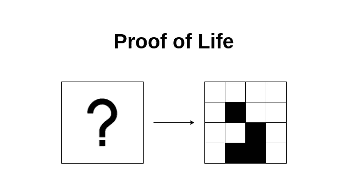
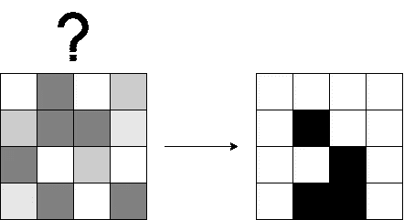
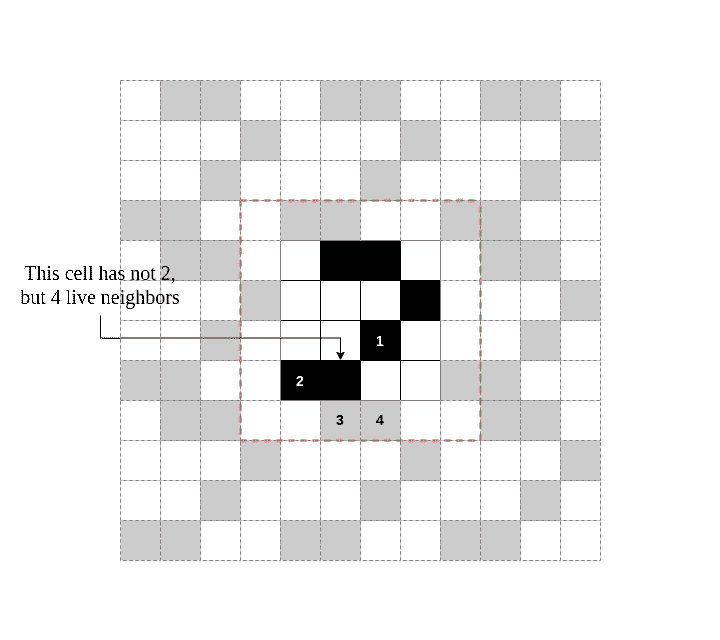
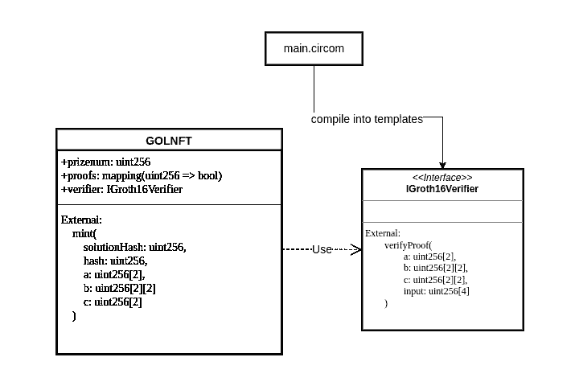
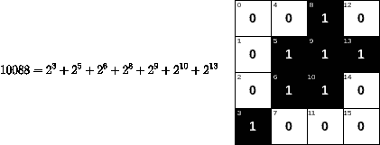
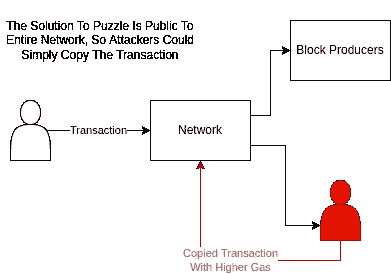
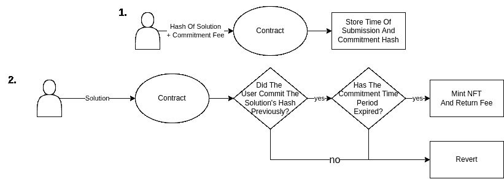

# 生命的证明:康威“循环而可靠的生命游戏”的零知识证明实现

> 原文：<https://medium.com/coinmonks/proof-of-life-zero-knowledge-proof-implementation-of-conways-game-of-life-with-circom-and-6438521fb2b1?source=collection_archive---------5----------------------->



最近，关于 ZKP 的潜力——密码学中的零知识证明的讨论越来越多。紧跟潮流，我决定学习 circom，并尝试将康威的生命游戏作为 zkSNARK 电路来实现，并在 NFT 智能合约中使用该电路。

在这篇文章中，我将简要介绍正在使用的技术，展示我的电路，并解释其工作原理。

你可以在这里查看代码:[https://github.com/rubydusa/proof-of-life](https://github.com/rubydusa/proof-of-life)

# ZKP、zkSNARK 和 Circom 简介

就本文的目的而言，零知识证明意味着一段数据支持一组约束的数学证明，而不揭示那段数据是什么，也不揭示关于它的任何其他东西。

zkSNARK — *零知识简洁的非交互式知识论证*是一种零知识证明，它只需要证明者和验证者之间的一次交互，并且是简短的。

Circom 是一种编程语言，用于编写程序(称为电路)，这些程序接受一组输入，并描述关于它们的*约束*，以及有一个、多个或没有输出。

使用这些约束，您可以生成*证明*，您知道一组支持约束的输入并验证证明。

# 正在建造什么？

在这篇文章中，我将展示一个 NFT 契约，每当有人提供证据证明他们有以下问题的解决方案时，它就铸造一个令牌:

找到一个生活游戏的网格状态，使得在 N 次迭代之后，网格状态匹配某个预定义的状态:



对于生命的有限网格状态，我将使用包装变量:



为了澄清，每当我说“解决方案”时，我指的是适用于上述问题的网格状态。

不允许重复的解决方案。

ZKPs 允许我们在提交后保持解决方案的私密性，防止抢跑，并创建这类大型谜题。

# 细节

本节将涵盖实施细节并解释项目的体系结构:



## 该电路

电路参数化为 N——迭代次数，W——网格宽度，H——网格高度。

它有三个输出:

*   out-N 次迭代后网格的状态
*   solution hash—“out”的哈希，这是必需的，以便合同可以验证它不是重复的解决方案
*   hash——“address”与“solutionHash”的散列，这是防止前端运行所必需的(稍后将详细介绍)

和两个输入:

*   地址(公共)—证明者的地址
*   数据(私有)—解决“出”的方法

网格状态表示为一个* 254 位数，并分解为一个 W×H 位矩阵。然后，应用寿命算法 N 次，并且输出被约束为无论结果如何。



*在实际电路中，通过将 254 位数字序列的位拼接在一起，它被扩展为支持具有超过 254 个单元的网格

## 验证者合同

为了在线验证证明，我们需要将电路编译成可靠的合同模板。这些契约有一个单一的公共函数，它将证明数据作为输入，并返回一个布尔值来指示证明是否有效。

对于 groth16 协议，函数签名如下所示:

```
function verifyProof( 
    uint[2] memory a, uint[2][2] memory b, uint[2] memory c, uint[4] memory input) public view returns (bool r)
```

由于我不是密码学家，我无法解释 a、b 和 c 的细节——请将它们视为证明的“私人部分”,输入参数由电路的公共输入和输出组成。

注意，输出也是验证输入的一部分，因为契约只负责验证一个证明，而不是计算它。

## NFT 合同

NFT 合同继承了 ERC721Enumerable，并具有以下附加存储变量:

```
uint256 public prizenum;mapping(uint256 => bool) public proofs;IGroth16Verifier public verifier;
```

*   prize num——受欢迎的网格状态
*   证明—跟踪已提交解决方案的映射
*   验证者—验证者合同的地址

它还添加了一个外部函数“mint ”,当提供一个唯一的证明时，该函数铸造一个令牌:

```
function mint(uint256 solutionHash,uint256 hash,uint256[2] memory a,uint256[2][2] memory b,uint256[2] memory c) external {require(!proofs[solutionHash], "GOLNFT: Solution already exists!");require(verifier.verifyProof(a, b, c, [solutionHash,hash,prizenum,uint256(uint160(msg.sender))]), "GOLNFT: Invalid proof");_safeMint(msg.sender, totalSupply());proofs[solutionHash] = true;}
```

# 零知识证明如何防止抢跑？

如果我们不在乎保持解决方案的私密性，我们可以简单地模拟在 solidity smart 契约中执行生命，这样负担会小得多。

那么为什么首先要使用 ZKPs 呢？

上述方法的问题在于，恶意行为者可能会通过监听广播事务来窃取谜题的解决方案。一个恶意的参与者将简单地复制呼叫数据，提交一个具有更高汽油费的交易并获得回报:



一种散列承诺方案更好，其中用户在提交解决方案之前承诺一个散列，并且如果他未能在某个时间框架内提交解决方案则受到惩罚，但是该方案有重大缺陷:

1.  如果承诺的成本太高，它会阻止资金不足的用户参与
2.  如果承诺的成本太低，恶意行为者可以抢先承诺，并故意损失金钱，如果这有利于他们看守令牌的话



我们能够通过要求事务调用者提供他的地址散列和他的解决方案来防止这种情况。验证者契约能够验证公共地址和私有解决方案是否与所提供的散列相匹配。

现在，如果一个领先者试图窃取一个解决方案，他用相同的输入调用 mint 函数将会失败，因为他的地址与散列不匹配。

# 零知识证明如何实现可伸缩性？

如果我们甚至不考虑前端运行，使用 ZKPs 还有另一个主要好处:可伸缩性。验证是常数时间，因此验证者契约中使用的 gas 是有界的。或者，对于具有大量迭代的大型网格，在 solidity 中实现寿命可能会多次消耗气体极限。

缺点是 groth16，即正在使用的 zkSNARK 协议需要一个特定于电路的可信设置，这意味着为了将应用程序部署到某个链中，您需要事先进行一个可信设置仪式。

可信设置是在证明生成和验证过程中使用的随机性的重要来源，如果它是由一方创建的，则该方能够伪造假证明，除非他们丢弃使他们能够这样做的“密钥”(因此是可信的)。

可信设置仪式是多方创建可信设置的一种方法，使得只要一方是诚实的(丢弃他们那部分“秘密密钥”)，可信设置就是安全的。

# 敬请期待！

我计划创建一个 react 站点用于演示目的。如果你对这个项目有任何问题，请随时询问，并通过[https://twitter.com/rubydusav](https://twitter.com/rubydusav)联系我

> 交易新手？试试[密码交易机器人](/coinmonks/crypto-trading-bot-c2ffce8acb2a)或者[复制交易](/coinmonks/top-10-crypto-copy-trading-platforms-for-beginners-d0c37c7d698c)