# 区块链是绿色未来的一部分

> 原文：<https://medium.com/coinmonks/proof-of-stake-blockchains-are-part-of-a-green-future-5b3f20e1b524?source=collection_archive---------7----------------------->

**而且 Solana 已经比 Visa 更节能了！**

*作者麦克斯·舍伍德，Ultimate
@wholegrainmax* 的增长经理

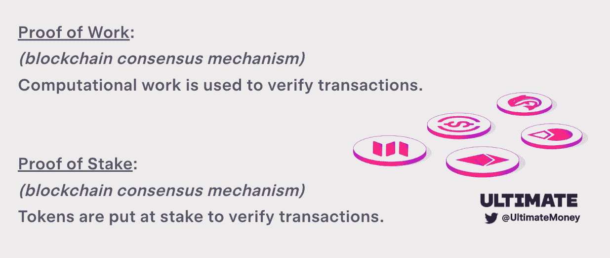

**能源使用:区块链最有争议(也最被误解)的问题**

区块链的能源使用是一个有争议的话题，EU-议会[提议](https://www.coindesk.com/policy/2022/04/21/sweden-eu-discussed-bitcoin-proof-of-work-ban-report/)禁止工作证明(PoW)挖掘，倡导团体呼吁改变比特币的[底层代码](https://cryptoslate.com/change-the-code-and-the-insane-push-to-make-bitcoin-a-centralized-proof-of-stake-network/)，美国各州[通过了关于可以进行的加密挖掘活动类型的法规](https://www.coindesk.com/layer2/2022/06/06/new-york-mining-ban-is-a-green-opportunity/)。鲜明的能源使用标题抓住了读者的注意力，但这种注意力被淹没在复杂的对话中。

诚然，像比特币这样的传统区块链使用大量能源，但同样真实的是，今天区块链的大多数交易都是在效率大大提高的 PoS 区块链上进行的。这些区块链不需要计算工作来验证交易，而是依赖于一个“胡萝卜加大棒”的系统，其中验证交易需要“把你的钱放到你的嘴上”。

事实证明，区块链对环境的影响很小，而像 Solana 这样的区块链的能源效率已经与 Visa 这样的传统支付网络不相上下。让我们开始吧！

**区块链的能源使用主要是由于工作证明**

区块链的能源消耗辩论理所当然地聚焦于比特币和以太坊等工作网络的证据。比特币[持续使用](https://ccaf.io/cbeci/index)约 10GW(100 亿瓦)的电力——足以为超过 1300 万个家庭供电，需要相当于 6 个核电站的输出。(参考文献 2，参考文献 3)假设每个比特币矿工都使用最高效的 S19 矿工，那么全球至少有 200 万台这样的机器在运行。(参考文献 4)

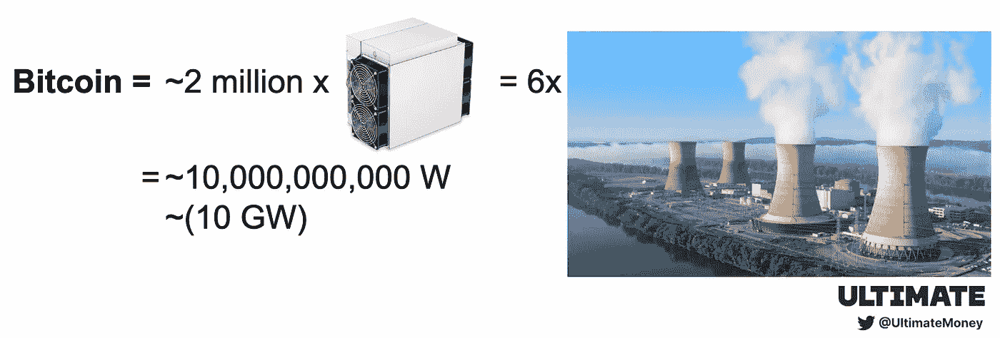

深入讨论比特币的能源问题超出了本文的范围，但值得一提的是，并非所有比特币的能源消耗都是“浪费的”。2020 年和 2022 年的研究估计，比特币 39%到 58%的能源消耗来自可再生能源。一项 [2021 年的研究](https://cointelegraph.com/news/banking-system-consumes-two-times-more-energy-than-bitcoin-research)显示，银行业和金矿开采都比比特币消耗更多的能源。 [YouTube](https://thefactsource.com/how-much-electricity-does-youtube-use/) 、[网飞](https://theshiftproject.org/en/article/unsustainable-use-online-video/)和[视频游戏](https://www.researchgate.net/publication/336909520_Toward_Greener_Gaming_Estimating_National_Energy_Use_and_Energy_Efficiency_Potential)也是同样的规模，而美国的干衣机[消耗了](https://www.forbes.com/sites/williampentland/2013/06/11/europes-clothes-dryers-consume-half-as-much-energy-as-americas/?sh=4f3718b75e67)超过三分之二的比特币能量。

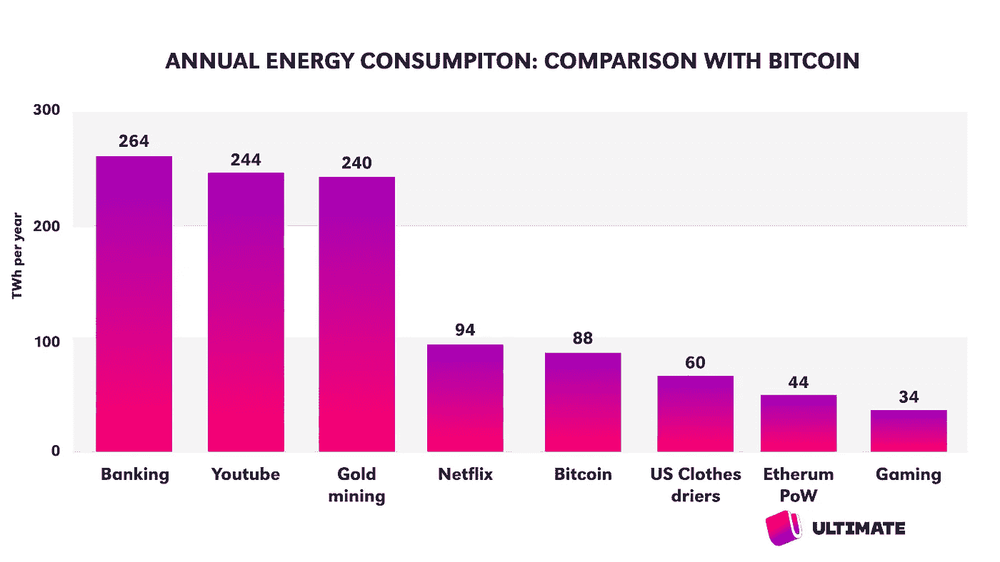

与更新的区块链 Stake Proof 相比，比特币独树一帜，其能源使用量是 PoS 链的 20，000 到 150，000 倍。如果比特币的耗电量相当于帝国大厦的高度，那么 PoS 链就相当于一个安全别针的大小。

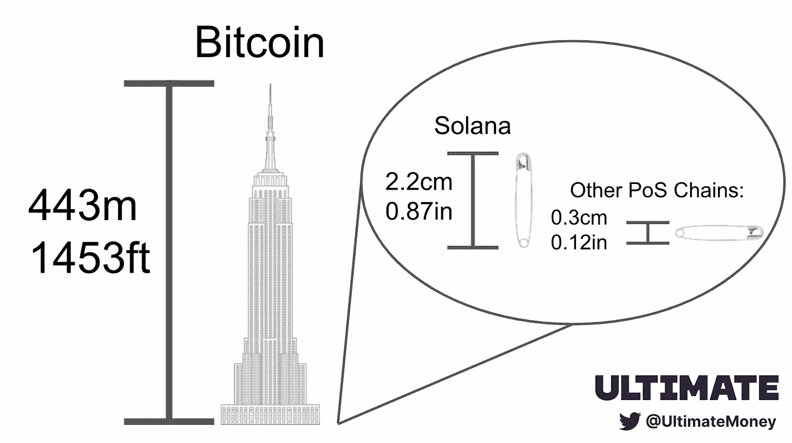

比特币开创了作为共识机制的工作证明，不太可能改变，但以太坊有望成为第二大耗电区块链。

**股权证明将以太坊的能耗降低 99.9%**

以太坊持续使用大约 5GW 的电力——是比特币的一半。(参考文献 5)这相当于 3 座核电站产生的电力或 650 万个家庭消耗的电力。以太坊矿工使用显卡，全球大约有 1500 万个。(参考文献 6)

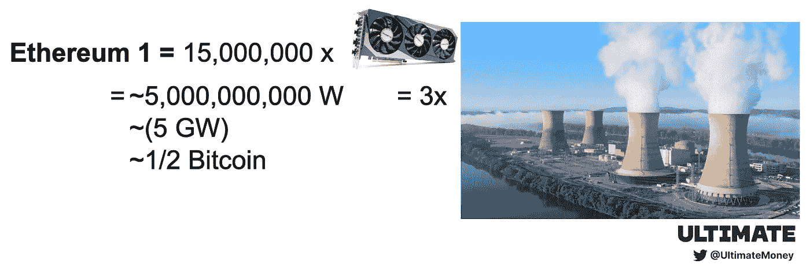

幸运的是，以太坊正处于向股权证明过渡的风口浪尖，这将发生在最早于 9 月中旬举行的一场名为“合并”[的活动中。一旦这种情况发生，以太坊区块链将不再需要矿机运行，而是在不到 10000 个](https://www.theblock.co/post/162988/ethereum-foundation-suggests-tentative-dates-for-the-merge)[低功率验证器节点](https://www.nodewatch.io/)上运行，需要大约 1MW 的功率。(参考文献 7)这相当于大约 1300 个家庭使用的电力，与工作证明相比，以太坊的能源消耗减少了超过 [99.9%。](https://blog.ethereum.org/2021/05/18/country-power-no-more/)

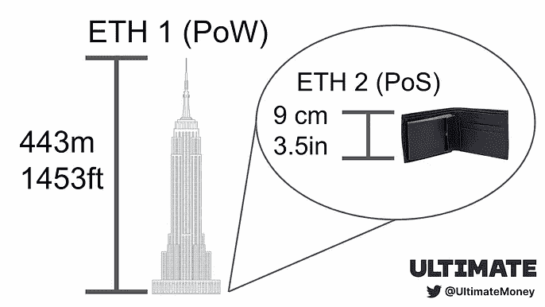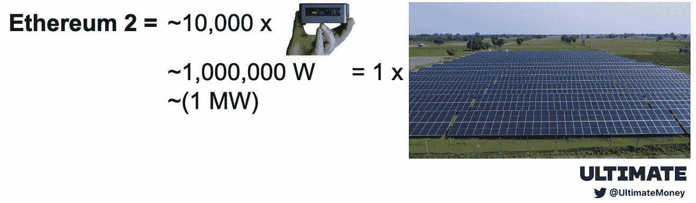

**区块链的能效令人难以置信**

利害关系证明(PoS)是在工作证明(PoW)之后发明的，是新区块链大多数人选择的共识机制。因为计算工作不用于验证交易，所以 PoS 区块链消耗的唯一能量是保持验证器节点在线并与网络同步所需的能量。(这些计算机主要是下载和上传数据，没有运行任何密集的计算)与 PoW chains 相比，这增加了事务吞吐量，同时降低了能耗。

大多数 PoS 区块链的验证器节点可以在像英特尔 NUC 这样的低功耗电脑上运行。一份来自加密碳评级协会(CCRI)的 2022 年报告测量了在多个区块链上运行 PoS 验证器节点所需的功率。如果我们将每个节点的功耗乘以每个区块链上活动验证器的数量，我们会看到大多数 PoS 链的总功耗在 10–70kW 之间。

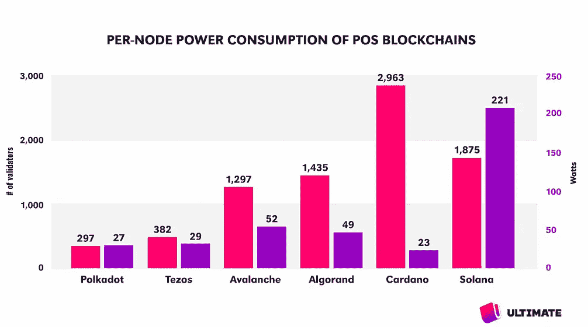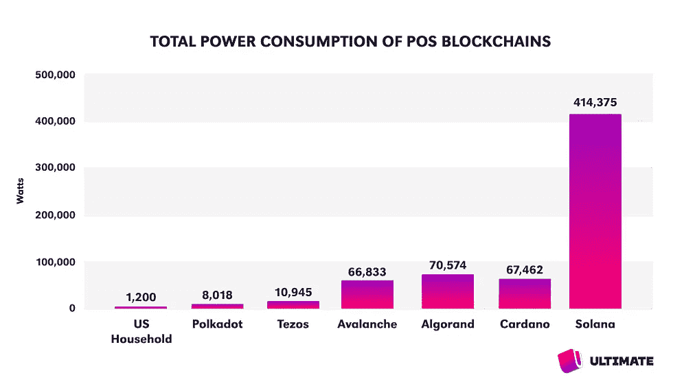

几十千瓦的耗电量相当于不到 100 个家庭消耗的能量。(参考文献 3)这种电量可以由住宅建筑上的[太阳能电池阵列](https://uksolarpowerpanels.co.uk/solar-installations-on-farm-sites/)或者类似于户外音乐节上的[移动式柴油发电机](https://www.dieselgeneratortech.com/trailer-generator/starlight-trailer-genset.html)产生。

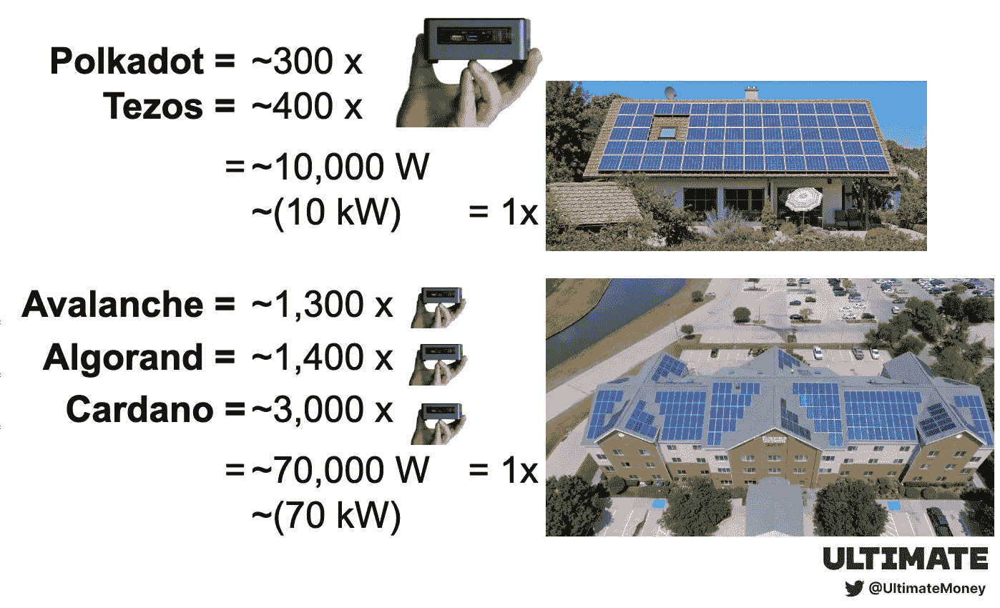

索拉纳:最渴望权力的利益链的证明，但一个绿色的榜样？

如上图所示，Solana 是功耗最高的 PoS 链，功耗约为 415kW。Solana 的设计理念是通过依赖具有强大硬件的验证器来增加事务吞吐量。根据 CCRI 的测量，一台 Solana 验证机使用 221 瓦的功率，比其他网络上的验证机使用的功率高 4-10 倍。全球有近 2000 个验证器(仅次于 Cardano 的第二大验证器), Solana 网络是一个电力饥渴的区块链，消耗多达 550 个家庭的电力。然而，有三个因素对 Solana 有利:透明度、补偿和事务吞吐量。

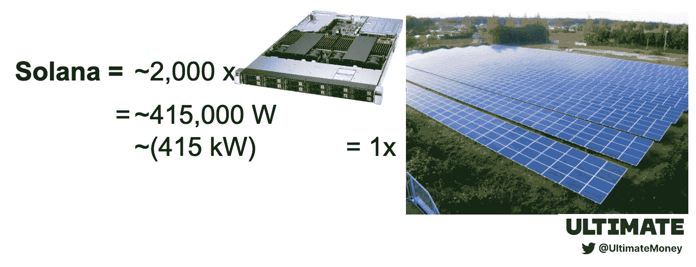

透明:索拉纳基金会已经承诺估算并公布网络验证者的碳足迹。2022 年 3 月[能耗报告](https://solana.com/news/tag/energy-use-reports)由独立研究员[罗伯特·墨菲](https://www.linkedin.com/in/rjmurphy/)作出，他的[报告](https://solana.com/climate-footprint-analysis-summary-december-2021.pdf)和[数据](https://docs.google.com/spreadsheets/d/1kfWV3IE2QHjOkwkCdnAKkhBiecuQ0GPjU2lT1SxG4iQ/edit?usp=sharing)有待审核。研究发现，Solana validators 使用的电力平均碳强度为 198 克二氧化碳/千瓦时，每年产生 2976 吨二氧化碳，大约相当于 1178 个美国家庭的排放量。然而，这可能是一个巨大的高估，因为它是基于每个验证器 984W 的估计功耗，远远高于 CCRI 的每个验证器 221W 的测量值。 [984W 数字](https://outervision.com/b/W0yCEa)包括两个强大的图形卡，这两个图形卡[目前对于验证器操作](https://docs.solana.com/running-validator/validator-reqs#:~:text=Minimum%20SOL%20requirements,exempt%20reserve%20of%200.02685864%20SOL.)不是必需的，90%的 CPU 使用率也可能是一个很大的高估。

补偿:但是这种高估是碳补偿项目的基础——这使得索拉纳基金会宣布索拉纳为碳中和区块链。通过与抵消公司 [Watershed](https://watershed.com/en-GB) 的合作，该基金会正在资助破坏 CFC 和 HFC 制冷剂——温室气体的效力是 CO2 的 1 万倍——[Green America](https://www.greenamerica.org/climate-change-100-reasons-hope/top-10-solutions-reverse-climate-change)将其列为减少碳排放的最具影响力的方法之一。虽然碳抵消并不能消除大气中排放的碳，但该项目显示了索拉纳基金会值得称赞的环保意识和承诺。他们并不孤单，其他有碳补偿项目的区块链包括[雪崩](https://twitter.com/avalancheavax/status/1456334992687128577)、[阿尔格兰德](https://algorand.foundation/news/carbon-neutral)和 [Celo](/celoorg/a-carbon-negative-blockchain-its-here-and-it-s-celo-60228de36490) 。

**较高的能耗可以通过事务吞吐量来证明**

虽然索拉纳区块链的耗电量几乎是其他五家 PoS 连锁店总和的两倍，但它处理的交易量却是其他 PoS 连锁店的 45 倍。(我们不统计投票交易，投票交易是用来达成索拉纳共识的，不是用户或程序做的。)

*五链是波尔卡多特、雪崩、卡尔达诺、阿尔格兰德、特佐斯。*

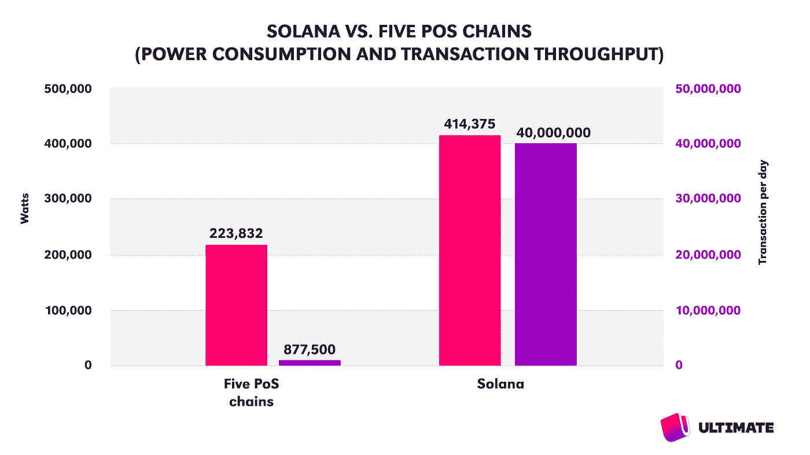

从每笔交易的能源角度来看，Solana 的功耗增加是因为它的交易吞吐量。索拉纳基金会的(过高)估计将索拉纳的一笔交易等同于 2.5 次谷歌搜索的能量消耗，或者比点亮一个 LED 灯泡 5 分钟的能量还少。CCRI 的估计要低 4.5 倍。

不可否认，每个事务的能量是一个稍微有缺陷的度量，因为验证器需要不断地消耗能量来保持区块链运行，而不管正在进行的事务的数量。并非每笔交易都消耗能源，关键是 Solana 网络作为一个整体提供了足够多的效用来证明其能源使用是合理的。

**股权证明区块链像索拉纳一样节能签证**

有人可能会说，PoS 连锁店是经济奇迹:几千台低功率机器创造了一个分散的网络，使任何互联网用户都能在全球经济中进行交易。

在每笔交易的基础上，Solana 验证器的能耗与 Visa 的数据中心相当:Visa 在最近的 [ESG 报告中解释说，他们从 2020 年](https://usa.visa.com/content/dam/VCOM/global/about-visa/documents/visa-2020-esg-report.pdf)起使用了约 706，000GJ 的电力、天然气和其他燃料能源，其中一半以上是在数据中心消耗的。Visa 的 [2020 年度报告](https://annualreport.visa.com/financials/default.aspx)显示，Visa 的网络处理了 1408 亿笔交易。(这大约是索拉纳每年 140 亿英镑的无投票权交易的 10 倍。)仅考虑数据中心的能源使用，我们计算出 Visa 网络每笔交易使用 0.7 瓦时的能源。这非常接近 Solana 基金会在其 2022 年 3 月的 Solana 能耗报告中报告的每笔交易 0.75 瓦时，正如我们之前讨论的那样，这可能比 CCRI 测量的每笔交易 0.17 瓦时焦耳高出 4.5 倍。

这远远不是一个完美的比较:Visa 在数据中心的能源使用不仅仅是因为交易处理，它还可能包括视频通话和文件共享等支持功能。但 Visa 公司及其所有支持功能的目的最终都是为了促进交易。不幸的是，我们不知道索拉纳实验室和索拉纳基金会员工的能源使用情况。还有一个问题是，Visa 和 Solana 的最终用户使用销售点设备、移动电话或个人电脑进行交易。

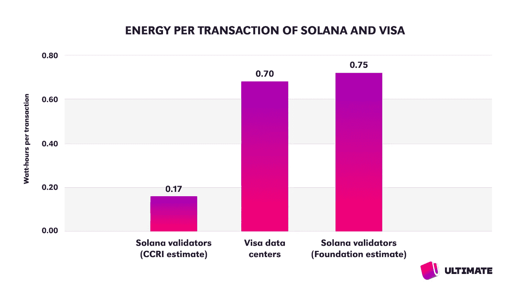

我们可能永远不会知道确切的数字，但很明显，在每笔交易的能源效率方面，Solana 已经与 Visa 大致相当。Visa 和 Solana 一样，已经开始抵消他们的碳排放，并制定了向 100%可再生能源过渡的目标。

**证明区块链在绿色未来中占有一席之地**

对于所有围绕区块链能源使用的恐惧、不确定性和怀疑，股权证明已经成为一种增加交易吞吐量和降低能源消耗的技术。像 Solana 这样的区块链公司正在通过透明报告和碳抵消计划展示可扩展性、能源效率和对环境的承诺，从而引领潮流。通过使用利益链证明进行交易，用户可以利用传统支付网络的节能替代方案。

**参考文献:**

1.  [剑桥](https://ccaf.io/cbeci/index)指数估计为 10.4 GW。[数字经济学家](https://digiconomist.net/bitcoin-energy-consumption)估计为 136 TWh/年，或连续 15GW。
2.  每个核电站 1.8 千兆瓦，典型的有两个反应堆的电站。(双反应堆核电站是最常见的核电站，平均发电量为 1848 兆瓦。图为位于美国伊利诺伊州莫里斯的德累斯顿发电站，额定发电量为 1845 兆瓦。
3.  假设一个典型家庭的能耗为 750 瓦。(美国 EIA [显示](https://www.eia.gov/tools/faqs/faq.php?id=97&t=3#:~:text=In%202020%2C%20the%20average%20annual,about%20893%20kWh%20per%20month.)平均能耗为 1.24 千瓦，但在可能运行验证器的其他国家[平均能耗较低](https://en.wikipedia.org/wiki/List_of_countries_by_electricity_consumption)。)
4.  假设一个[比特币的交易速率](https://www.blockchain.com/charts/hash-rate)为 2 亿次/秒，一个[比特大陆蚂蚁矿工 S19 Pro](https://shop.bitmain.com/release/AntminerS19Pro/overview) 的效率为 110 次/秒。
5.  Kyle McDonald 的自下而上估计值为 2.6 吉瓦，数字经济学家 T21 的估计值为 8.7 吉瓦，是他们比特币估计值的 56%。比特币用了 10GW，以太坊用了一半。
6.  可能低估了，假设他们都是 Nvidia RTX 3060ti 卡哈希在 60 英里/秒
7.  假设每个节点 100W，每个节点运行多个验证器，如以太坊博客中的[所述。](https://blog.ethereum.org/2021/05/18/country-power-no-more/)

> 交易新手？试试[密码交易机器人](/coinmonks/crypto-trading-bot-c2ffce8acb2a)或者[复制交易](/coinmonks/top-10-crypto-copy-trading-platforms-for-beginners-d0c37c7d698c)