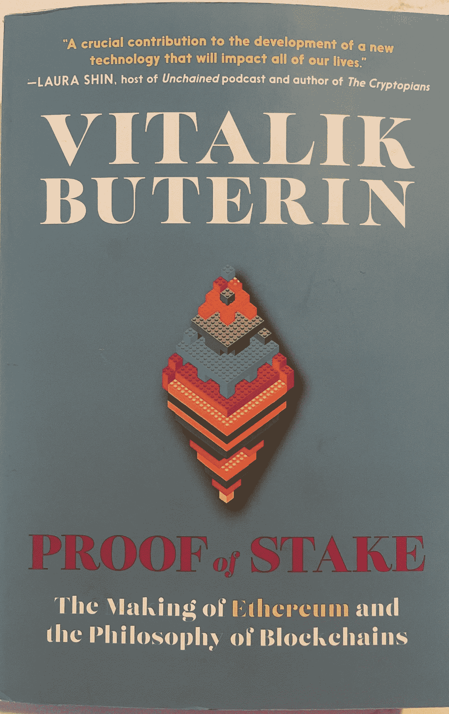

# 《利害关系的证明》，维塔利克·布特林著:书评

> 原文：<https://medium.com/coinmonks/proof-of-stake-by-vitalik-buterin-book-review-fe8bdd9dcd9b?source=collection_archive---------8----------------------->

在购买这本书之前，有两件事你应该知道。其一，这不是一本传统的书，而是维塔利克·布特林之前在各种在线网站上发表的关于加密和区块链主题的论述的集合。另一个是所讨论的主题是高度先进的，它将需要你的全部注意力和焦点来适当地消化它。

*利害关系证明*有时也会测试你的数学技能(因为它的结构方式也测试了我实际复习的过程)。

# 解读*利害关系的证明*:书与概念

在过去 8 年左右的时间里，Buterin 和以太坊基金会一直在推动以太坊脱离工作证明系统——其中节点(矿工)在区块链上验证交易(并使用大量资源来这样做)——转向利益证明系统。

根据 Vitalik 自己的话，可以在他的书的附录中找到他的加密词汇表，**利害关系的证据**被定义为:

> 一种将数据附加到区块链的方法，要求网络上的验证计算机“标记”令牌，以便参与商定接受哪些新数据以及接受的顺序。验证者因参与而获得象征性奖励。丢失标记的风险会阻止攻击者试图破坏数据。

这本书既是以太坊[的建立和发展的路线图和文档，也是其未来的可能性。然而，这本书是对最近以太坊合并的评论，而不是解释，Vitalik 在 8 月初在多伦多举行的区块链未来学家会议上详细讨论了这一合并。](/coinmonks/the-cryptopians-book-review-404f9eb4a103)

# 新世界，新定义…

说到定义，有一种全新的字典可以被创造出来，它属于 web3 的世界。当然，Vitalik 为这个词汇做出了广泛的贡献，甚至创造了[准加密俚语](https://investmentfirms.com/crypto-slang-terms-to-know/)，如“比特币最大化”，以及许多其他词汇。

但众所周知，维塔利克不仅创造了新词，他还创造了一个全新的世界。这是读者在整本书中接触到的世界。

# 关于思想…

总之，这本书*励志*。我最喜欢的一个论述(我不认为博客或文章这个词配得上他的内容)是[关于秘密城市](https://vitalik.ca/general/2021/10/31/cities.html)的部分——一个关于当地政府和社区拥有的所有可能性的帖子，因为它与区块链有关。正是这些类型的概念真正让“思想的汁液”流动，让读者真正思考所有的可能性。

当然，这些类型的断言并非没有怀疑，一些人很快(并且正确地)指出，在加密社区中有许多承诺——其中许多看起来很浮夸。

但是对于每一个挑战，Buterin 都提出了可以作为解决方案的多种选择。

我给出的一个要点是，无论你如何与加密世界互动——无论你是日间交易员、建筑商还是首席执行官——如果你擅长数学，你就可以在生态系统中创造自己的位置。

# 关于数学的话题…

在整本书中，Buterin 再次展示了数学对于解决密码世界面临的独特挑战是多么重要。“独一无二”这个词甚至不能公正地描述这些挑战，因为这个世界是全新的，许多挑战以前也从未存在过。

读者将能够看到布特林展示他的数学能力，无论是计算出像[futarty](https://www.youtube.com/watch?v=PRog7R37MA0)这样的自动化治理系统，解释预测市场，还是改进像[基尼系数](https://vitalik.ca/general/2021/07/29/gini.html)这样的模型(是的，我也不知道那是什么)。

书中甚至有一节包含了布特林自己创造的几种流行游戏的变体，比如国际象棋和扑克。在某些情况下，玩家必须能够相当快地完成数学方程式才能参与其中——我必须承认，我非常兴奋能给他们[一次尝试的机会。](https://vitalik.ca/general/2019/12/24/christmas.html)

通过这本书，Vitalik Buterin(又一次)成功地帮助将高等数学、密码学和其他应该完全停留在书呆子巷的密码主题变成了真正酷的东西。它最终会超过《纽约时报》畅销书排行榜上的书籍吗？也许不会。但是很快他们可能不得不增加一个新的类别。

> 交易新手？试试[加密交易机器人](/coinmonks/crypto-trading-bot-c2ffce8acb2a)或者[复制交易](/coinmonks/top-10-crypto-copy-trading-platforms-for-beginners-d0c37c7d698c)