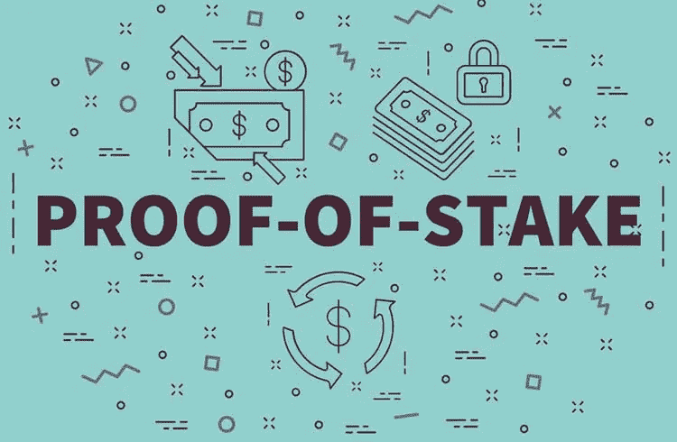

# 利益证明—概述和概念研究潜水

> 原文：<https://medium.com/coinmonks/proof-of-stake-overview-and-concept-study-dive-84a15aaf1763?source=collection_archive---------37----------------------->

达成共识有许多方式，在不同的区块链上使用不同的方法。一个非常成功的共识算法被称为利害关系证明。在本文中，我将介绍利益相关证明的工作原理、它面临的潜在挑战以及谁在使用它。

利害关系证明是一种共识算法，通过为参与者投票来寻求达成共识。在这种情况下，利益相关者是指那些为这个系统的积极成果做出最大投资的人。这些用户被认为最有可能投票产生积极影响或改善系统。参与证明是如何工作的？

[https://www.criptofacil.com/o-que-e-e-como-funciona-o-proof-of-stake/](https://www.criptofacil.com/o-que-e-e-como-funciona-o-proof-of-stake/)

在参与共识协议的证明中，没有矿工。相反，有验证器。这些验证者不需要投资计算设备来挖掘创造硬币的块，因为所有的硬币从一开始就存在。相反，这些验证器(也称为利益相关者)的目的是确定哪个块进入区块链。

为了验证交易和创建区块，验证者放置他们自己的硬币作为赌注。你可以把它想象成他们在打赌。如果他们验证了一个欺诈交易，他们就失去了他们的财产以及他们将来作为验证者参与的权利。理论上，这种检查鼓励系统只验证真实的交易。

在下注证明中，验证者在总硬币中所占的份额越大，被选中创建下一个区块的机会就越大，因为他们的赌注更高。与只有 100 枚硬币的节点相比，拥有 400 枚硬币的验证器节点被选中的可能性是其他节点的四倍。如果添加了验证程序块。验证者收到一枚与其赌注成比例的硬币。

也就是说，这回避了一个问题，对于一个表现不好的验证者来说，是否有可能通过在多个块上下注而不损失任何东西，这样他们最终总是会赢？非常好。你偶然发现了所谓的无利害关系问题来证明游戏。

关于区块链，有一些我以前没有提到的东西，这个单链分叉的可能性。当区块链在利害关系证明范式下扩展时，区块链中的分叉可能会意外发生。

例如，如果一些节点接收信息以添加一个块，而其他节点接收更新以添加另一个块，或者因为存在恶意尝试重写历史和回滚事务。换句话说，如果有多个竞争的块选项，那么一个表现不好的验证器是不是可以把赌注押在所有的块上，这样它们就总是排在最前面？

是真的。这些都是可能的，但是利害关系证明的拥护者有策略来对付这些类型的攻击。策略是一个可怕的解决方案。这意味着如果验证器在几个链中同时创建块，它们将受到惩罚。或者，一些协议使用一种策略来惩罚在错误的链中创建块的验证器。在这种方法中，验证者必须有选择性地、认真地判断他们赌的是哪个区块链。谁使用参与证明？

以太坊在一个代号为 casper 的项目中已经从工作证明转变为利益证明。数字货币或 Dash 是赌注证明算法的先驱之一。它建立在比特币的核心平台上，但增加了隐私和快速交易功能，如 PrivateSend 和 InstantSend。还有 Lisk。旨在允许开发者构建他们自己的分散式应用。在功能上类似于以太坊或者 NEO，但是允许开发者使用 JavaScript。Lisk 使用一种自定义形式的利害关系证明，称为委托利害关系证明。这只是意味着只有前 101 名代表可以拥有网络成员资格，这些代表由社区不断投票决定。一个口齿不清等于一票。现在，这结束了参与的证明。我将介绍的下一个共识方法是委托拜占庭容错，简称 DBFT。

**委托拜占庭容错**

在这一节中，我将尝试介绍另一种共识算法，即所谓的委托拜占庭容错。我将讨论它的工作原理、潜在的挑战以及谁在使用它。委托拜占庭容错或 DBFT 是一种基于向不同节点分配角色以协调一致性的一致性算法。现在，拜占庭容错是如何工作的？

[https://themerkle.com/what-is-delegated-byzantine-fault-tolerance/](https://themerkle.com/what-is-delegated-byzantine-fault-tolerance/)

DBFT 没有矿工。相反，它的节点分为普通节点和共识节点。网络中的大多数节点只是普通公民节点，可以转移或交换资产，但他们不参与验证块。共识节点有能力验证写入区块链的每个数据块。共识节点充当网络中其他节点的代表，类似于当选的政府官员如何代表其大多数选民。普通节点要成为共识节点，通常需要满足特定的标准，这些标准因平台而异。因此，这些可能涉及拥有一些特殊的设备，有专门的互联网连接或在网络中有一定的股份。

共识节点跟踪可以添加到区块链的建议块。当决定下一步应该添加哪个块时，从所有共识节点池中随机选择一个共识节点。在近地天体区块链中，这个被选择的节点被称为发言人，所有其他共识节点被称为代表。

演讲者创建了一个新的积木，并向代表们推荐它。在通过之前，所有代表的三分之二需要证明这一障碍。如果没有通过，被选中的发言人将恢复为普通代表，另一个发言人将被选中。这位新发言人提出他们的道理，该加哪个区块，这个区块就拿出来投票。如果通过，新块将被添加到区块链。据说 DBFT 比工作证明要快得多，而且它需要的资源更少，因为没有复杂的密码难题需要解决。

此外，它对分叉有抵抗力，因为在任何给定的时刻，真相只有一个版本。尽管如此，DBFT 也不是没有问题。让我们来看两个潜在的场景。首先，让我们假设有一个不诚实的发言者。从代表中随机选择的发言人总是有可能不诚实或出现故障，如果发生这种情况，网络需要依靠诚实的代表投票否决提议的阻止，这样它就不会达到三分之二的支持率。由于该协议的用户对代表进行投票，而发言人是从代表组中随机选择的，因此由用户来确定哪些代表是值得信任的，并投票选举他们掌权。

让我们来看看我们的第二个场景。投票选举代表的用户需要尽职尽责，只选举诚实的代表掌权，这样不诚实的代表就占少数。如果少数代表不诚实，诚实的多数人可以投票否决该选区，该选区将进入区块链。为了帮助解决这一问题，一些区块链平台公布了每位代表的诚实和表现数据，供选民审查。那么，谁使用委托拜占庭容错呢？尼欧是这个协议的最大拥护者之一。这是一个加密货币的区块链平台，旨在建立一个分散应用程序的可扩展网络。虽然工作证明和利益证明肯定是更受欢迎的选择，但更新的机制不断出现并证明自己。请记住，共识算法的声誉来自于它在很长一段时间内的安全性。例如，自 2009 年问世以来，比特币一直是一个安全的网络。也就是说，没有完美的共识机制，也可能永远不会有，但看到新的区块链提出他们自己的机制很有趣，了解他们的利弊也同样有趣。

> 交易新手？试试[加密交易机器人](/coinmonks/crypto-trading-bot-c2ffce8acb2a)或者[复制交易](/coinmonks/top-10-crypto-copy-trading-platforms-for-beginners-d0c37c7d698c)