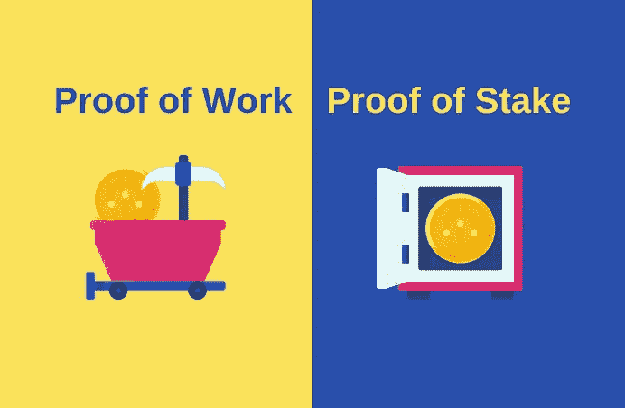

# 利害关系证明与工作证明:理解差异

> 原文：<https://medium.com/coinmonks/proof-of-stake-vs-proof-of-work-understanding-the-differences-6755d7ed73aa?source=collection_archive---------36----------------------->

Picture Source: [amonrat rungreangfangsai](https://www.flaticon.com/authors/amonrat-rungreangfangsai)

在[以太坊](https://prominentcrypto.com/ethereum/)合并后，用户和爱好者密切关注这一历史性的变化将如何影响第二受欢迎的[区块链](https://prominentcrypto.com/blockchain/)。从以太网的价格、去中心化应用的可用性和 NFT 社区来看，以太坊从工作证明(PoW)转向利益证明(PoS)的风险很高。

**什么是以太坊合并？**

以太坊中的交易验证过程从所谓的工作证明转变为利益证明。“合并”将减少运行区块链的碳排放，同时通过增加对区块链的兴趣，为用户和开发者创造更多更广泛的采用机会。街区。由于 ETH 仍然是所有加密货币中市值第二高的，因此了解证据证明的利弊非常重要。

**什么是工作证明？**

可以这样想:工作证明是组成区块链网络的计算机如何通信并就如何处理交易达成一致。工作证明是加密货币用来达成计算机到计算机协议的共识算法。它要求创造新区块的矿工提供证据，证明他们通过解决一些计算难题做到了这一点。[比特币](https://prominentcrypto.com/bitcoin/)是区块链网络成功运用工作证明的完美例子。

**什么是股权证明？**

利益证明是一种区块链共识算法，根据用户拥有的令牌数量(也称为他们的利益)来选择下一个块的创建者。把它想象成一枚硬币等于一张选票。

桩的证据改变了使用硬币所有者的机器来验证块的方式。所有者提供他们的硬币作为验证区块能力的抵押品。投币者成为“验证者”，他们可以帮助验证以确保每笔交易的安全性。

通过赌注证明的验证者将在他们下注一定数量的硬币后被随机选中。例如，以太坊将要求用户在成为验证者之前存入 32 个 ETH。

这些差异真的重要吗？

普通用户看到的 PoW 和 PoS 之间的差异的影响要小得多，因为它们都旨在为令牌持有者创建一种参与区块链验证的方式。利害关系证明和工作证明之间的主要区别在于它们如何选择谁来创建块和验证交易。

对适当机制的选择因区块链而异。对于像以太坊这样的区块链来说，利益验证是一个改善整体体验的机会，这样更多的用户可以参与进来，并相信区块链技术在长期内是安全和稳定的。转向 PoS 甚至为无法访问 32 ETH 的零售用户提供了有意义的参与机会。

利害关系证明和工作证明各有利弊，必须认识到没有一个制度是完美的。有一个完整的多链区块链解决方案生态系统来满足每个社区的需求。毕竟，加密不是一个通用的环境

> 交易新手？试试[加密交易机器人](/coinmonks/crypto-trading-bot-c2ffce8acb2a)或者[复制交易](/coinmonks/top-10-crypto-copy-trading-platforms-for-beginners-d0c37c7d698c)