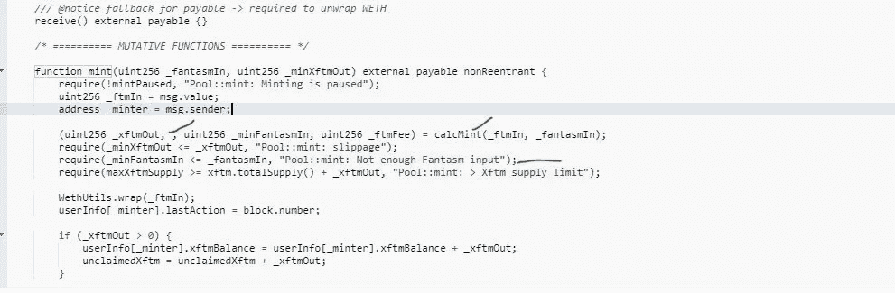

# 在快速增长的链条中保护您的资产— Fantasm Finance Hack

> 原文：<https://medium.com/coinmonks/protect-your-assets-in-a-rapidly-growing-chain-fantasm-finance-hack-b97fd0913318?source=collection_archive---------29----------------------->

## Fantom chain 是市场份额增长最快的 EVM 之一。每个月，这个链都会增加一百万个新地址，但是黑客们不会落后。

2022 年 3 月 9 日下午 1:50:20+UTC，Fantasm Finance 的抵押品储备池被欺诈性地利用了 262 万美元。

重要的是要记住，攻击发生时，Fantom Network 刚刚开始崭露头角，其新平台也开始浮出水面。这使得它成为坏演员的好目标，因为他们继续在不断增长的利基和网络上捕食。

攻击者使用龙卷风现金来掩盖交易。

Fantom 的本地令牌 FTM 是 Fantasm 上用作抵押品支持的令牌之一。

Fantasm Finance 黑客利用了该协议 mint 函数的错误检查代码中的一个漏洞。错误检查功能的工作是验证用户在创建 XFTM 令牌时是否在合同中输入了 FTM 令牌。

但是，该代码将 msg.value 的值(计算随交易一起发送的 ETH 的数量)与可接受的铸造 FTM 令牌的最低值进行了比较。

攻击者能够通过只发送 FSM 令牌(铸造中使用的附属令牌)而不发送任何 FTM 令牌来利用该代码。这种不正确的错误检查功能允许攻击者在不插入任何 FTM 的情况下制造 XFTM 令牌。

使用 Fantasm 的少量 FSM 令牌，黑客能够铸造 XFTM，这是 Fantom 在平台上的 FTM 的代表。

攻击者能够从协议中获得价值，并通过将新创建的 XFTM 令牌卖回给项目来购买更多的 FSM 令牌用于后续攻击。

从 50 FTM 开始，黑客们逐渐增加数量，总共切换了 280 万 XFTM。黑客使用 Tornado Cash 将资金交换了大约 1,007 ETH，约合 262 万美元。

让我们再详细回顾一遍发生的事情。

通过龙卷风现金，剥削者从 BNB 链获得资金。

剥削者使用 Pancakeswap 将 BNB 变成 USDC。

剥削者使用 Celer 桥连接 USDC 和 Fantom。

剥削者通过 Fantom 链上的桥接收这个 USDC:

 [## Fantom 事务哈希(Txhash)详细信息| FtmScan

### 0x 39 be 07303 cf 562407 c 857 d9b 43077 f 99 BD 63 ee 46 B1 a 95 D5 cfe 5947 ee3c 106422 222 天前 15 小时(2022 年 3 月 9 日 01:39:21 PM +UTC)…

ftmscan.com](https://ftmscan.com/tx/0x39be07303cf562407c857d9b43077f99bd63ee46b1a95d5cfe5947ee3c106422) 

水龙头提供 FTM 给剥削者，然后剥削者用更多的 USDC 交换 FTM。

开发者利用了 Fantasm Pool 合同中的漏洞，部署了一份合同。这是开发商忽略了在要求的最小 FTM 存款后将条件设置为 mint XFTM 的地方。

合同使用以下公式计算 calcMint 函数中的薄荷量:`_xftmOut = (_fantasmIn * _fantasmPrice * COLLATERAL_RATIO_MAX * (PRECISION — mintingFee)) / PRECISION / (COLLATERAL_RATIO_MAX — collateralRatio) / PRICE_PRECISION;`

由于小数错误,_xftmOut 比它应该的要大。

通过只插入 FSM 令牌而不插入 FTM，攻击者伪造了 XFTM。为了获得越来越多的 FTM，开发者向 FTM 出售 XFTM 令牌，购买更多的 FSM，并重复这个过程。

最后，剥削者将他所有的 FTM 换成 ETH，并使用 Celer Bridge 再次将这些资金转移到以太坊。

> 交易新手？试试[加密交易机器人](/coinmonks/crypto-trading-bot-c2ffce8acb2a)或者[复制交易](/coinmonks/top-10-crypto-copy-trading-platforms-for-beginners-d0c37c7d698c)