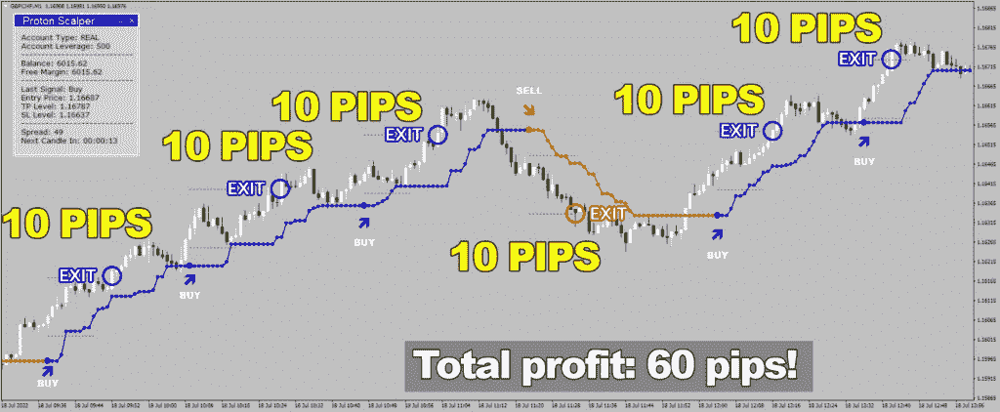
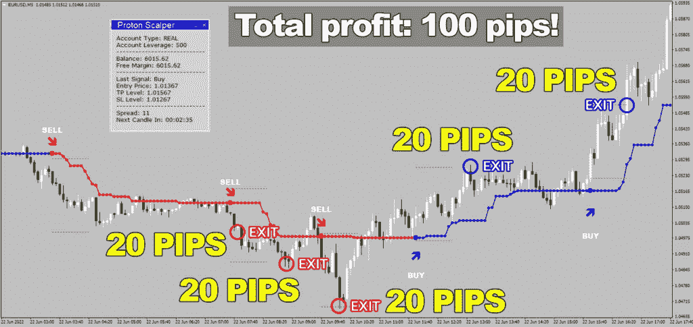
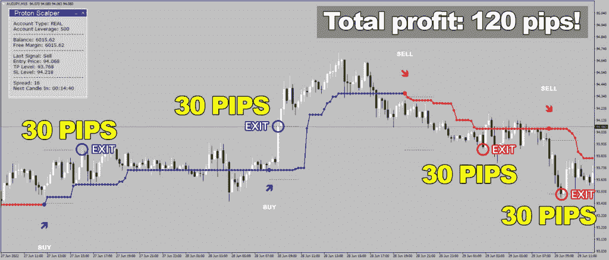
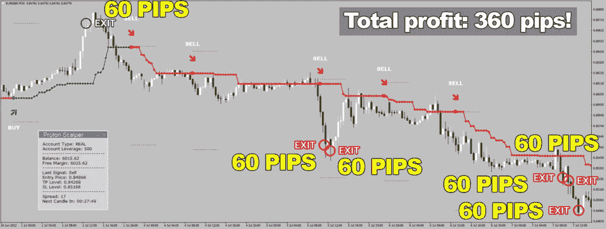

# 质子黄牛回顾-宏伟的交易软件

> 原文：<https://medium.com/coinmonks/proton-scalper-review-magnificent-trading-software-57c9399daead?source=collection_archive---------60----------------------->

**什么是质子黄牛？**

[**质子黄牛**](https://bit.ly/ProtonScalper) 是一个难以想象的精确指针，可以产生精确而有益的买入/卖出信号。有了质子黄牛，你终于可以让你的家人舒舒服服地呆在家里，而不用面对毫无意义的挑战，也不用费尽周折去挑选从哪里取钱

与质子黄牛权力在您的政府，您将获得高复发交流与无与伦比的胜率-零拥挤。

**质子黄牛党如何让你的交易变得更好？**

质子黄牛是由一群经验丰富的经纪人和编程工程师设计的，以确保它做一个任务，特别是一个差事:它为客户带来现金。所有其他的事情都很完美，但并不那么重要——首先，交换程序应该为经纪人创造收益。这就是它的主要目标——制造一个在未来很长一段时间内对你都有生产力的设备。

这使得质子黄牛真的不同寻常:虽然不同的设备忽略了适应不断变化的经济形势，质子黄牛有效地改变到另一个轴承。把它当成一个微调过的乐器:最细的标志就像是质子黄牛的巨大警报。

您不需要强调任何事情:只需在您的图表上加载质子头皮，您将看到它可以在眨眼之间完成令人震惊的结果。这正是最终将帮助你开始另一种生活的东西:有了质子黄牛，你将真正想要拥有一种你渴望的生活方式。

**选择质子黄牛的主要原因有哪些？**

**新颖的技术**

利用商业头脑创造的富有想象力的技术

**简单利润**

只需跟随异常准确的买/卖标志，轻松获利！

**没有重画！**

没有可怕的冲击，只有可靠的买/卖标志，保持固定设置。

**瞬间下载**

购买后，你将被转移到会员区页面下载加入。

**正版和模拟账户**

实际上，你会希望在两个交易账户上同时使用指针！

**整天，天天支持**

质子黄牛集团通常准备解决您的查询。你可以在周末和晚上给我们发邮件。

**质子黄牛交易成绩有多好？**

与质子黄牛你永远不会错过好处:只要看看它的迹象如何跟随市场的每一个回合！英镑/瑞士法郎 M1 时段 6 次成功中的 6 次！

质子黄牛不只是为您带来现金，它为您带来现金迅速，安全和有效。5 次欧元/美元的交易，M5 时间周期——您的记录将增加 100 个点！

当任何剩余的商人正在经历无尽的时间试图计算下一个市场的发展，你可以简单地放松和观看质子黄牛去做生意:4 澳元/日元惊人的成功，M15 时间跨度！

难以置信的准确性和无与伦比的结果:质子黄牛舀每一个潜在的好处，从市场上！欧元/英镑 360 点，M30 时间周期——梦想如预期般实现！

**质子黄牛有什么特别之处？**

**适合交易者，全面考虑，**
质子黄牛的互动点的直接性使其在任何情况下都是合理的，对于那些在这一点上没有下载 MetaTrader 终端的交易者来说，其中心的计算将决定它对交易社会的每一个人来说都是一个非凡的决定，即使是最有经验的人。

几个有利可图的策略的组合它的团队相信这个项目应该是最好的交换方案。为了达到这个目的，他们在选择计算将包含的内容时进行了令人难以置信的考虑。我在这几年的交流中所经历过的最好的交流安排，都是在这场演出中艰难地完成的。

**试玩交易系统**
下载质子黄牛程序并将其引入 MT4 阶段将花费您不到 5 分钟的时间。在你把它放在你的图表上之后，这就是全部了！现在，你可以通过跟踪 Proron 黄牛的精确买卖信号来赚钱——就这么简单！

**由拥有 9 年以上经验的交易员制作**
这是一个家族企业，因此他们在为自己的组织挑选人员时会格外小心。他们关注个人，他们意识到编程解决了组织和工作的问题。因此，每一位协助他们设计产品的设计师都是经验丰富的经销商。

**宝腾黄牛将如何帮助你实现交易利润最大化？**

这个令人难以置信的框架将允许你限制花在屏幕前的时间。在任何情况下，当你和你的朋友、家人在一起或者做你最想做的事情时，你都会从中受益。很棒，是吧？

**进入一键交易**
当新的标志产生时，屏幕上会弹出质子黄牛管理器，您只需点击一键即可进入交易！因此，当达到理想的获利水平时，退出你的交易所，

**宝腾证券经理因此离开交易所。**

不需要靠近 PC！增加你的收益
这个非常简单:当你限制你的不幸时，你就增加了你的收益。当每一个周期都自动化时，你就不会犯错误，也不会错过赚钱的机会。

**质子黄牛管理器有哪两种模式？**

万一你认为你的质子黄牛应该进入交易所，然后自然离开，你应该选择默认的半 EA 模式。

当另一个信号产生时，交换板将出现在屏幕上，显示与下一次交换相关的所有数据。你只需要选择一个——同样的“在止盈位出场”或者“在相反的信号出现时出场”——然后点击它。然后，在这一点上，产品将进入交换的每一个基本设置，当交换完成时，它将自然关闭并受益！

另一个选择是让质子黄牛参与 100%编程模式。对于这种情况，您需要在管理器的属性中启用 AutoMode，然后您出色的编程将完成每一次交换。你一点工作都没有！没有时间花在电脑前，有更多的机会与朋友和家人一起投入高质量的精力，或者完成你真正想做的事情。请记住，您将会四处走动，质子黄牛将会为您监督此类交易，就像这个星球上最杰出的同事一样。

带来现金几乎做任何事情从未如此简单-与质子黄牛和其经理的自动模式，你将永远不需要强调搜索在未来任何一点的收入！

[**点击此处，从其官方网站获得质子黄牛特别折扣**](https://bit.ly/ProtonScalper)

> 交易新手？尝试[加密交易机器人](/coinmonks/crypto-trading-bot-c2ffce8acb2a)或[复制交易](/coinmonks/top-10-crypto-copy-trading-platforms-for-beginners-d0c37c7d698c)