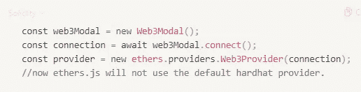

# Hardhat 智能合同开发中的提供者和签署者

> 原文：<https://medium.com/coinmonks/providers-and-signers-in-hardhat-smart-contract-development-15f6f51abd81?source=collection_archive---------3----------------------->

> 我为什么写这个博客？当开始智能契约测试时，我发现在编码时理解签名者非常令人困惑。

在本文中，我将结合 Ether.js 使用 Hardhat 来部署区块链并与之交互。

# 签名者与提供商

> 签名者=钱包账户，我们从供应商那里得到一个签名者。

# 签名者简介

*   简而言之，签名者=钱包账户。**ethers . js 中的 Signer 是代表以太坊账户的对象。**
*   要理解什么是“钱包账户”或“以太坊账户”，我们可以简单地联系到我们已经知道的东西。
*   如果你第一次使用元蒙版，你需要创建你的“钱包”。创建钱包后，您将从 metamsk 获得一个唯一的钱包帐户。
*   如果我们不能将它与“以太坊区块链”联系起来，这个账户就没有意义，因为你总是查询*“我在 Goerli Testnet 中的账户余额”*我们不是简单地查询*“我的账户余额”。*
*   这里的格利试验网是区块链以太坊。这可以直接联系到“提供商”。
*   如果我们知道一个账户的私钥，就意味着我们是这个账户的主人。

## 签名者能做什么？

*   我们可以使用以太坊钱包/账户做任何事情。
*   使用以太坊账户，我们可以发送“签名”信息。

## 你能产生多少签名者？

*   我们不会“生成”新的签名者。这些只是区块链中的以太坊帐户，类似于我们在第一次安装时需要创建的元掩码帐户。
*   我们可以生成尽可能多的签名者。
*   在生产中，我们可能会有几个钱包帐户。但是当开发智能合同时，我们需要更多的功能来测试，这样我们就不必经历元掩码的痛苦来按需生成新帐户。
*   对于使用 Hardhat 框架的开发人员，我们可以利用`import {ethers} from “Hardhat”;`创建一个 Hardhat-Ethers 库的实例。然后，我们可以在“测试区块链”上生成大约 20 个这样的“按需”地址，这些地址是本地的，只是为了测试目的而创建的。我们可以使用`ethers.getAccount()`生成

## 有 3 种方式生成签名者

1.  (生产)使用`Wallet` -假设你已经有一个以太坊账户/钱包账户。
2.  (开发)使用 ethers.js `ethers.getSigners()` -正好生成 20 个帐户。参考
3.  (开发)使用 ethers . js`ethers.Wallet.createRandom()`——如果你需要更多，这将不断产生新的帐户一个接一个。[参考](https://ethereum.stackexchange.com/questions/123519/how-to-get-more-than-20-signers-with-ethers-js-hardhat-waffles)。

## [**安全帽-乙醚**](https://hardhat.org/plugins/nomiclabs-hardhat-ethers#hardhat-ethers) **vs** [**乙醚. js**](https://github.com/ethers-io/ethers.js/)

*   Hardhat-ethers = ethers.js +其他 Hardhat 助手
*   为了便于开发，我们一般在 hardhat 开发中使用 hardhat-ethers，而不是 ethers.js。
*   要获得 hardhat-ethers 中助手的完整列表，请访问[参考文献](https://hardhat.org/plugins/nomiclabs-hardhat-ethers#helpers)。

# 提供者

*   我们通过区块链的一个节点连接到区块链。提供程序用于连接到这些区块链节点。有两种类型的提供者`JsonRpcProvider()`和`Web3Provider()`

## `JsonRpcProvider()` vs `Web3Provider()`

*   JsonRpcProvider():当我们使用 RPC URL 直接连接到区块链时使用它。
*   Web3Provider():当我们不使用 RPC URL 连接到区块链时使用它。我们使用第三方工具，如 metamask，然后使用 RPC 连接到区块链。在开发 dapp 时，我们需要指定我们需要通过 metamask 或其他钱包连接哪个 EVM 链。
*   在两种 JsonRpcProvider()方法中，我们可以有多个签名者，假设我们知道私钥，但是一般来说，对于一个 dapp 的一个事务，我们只使用一个签名者。

1.  当我们想通过**元掩码**进行交易时，使用`Web3Provider()`。

web3provider

2.使用`JsonRpcProvider()`，当我们想通过编程直接使用账户的私钥访问区块链时，我们使用这个。这不会向用户显示任何窗口/弹出窗口，因为交易不需要连接到用户钱包。当我们不想用 metamask 钱包付款时，就用这个。

jsonrpcprovider

> 交易新手？试试[加密交易机器人](/coinmonks/crypto-trading-bot-c2ffce8acb2a)或者[复制交易](/coinmonks/top-10-crypto-copy-trading-platforms-for-beginners-d0c37c7d698c)