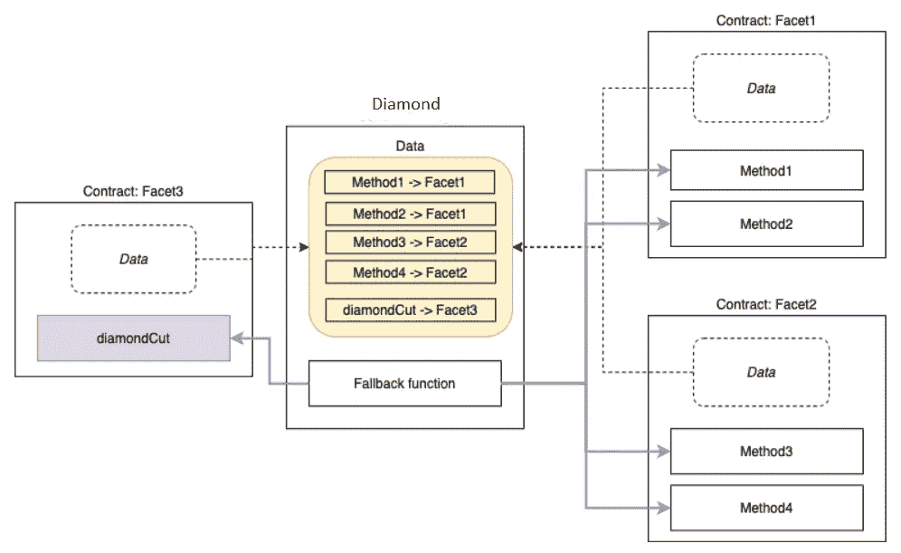

# 代用钻石

> 原文：<https://medium.com/coinmonks/proxy-diamonds-c9900264bb2f?source=collection_archive---------5----------------------->

在我的[上一篇文章中，](/coinmonks/transparent-proxy-pattern-uups-d7416916789f)我写了两种主要使用的代理模式:透明代理模式和 UUPS(通用可升级代理标准)。正如我在那里所说的，创建这种模式是为了避免代理选择器冲突。钻石，也被称为多面代理，也解决了这个问题。但除此之外，它还解决了一个问题。

## 新问题——智能合约的规模

智能合约的最大大小是 24 kB，不能再大了。当然，如果我们想创建更复杂和精细的契约，这是一个问题。钻石就在这里出现了。这个问题的解决方案很简单，听起来像是“让我们把这个合同分成更多的合同”。很简单，不是吗？如果我们使用 2 个契约，我们可以编写 48 kB 大小的文件，如果使用 3 个契约，我们可以编写 72 kB 大小的文件。因为没有数量的限制，我们可以创建如此复杂和长的文件。所以，当我们知道如何将契约的规模扩展到极限之外时，我们应该把注意力集中在如何将它们全部连接起来的方式上，并且使这种连接尽可能平滑。

## 钻石及其刻面

正如我在这篇文章的标题中所说，钻石是一个代理。所以这是它如何工作的线索。在这个模式中，我们有主合同—钻石和我们想要使用的所有合同—刻面。这张图片展示了一个系统构建为菱形的例子。在这篇文章的其余部分，我将尝试解释这里显示的所有元素。

Diamond with facets. The picture comes from [here](https://hiddentao.com/archives/2020/05/28/upgradeable-smart-contracts-using-diamond-standard).

在 diamond 中实现了 *fallback* 函数，它让我们能够从 facets 中使用外部函数。所有方面都是分开的、独立的契约和库。方面可以与其他方面共享内部函数和状态变量。此外，所有方面都是无状态契约——这意味着它们没有契约存储。使用刻面的最大优势是可以使用以前部署的契约作为刻面，并且许多不同的钻石可以使用一个刻面。

刻面能够从钻石的存储器中读取和写入。钻石可以用来储存，一种[永恒的储存模式](/coinmonks/proxy-eternal-storage-f67c54972cdb)。这种存储管理方式的优势在于，我们可以根据需要选择使用任意数量的变量。这种存储模式不是唯一可以使用的模式。

## 如何通过所有刻面找到被调用的函数？

如果我们的契约只是一个契约，那么从实现它们的函数中调用一个是一件容易的事情。如果我们的契约只是简单的代理和逻辑层的代理，这个任务就比较难了。我们必须有逻辑契约的当前地址的地址，然后用这个地址和被调用函数的签名使用*delegate call*。但是，当我们的功能不是在一个契约中实现，而是在许多契约中实现时，我们应该如何实现它呢？

当我问自己这个问题时，我的第一个尝试是使用地图。后来我读到，这是一个好镜头。在菱形中，我们使用一个映射，其中键是函数的选择器，对应的值是实现该函数的智能契约的地址。我们在标有`Data`的黄色区域的图片上看到了这一点。

当有人想使用刻面中的任何函数时，他调用钻石契约，并使用*回退*函数。实现了*delegate call*函数，该函数与在映射中对应于所选函数的选择器的契约相连接。

因为映射中的键是独立的、不同的元素，所以我们不会将两个值与一个键(选择器)连接起来。由于这一点，我们避免了不同方面之间的代理选择器冲突问题。

## 在 diamond 中添加、替换和删除函数

菱形模式的优点是可以相对容易地改变它所使用的功能列表。这个模式的核心是映射包含的函数选择器和方面的地址。因此，在 diamond 中添加、替换或删除一个函数只是对映射中的正确元素进行操作。但是如果每个人都能做到，将会出现巨大的混乱和安全漏洞。因此，这些操作有一个明确的函数— `diamondCut`。该函数在单个事务中更新任意数量的方面中的任意数量的函数。所以我们看到它是原子操作，换句话说，它是全有或全无的操作。在单个事务中执行所有更改可以防止数据损坏，这种损坏可能发生在多个事务中完成的升级中。感谢 defined function 在我们的钻石核心映射中进行任何更改，我们保护了自己。

钻石图案没有钻石所有权/认证的定义标准。可以创建任意机制来授予使用`diamondCut`的权限。这种模式并不限制在这种情况下的使用，但是我们在授予对这个函数的访问权限时应该非常小心。

## 利弊

这种模式的好处是:

*   一、钻石的恒定地址
*   从许多不同的合同使用功能的可能性
*   添加/删除或替换 diamond 使用的功能的简单方法
*   有权创建大于 24 kB 的合同
*   重用以前部署的合同
*   独立的功能可以在独立的刻面中实现，也可以在钻石中一起使用

这种模式的最大缺点是它的复杂性。为什么我会这么想？因为当系统越复杂，就越容易出现安全漏洞。在这个模式中，我们从不同契约中使用了许多不同的函数。该系统在安全性维护和检查方面比简单的代理模式要求更高。

我希望这篇文章对你有用。如果你有任何想法，我如何能使我的帖子更好，请告诉我。我随时准备学习。你可以通过 [LinkedIn](https://pl.linkedin.com/in/szymon-skrzy%C5%84ski-881462214) 和 [Telegram](https://t.me/eszymi) 与我联系。

如果你想和我谈论这个话题或者我写的其他话题，请随意。我乐于交谈。

快乐学习！

> 交易新手？试试[密码交易机器人](/coinmonks/crypto-trading-bot-c2ffce8acb2a)或[复制交易](/coinmonks/top-10-crypto-copy-trading-platforms-for-beginners-d0c37c7d698c)