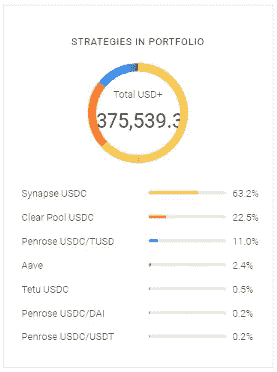

# PSA——在加密领域，透明不一定等于安全

> 原文：<https://medium.com/coinmonks/psa-in-crypto-transparency-doesnt-necessarily-equal-safety-86b23ae9f471?source=collection_archive---------15----------------------->

嘿，伙计们，随着 FTX 等交易所周围的所有 FUD 在过去一个月里崩溃，我已经决定尝试将我的大量资产从集中交易所剥离，转而在 DeFi 上赚取收益。如果你关注过我以前的一些文章，你会知道在过去的几个月里，我对产生一些最高收益的不同的 [stablecoin 协议](/@CryptosWith/top-places-to-stack-stablecoins-all-13-apy-without-algos-lock-ups-or-altcoins-11-2022-5a0dcc4c13aa)做了大量的研究，overnight.fi 就是其中之一。

# 什么是隔夜. fi？

如果您不熟悉 Overnight.fi，它是一个 stablecoin 协议，本质上利用了其他 stablecoin 协议，更具体地说是与、、戴的 stable coin 协议。

他们的主要连锁店在多边形和币安，但最近他们增加了雪崩和乐观。本质上，Overnight.fi 的工作原理是，你将$USDC 换成$USD+，只要你持有$USD+，它就会每天自动调整你的收益率。$ USDC/$美元+可以直接在 DAPP 上进行双向兑换。

美元+ APY 的平均汇率可能会有所不同，而且可能会有很大的差异，根据你使用的网络，过去一周的 APY 汇率在 11%左右。我在过去高度评价过 Overnight.fi，主要有两个原因:他们的策略非常透明，这意味着你确切地知道你的 stablecoins 发生了什么，还因为重新设定基数的机制是天才的——这意味着没有浪费汽油费，除了你的钱包里有多少代币之外，没有什么可以跟踪的。对于我来说，就风险而言，隔夜. fi 勾选了很多框…但这并不意味着我仍然不能得到 rekt。

# 什么意思

我以为过夜。菲是一个非常安全的游戏。这就是为什么当我前几天登录时，发现我的“每日支出”是这样的，我感到如此惊讶:

我立刻意识到这是一个错误，我刷新了页面几次，然后担心我变得粗糙，我最终去了他们的不和谐频道，看看是否有任何关于此事的新闻。你瞧，我看到了下面的[公告](https://discord.com/channels/933003627444969552/933003628061536288/1048199105584844812):

**这是我第一次成为合同漏洞的受害者。**本质上，AVAX 上有一个漏洞，一名黑客利用 950 万美元的快速贷款，在隔夜 fi 的 stablecoin 策略中操纵 USDC 的价格。

如果你不熟悉闪贷，它本质上是一种无抵押贷款，没有任何借款限额，但是用户必须在同一笔交易中归还借款。也许最著名的“闪贷攻击”之一是去年 3 月向无聊猿游艇俱乐部持有人空投的$APE，在那里，用户能够获得足够大的闪贷，以租赁 5 只无聊猿，要求空投价值约 80 万美元的$APE，然后一次性归还无聊猿。

# 透明度≠安全性

正如我之前提到的，Overnight.fi 非常透明，从技术上来说，你可以使用与他们相同的策略，这些策略都是公开的:

他们所有的[智能合同地址](https://docs.overnight.fi/advanced/contract-addresses)都可以通过他们的白皮书公开获得，他们也在今年早些时候接受了 [Hacken](https://hacken.io/wp-content/uploads/2022/02/Overnight_03022022_SCAudit_Report_2.pdf) 的审计。事后我意识到，Overnight.fi 案例中的透明度是一把双刃剑——你可以看到利润是如何产生的，但本质上，如果战略/合同不安全，它也可以作为事情如何被利用的蓝图。

我认为最令人沮丧的是，在每个人都在说集中式交易所不可信，DeFi 是最安全的去处之后，这种情况又出现了。

# 结论；一线希望

也许我在这里对 DeFi 太苛刻了，因为不管我在这次利用中的损失，到目前为止，2022 年我在集中交易所的损失仍然比我在 DeFi 协议上的损失更多。然而，重要的是要记住，DeFi 本身也不是完全安全的。事实上，仅在 2021 年就有将近 23 亿美元从 DeFi 协议中被取走，我可以想象 2022 年会更多。此外，在一个非常规范的空间中，对于那些违反规则的人(即 SBF)来说，几乎没有什么影响或后果，并且在保护性法规起草之前，我认为合同漏洞和其他诈骗/盗窃将会继续发生。

我还在生气吗？绝对的。被抢劫很糟糕，但我感谢几件事——大约一个月前，我在一夜之间取出了大部分资金，所以我很高兴我没有失去这些。此外，谢天谢地，黑客没有得到我 100%的资金，因为 Overnight.fi 团队立即暂停了所有链上的 USD+并退出了头寸。

感谢你花时间阅读这篇文章，一定要在推特([https://twitter.com/CryptosWith](https://twitter.com/CryptosWith))上关注我，获取我所有的最新消息。

免责声明:最后提醒一下，这不是财务建议，仅用于教育和娱乐目的。请一如既往地做自己的研究，找到最适合你的投资。大家注意安全。

> 交易新手？试试[密码交易机器人](/coinmonks/crypto-trading-bot-c2ffce8acb2a)或者[复制交易](/coinmonks/top-10-crypto-copy-trading-platforms-for-beginners-d0c37c7d698c)