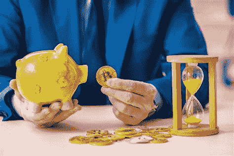

# PSA——开立加密个人退休帐户前了解你的风险

> 原文：<https://medium.com/coinmonks/psa-know-your-risks-before-opening-up-a-crypto-ira-a191844c3c4b?source=collection_archive---------14----------------------->

嗨，伙计们，下面是我在试图等待熊市结束时，一直在挖掘的一系列不同事物中的另一个版本。在你开始之前，如果这篇文章是 FUD 的推广者，我也想提前道歉，因为这真的不是我的本意。随着 [Voyager 最近宣布第 11 章重组，](https://www.prnewswire.com/news-releases/voyager-digital-commences-financial-restructuring-process-to-maximize-value-for-all-stakeholders-301581177.html)我发现我们继续对我们投入资金的事情提出问题是绝对必要的，特别是如果我们正在考虑在未来 30 多年内投入资金。我非常喜欢冒险，但我也认为在我们冒险之前，问自己一些问题是很重要的。此外，我还想明确表示，我非常希望 crypto IRA 的成功，因为如果他们能够工作，他们将有巨大的利益，像我这样的普通人甚至有资格使用他们。与 1%相比，我们没有多少“优势”，我认为个人退休帐户(更确切地说是罗斯个人退休帐户)就是其中之一。

# 为什么是加密个人退休帐户？

T2 个人退休帐户或个人退休安排基本上是一种人们可以为退休进行延税投资的方法。换句话说，根据你开设的个人退休帐户(因为有好几个)，你可以通过将资金投入个人退休帐户来减少潜在收益的税务负担。就加密货币而言，这听起来对霍德勒夫妇来说非常好，因为如果你打算持有你的 BTC 20 年左右，那么为什么不把它放入类似罗斯个人退休帐户的东西，这样当你退休时，你的密码就可以去月球了，你就不必支付资本利得税了？

如果你报告了去年牛市中的任何收益，你就会亲身体会到支付大部分加密收益的痛苦，所以我完全理解为什么许多人一直在考虑将资金投入这些相对较新的和即将到来的加密货币 IRA 提供商。

我认为，围绕加密货币的市场已经有足够多的 FUD，所以请相信我，当我说我不想再增加更多时，但鉴于目前正在冲击多个平台的传染病，我认为强调这些 IRA 提供商的一些风险也很重要。

在尝试不同的加密个人退休帐户之前，我创建了一份清单，帮助我了解我正在进入哪种加密个人退休帐户平台…

# 最大的第一:破产

在以菲亚特为基础的个人退休帐户中，通常资金由 FDIC(联邦存款保险公司)承保，最高金额为 250，000 美元，或者，如果您的个人退休帐户是股票和债券，大多数经纪帐户由 SIPC(证券投资者保护公司)保险承保，如果您的经纪公司破产，最高可承保 500，000 美元。在我的研究中，我还没有找到一个加密货币个人退休账户提供商，它已经阐明了一个足够的应急计划，如果你的基金本身作为一家公司倒闭，会发生什么。事实上，随着去年 5 月比特币基地出现一些破产恐慌，首席执行官 Brian Armstrong 自己发现，在世界末日的情景下，客户资产可能受制于债权人:

这意味着客户的资产(你和我持有的比特币基地的资产)将在其他所有人之间分配，包括所有股东和在你之前介入的风投。这通常相当于普通零售商得到了一美元的几分，因为我们通常是最后一个排队的人得到剩余的东西。Brian Armstrong 的推文读起来也是双重警告，因为许多最大的加密 IRA 提供商(即 iTrustCapital，Alto)有一些(如果不是全部的话)客户的加密货币存放在[比特币基地托管处](https://www.coinbase.com/custody/assets)。考虑到市场变化有多快(有时很危险)，如果您的加密个人退休帐户提供商破产，或者如果您的个人退休帐户提供商雇佣的第三方破产，重要的是要弄清楚您的加密货币是否会进入破产程序。

> 交易新手？试试[密码交易机器人](/coinmonks/crypto-trading-bot-c2ffce8acb2a)或者[复制交易](/coinmonks/top-10-crypto-copy-trading-platforms-for-beginners-d0c37c7d698c)

# 有了 Crypto，你永远不会说自己太大而不能倒

去年 5 月，Terra 在不到一周的时间里损失了约 400 亿美元。6 月，Genesis 和 Celsius 因 3AC 违约而报告了 9 位数的损失，今天，Celsius 1.7 万用户仍然无法提取他们的资金。不管一个平台/实体有多受欢迎，可以肯定地说，在加密领域，事情可能会失败，而且会很快失败。

在处理个人退休账户时，我认为看一家公司的历史记录和寿命来决定他们是否会继续持有你的密码直到退休是加倍重要的。从更好的角度来看，LUNA 在 2022 年 4 月达到了 116 美元的历史高点，这仅仅是 3 个月前的事情。别说 3 个月，你真的愿意把你的资金交给一个没有保险的实体保管 30 年吗？

# 透明度是关键，尤其是当它“不是你的钥匙”的时候

在 TradFi 领域，通常重要的是要看你的资金持有人是否对其客户负有信托责任，或者换句话说，是否存在某种信任，即该公司参与了对其股东有利的互利投资实践。假设这对于管理你的加密货币的人也同样重要。但是，作为一个快速练习，请访问任何加密货币 IRA 的*任何*服务条款，只需按 CTRL+F 键访问“受托人”一词。：

按字母顺序排列:

https://www.altoira.com/terms-of-service/

https://bitcoiniracompanies.com/terms/

iTrustCapital:[https://itrustcapital.com/terms](https://itrustcapital.com/terms)

在你读完这一节之后，问问你自己，如果他们让你退休 30 年，你是否感到舒服。你需要希望，不管是谁管理你的基金，都不会在你没有完全意识到并同意的情况下从事一些暗箱操作，或者如果他们可以在你没有同意的情况下在你的基金周围移动。

由于许多提供商提供低费用(甚至免费)，这实际上让我更加怀疑 IRA 公司是如何盈利的，或者甚至更加怀疑，如果他们给你数百美元开设一个新账户。现在，如果你一直在关注我的博客，你应该知道，显然有很多方法可以相对安全地产生巨大的收益，只是要确保从长远来看，有人不会从你的退休账户上拿走 10 倍的杠杆……除非你同意这样做。因为如果你的基金有可能被锁定 30 年，我敢打赌，这个 10 倍的头寸一定会在某个时候被清算。

# 每个人都会说他们是安全可靠的，但是万一遭到黑客攻击呢？

如果你关注上个月早些时候的新闻， [IRA financial 已经对他们的加密货币托管人 Gemini 提起诉讼](https://fortune.com/2022/06/07/ira-financial-gemini-lawsuit-37-million-crypto-heist-retirement-accounts/)，此前[一名黑客在几秒钟内从人们的退休账户中取走了大约 3600 万美元](https://www.bloomberg.com/news/articles/2022-02-14/ira-financial-hacked-36-million-in-cryptocurrency-stolen)。想要一本清醒的读物吗？我想邀请你阅读相应的 [reddit](https://www.reddit.com/r/Gemini/comments/sp7raq/ira_financial_and_gemini/) 帖子中的评论，投资者在那里谈论失去他们的退休金和一生的积蓄。

尽管事件仍在发展中，但从 IRAF 黑客事件中还是可以获得一些重要信息:

1.  据我所知，受害者还没有完全康复。
2.  可能至少需要几个月的时间，才会有人为资金损失承担法律责任(或者至少达成和解)。
3.  没有提及抢劫和他们如何追回受害者资金的透明度(或至少从 10 分钟后我看不到的情况来看)，IRA financial 仍在继续运营，甚至仍然为注册奖金提供高达 200 美元的现金返还:

4.我认为这很好，所有这些公司为了确保你的资金安全而采取的措施，他们应该仍然有一个应急计划，如果他们真的被黑客攻击，他们应该如何应对，这应该与用户分享。

老实说，我同情 IRAF 黑客事件的受害者。许多评论让人想起我在卢娜的死亡螺旋后读到的评论，然而我觉得也许更同情爱尔兰共和军的受害者，因为他们并没有试图获得任何德根收益率或利用任何赌注——他们只是想要一个安全的地方来长期 HODL 他们的秘密。

# 我不想这么说，但很多问题都可以通过监管来解决

事实是，在联邦存款保险公司/SIPC 保险的个人退休帐户中，这种情况永远不会发生。政府支持联邦存款保险公司在这种情况下帮助消费者。如果秘密 IRA 也能得到同样的保证，比如通过 FDIC 或 SIPC，那么很多风险就无关紧要了。有了银行挤兑和破产的保障，理论上你可以把你的$BTC 全部押进去，晚上还能睡得很香，因为你知道你的退休账户早上还在。

看到加密 IRA 的风险，我现在也完全理解了为什么许多加密公司，比如那些没有银行的公司实际上在乞求监管(尽管做得很正确)，因为这将促进对加密应该代表的价值的信任。

# 结论

我目前是否在加密个人退休账户中有资金？不。然而，尽管有这些风险，我也仍然没有放弃在未来某个时候做一个加密个人退休账户，有这么多不同的产品，我仍然希望我能找到一个我对其风险感到舒服的——也许这将是以后的帖子。与此同时，我将继续关注政府监管的任何动向，并持有我的美元 BTC，直到它崩溃。

我还有没有错过任何其他明显的风险？或者，如果你参与了一个加密个人退休账户，有什么我错过的让你投资的缓解点吗？如果是这样，我很乐意在下面的评论中听到它，这将大大有助于我自己的搜索。

像往常一样，再次感谢你的阅读，一定要在推特上关注我，分享我所有的最新更新:[https://twitter.com/CryptosWith](https://twitter.com/CryptosWith)

免责声明:以上内容均非财务建议，仅供娱乐和教育目的。我不是财务或税务顾问，只是互联网上的一个普通人，所以请一定要做你自己的研究，找到什么投资可能对你最好。