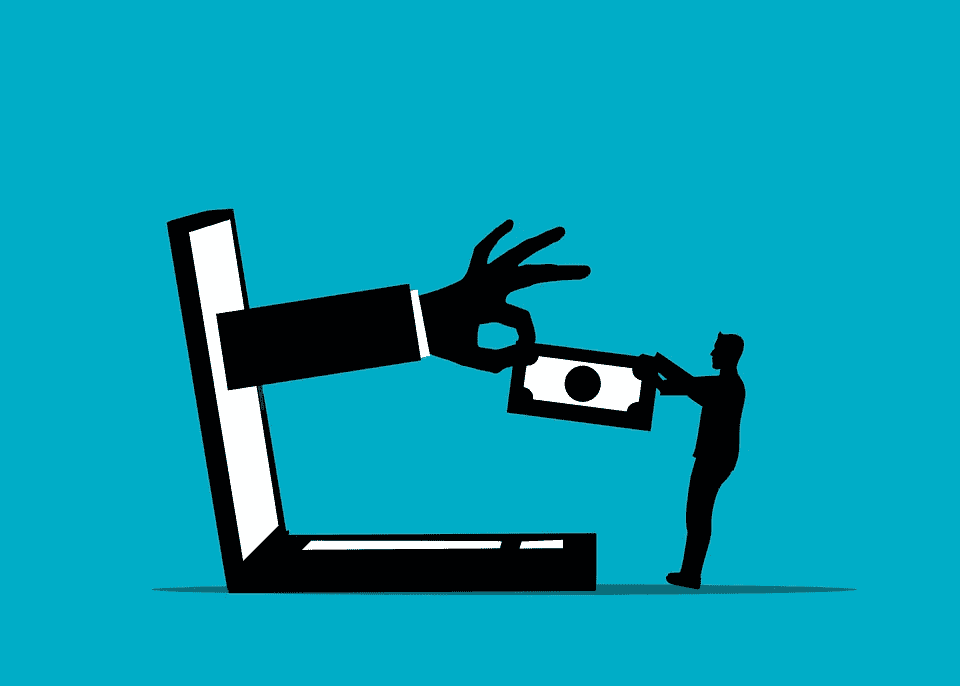
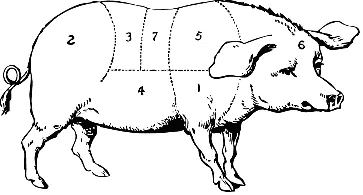

# PSA —警告您的父母有关加密诈骗

> 原文：<https://medium.com/coinmonks/psa-warn-your-parents-about-crypto-scams-ad26b9f9f71?source=collection_archive---------14----------------------->

我相信我们以前都听过这样的故事。无论是浪漫诈骗案、T2 礼品卡诈骗案还是 T4 技术支持诈骗案，我们都认为它们不会发生在我们身上。因为我们在这个领域受到的教育相对较高，我们可能不会。但这并不意味着我们的父母不会。

我不想透露太多关于我自己的信息，但我出生在大多数人认为的千禧一代的最前端，我的父母和我的姻亲都超过了 65 岁，知道我在秘密领域做了很多事情，他们开始问我一些让我非常震惊的问题:“我的一个朋友告诉我如何投资 10 万美元，然后获得 300 万美元！”或者…“你听说过这枚硬币吗(填空)，它现在几乎不值钱，但有人告诉我，它应该在短短几个月内从几分涨到几百美元！”如果这种说法没有吓到你，它们应该吓到你——涉及老年人的诈骗数量激增，而且没有迹象表明它们会停止增长。

幸运的是，我很感激我的父母愿意并且能够和我谈论这类事情，我也意识到我可以和我的父母开诚布公地谈论投资。我会解释为什么，我希望在读完这篇文章后，你会认识到与你的父母和爱人进行这些对话的重要性。

# 先来点背景知识

谢天谢地，我的父母已经对总体投资持相当怀疑的态度，但不幸的是，这个教训不是没有代价的。几十年前，我的祖父被他的一个“朋友”引诱到一个非常有利可图的投资机会，促使他在去世前几年投资了他一生的积蓄。钱转过去不久，“投资”就崎岖不平，对整个家庭造成了多代人的影响。

也许我祖父面临的最大问题是，他没有向他的孩子或妻子公开他所做的投资。因为当他向妻子说出自己的错误时，钱已经不见了。今天让我更担心的是，在科技和加密货币的新时代，骗子专门针对老年人，因为他们不仅对加密空间了解较少，而且因为他们通常坐拥相对较大的退休缓冲，这些缓冲可能在几分钟内失去，如果不是几秒钟的话。

根据去年的 [FBI 老年人欺诈报告](https://www.ic3.gov/Media/PDF/AnnualReport/2021_IC3ElderFraudReport.pdf)，加密货币已经成为几乎所有类型欺诈的首选支付方式，与前一年相比增长了 70%以上:

> “老年受害者的人数以惊人的速度上升，而损失金额更是惊人。2021 年，超过 92 000 名 60 岁以上的受害者报告给 IC3 造成了 17 亿美元的损失。这意味着损失比 2020 年报告的损失增加了 74%。”

如果你关注了我以前在[的帖子](/coinmonks/falling-victim-to-my-first-crypto-scam-61936c746a4a)，你会知道我自己也是一个骗局的受害者，我关注的许多博客和有影响力的人可以很容易地告诉你同样的事情——或者至少他们变得粗糙了一两次。(相信我，如果 Axie Infinity 的[首席开发人员被钓鱼，导致 6.25 亿美元的点击](https://www.theblock.co/post/156038/how-a-fake-job-offer-took-down-the-worlds-most-popular-crypto-game)，那么你或你认识的任何人都可能成为受害者。)然而，更让我担心的是诈骗者如何以各种方式专门针对老年人，随着 crypto 获得更多的采用，我认为针对老年人的诈骗只会获得更多的关注。

# 他们是如何针对老年人的？有很多，但最常见的可能包括:

# **生猪屠宰**:

骗子向爱情或财富的受害者提供承诺，继续让他们将越来越多的资金存入假钱包或项目。

# **技术支持骗局**:

这可能是最普遍的在线诈骗形式，但它通常涉及受害者在被通知他们的计算机有某种类型的安全风险需要修复后点击通过一个邮件链接。

# **庞氏骗局和泵转储:**

这些当然在加密中很普遍，它们涉及使用受害者的资金来偿还其他人的投资，或者基本上让受害者承受损失，而骗子则提前抛售。

# 为什么和父母交谈对你来说很重要？

对你的父母来说，通过了解一些加密的来龙去脉，你可能是他们生活中唯一理性的支持者，可以警告他们关于加密骗局的危险。根据最近的一篇博客文章:

> “许多长辈避免了被骗，因为一个年轻的亲戚意识到事情不对劲，并适当地报告了情况。”

这意味着，在成为每年发生的数以万计的老年秘密骗局受害者之一之前，你可能是你父母或亲人唯一的信息后盾。

# 结论:

在这一点上，至少在涉及到加密技术(以及其他可能对他们退休生活产生重大影响的东西)时，我已经让我的父母和姻亲向我保证，在卖掉农场之前，他们会先和我谈谈。我是密码专家吗？不。但我认为我至少可以帮助缓冲一些风险，如果我不在的话。

再次感谢你花时间阅读这篇文章，如果你还没有，一定要在 twitter 上关注我，获取我所有的最新更新:[https://twitter.com/CryptosWith](https://twitter.com/CryptosWith)

免责声明:本文中的任何内容都不是财务建议。请自行研究和/或联系财务顾问，找出最适合你的投资。

> 交易新手？试试[密码交易机器人](/coinmonks/crypto-trading-bot-c2ffce8acb2a)或者[复制交易](/coinmonks/top-10-crypto-copy-trading-platforms-for-beginners-d0c37c7d698c)