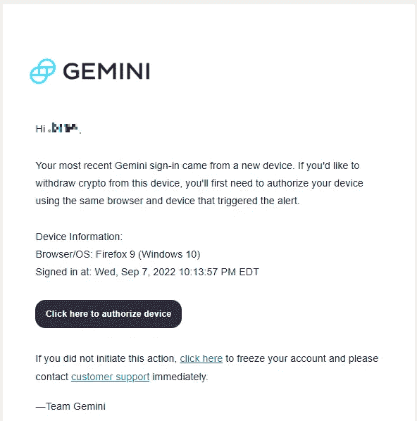
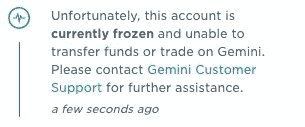
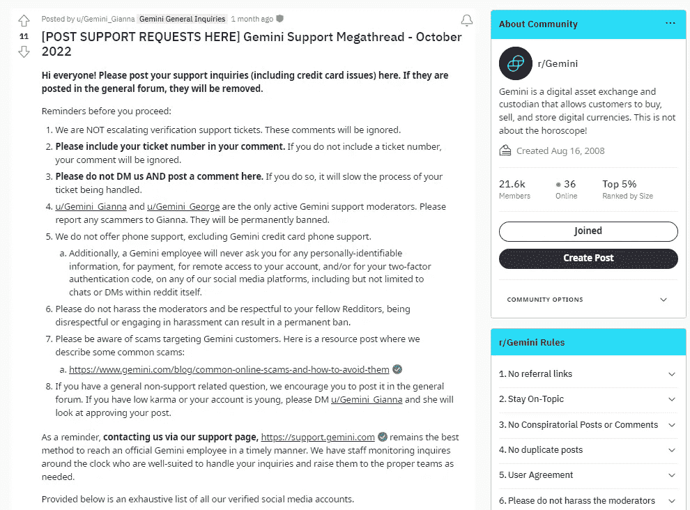
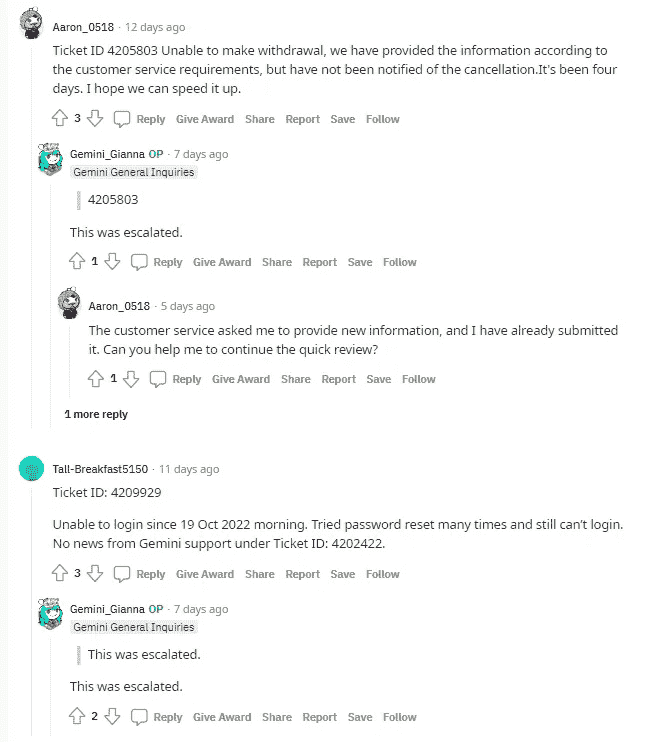

# PSA——如果你的双子账户被冻结，不要做什么

> 原文：<https://medium.com/coinmonks/psa-what-not-to-do-if-your-gemini-account-is-frozen-1bdcf19de0e4?source=collection_archive---------0----------------------->

嘿，伙计们，我敢肯定，无论是你的优步邮箱，还是我最不喜欢的亚马逊账户，在某个时候，你可能会收到一封类似这样的电子邮件:

假设你没有被钓鱼，并假设真的不是你，像任何负责任的公民一样，你可能会进入并立即更改密码。

9 月 7 日，在这样做之后，这正是发生在我身上的事情，在登录之后，我立即在屏幕上方看到一个通知，我的帐户被冻结了:

考虑到我真的只使用我的 Gemini 帐户来存放我的勇敢的$BAT，它的价值可能不到 100 美元，我并不太恐慌。无论如何，我不喜欢我无法控制我的资金，所以我立即联系客服，要求解冻。这第一步非常快，因为在我开了一张机票后，大约 24 小时左右，他们给了我回复，详细说明了我需要如何重新提交我的 KYC 信息。在 9 月 10 日这样做之后，我被告知在他们审查我的文件时等待。标准对吗？

再一次，我的文档在 9 月 10 日之前提交了，鉴于他们到目前为止的回复速度，我认为我的账户至少会在本周末解冻。

我大错特错了。

因为我用里程和积分做的所有事情，我习惯于与客户服务代表一起解决问题，我知道这些事情需要时间。为了确保我不会迷失方向，我提醒自己定期跟进这些事情。接下来的几周，我是这样跟进的:

**9 月 10 日** —重新提交了我在 KYC 的所有文件，得到了回复，告知我他们正在努力“解决您的帐户解冻问题”

**9 月 17 日**——我通过电子邮件联系客户支持，要求更新，但没有回应

**9 月 21 日** —我提交了 2 号票证，请求更新我的帐户状态，但没有回应

**9 月 28 日** —我提交了 3 号票证，请求更新我的帐户状态；收到的回复称，他们可以“向您确认，我的团队正在审核您的案例”

**10 月 7 日** —我通过电子邮件联系客户支持，要求更新，但没有回应

**10 月 11 日** —提交 4 号票证，请求更新我的帐户状态，但没有回应

**10 月 13 日** —提交 5 号工单，询问所有信息，并通过电子邮件联系客户支持，询问最新情况，并要求与真人交谈；收到回复，告知他们仍在“处理此案”然后我立即通过电子邮件回复，要求澄清为什么花了这么长时间——没有回应

**10 月 19 日** —我收到了对我 10 月 13 日电子邮件的回复，代表为延迟道歉，并通知我他们会“通知团队”

在这一点上，它推动了整整一个半月，我只是很生气。我也开始想到所有这些阴谋论，双子座本身将会毁灭，或者它们将会成为下一个航海家号或摄氏号。

因此，就像我每次寻找创新答案时所做的那样，我去了 Reddit，想看看是否有其他人和我一样的情况……你瞧，有很多人。

# Gemini Reddit 大型支持线程

浏览不同的 reddit 论坛，看到有多少人和我有*一样的*问题，如果不是更糟的话，真的很令人震惊。最终，我的细读把我带到了[双子座的超级支持线程](https://www.reddit.com/r/Gemini/comments/xutq0t/post_support_requests_here_gemini_support/)，它有以下几个方向:

除了上述规则/指示，我还从随后的评论中了解到，通过阅读支持手册 [Gemini Giana](https://www.reddit.com/user/Gemini_Gianna/) 或 [Gemini George](https://www.reddit.com/user/Gemini_George) ，任何希望通过 Gemini 客户服务获得帮助的人都应该注意以下几个关键事项:

1.  不要提交多张票，显然这只会使系统陷入困境
2.  这是毫无意义的开放第二个双子座帐户，如果你这样做，第二个将永远在待定 KYC
3.  您的票证升级大约需要 5-7 天(有时甚至更短)。
4.  如果您的票证升级，您的问题通常会立即得到解决

一旦你用你的票号发帖解释你的情况，其中一个模块最终会找到你，如下图所示:

# 最后，解冻

如此神奇的是，在我的机票升级的同一天，我收到了一封确认邮件，说我的账户终于被冻结了，距离我收到冻结通知已经将近整整两个月了。我通过 Reddit 解决了我的问题，尽管事实上我一直在跟进，骚扰 Gemini 的客户服务，以了解我的帐户发生了什么。

如果你有类似的情况，不管是不是双子座，我从这次经历中得到了一些启示，希望能对你有所帮助:

1.  正如我之前提到的，我的账户里只有 100 美元左右，谢天谢地，我不需要马上动用这些资金。如果你需要立即访问它，我无法想象这会造成多大的压力。
2.  一个平台有多安全或有多好并不重要，因为最终，如果它不是你的密钥，它就不是你的密码。因此，在将巨额资金投入一个地方之前，请记住这一点。
3.  我从来没有发现为什么花了这么长时间来解锁我的帐户，也许我永远不会知道。无能？他们积压得很严重吗？谁知道…
4.  Reddit 有所有的答案。说真的。即使是错误的。如果你遇到了什么问题，很可能你不是唯一一个遇到这种问题的人，快速查看一下其他人是如何解决你的问题的是值得的。

无论如何，感谢你花时间阅读这篇文章，请务必在推特([https://twitter.com/CryptosWith](https://twitter.com/CryptosWith))上关注我，获取我所有的最新消息。

免责声明:最后提醒一下，这不是财务建议，仅用于教育和娱乐目的。请一如既往地做自己的研究，找到最适合你的投资。干杯大家！

> 交易新手？试试[密码交易机器人](/coinmonks/crypto-trading-bot-c2ffce8acb2a)或者[复制交易](/coinmonks/top-10-crypto-copy-trading-platforms-for-beginners-d0c37c7d698c)