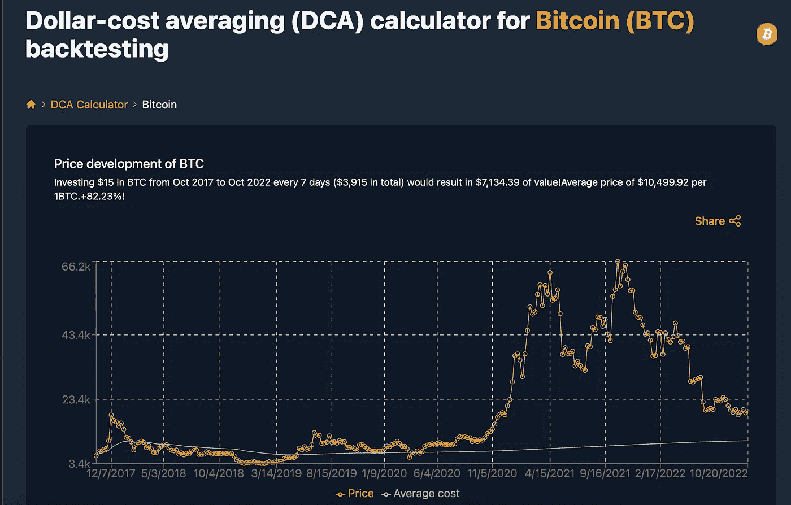

# 投资加密货币的心理

> 原文：<https://medium.com/coinmonks/psychology-of-investing-in-cryptocurrencies-19404bb3276f?source=collection_archive---------26----------------------->

Photo by [Milad Fakurian](https://unsplash.com/@fakurian?utm_source=medium&utm_medium=referral) on [Unsplash](https://unsplash.com?utm_source=medium&utm_medium=referral)

正如我们在我的上一篇文章中讨论的那样，加密货币交易平台变得更加容易获得，进入门槛(特别是对散户投资者而言)处于历史低点。投资经验很少的个人正涌入加密市场，推动指数级增长。这种新的投资者形象正进入一个以缺乏监管、信息不对称和过度波动为特征的市场。由此产生的摩擦是加密货币投资中非理性行为的推动力。

尽管我认为，由于当时我认为是好的研究，我准备以理性的心态进入这个世界。我不太骄傲地承认，我去年在 crypto 处于巅峰时买下了它，但不久之后就损失了一半投资。我还做过其他几个糟糕的选择，比如穿着糟糕的鞋子在雨中徒步旅行。毕竟，出于过度自信而做出糟糕的决定不是人之常情吗？

然而，在投资方面，我们希望避免人类行为中常见的陷阱。为了节省处理能力，大脑使用被称为[启发式](https://www.verywellmind.com/what-is-a-heuristic-2795235)的捷径。使用“经验法则”的方法加快了决策过程，但削弱了推理能力。我们的大脑非常善于保存能量。这就是为什么要使用快捷方式，比如抑制视觉输入或者忘记你刚刚读过的页面。这就是我们有时难以准确处理信息的原因。

许多这些认知偏差也会影响我们的财务决策。投资者的心理特征决定了信息是如何处理的，什么是优先考虑的，以及最终什么对他们的行为影响最大。有一个研究领域致力于此，叫做[行为金融学](https://www.investopedia.com/articles/02/112502.asp)，探索心理学对投资者决策过程的影响。

因此，通过有意识地摆脱“思维捷径”来进行投资是很有用的。具有讽刺意味的是，我们将试图智取我们大脑解决问题的常规能力。这说起来容易做起来难，因为即使是我们当中最精明的人也会误判事件发生的可能性，或者屈服于这些偏见。然而，理解这些偏见，培养一种观点感，并应用基本准则来改善我们的决策，可以让你的投资组合保持在水面上。

The Wall Street cheat sheet is a very useful indicator which shows the impulses that drive each phase of a market cycle.

# **注意常见的认知偏差**

## 1.确认偏差

我们都喜欢阅读或听到证实我们自己观点和信念的东西。比如，社交媒体已经成为传播误导信息的沃土。引人注目的标题经常被用来吸引人们对毫无根据的说法的注意。有些新闻文章声称是“事实”，但实际上是与读者一致的有偏见的观点。任何反对他们立场的证据要么被忽略，要么被过滤掉。我们将反复寻求确认偏见的令人愉快的安慰。

Hopium，一个在密码社区流行的短语，只不过是一个毫无根据的希望的假象。它包括像“今年月神经典到 1 美元”这样的说法通常，看跌的人被认为是散布恐惧、不确定性和怀疑的人(FUD)，即使他们的批评是合理的。这是因为人们不想要与他们的确认偏见相矛盾的客观分析。他们只是想要证实他们的确认偏见的信息来增强他们的希望。

## 2.沉没成本谬论

你有没有在电影院看完一部糟糕的电影，理由是既然钱已经花在这里了，不如充分利用它？不幸的是，我们没有意识到，通过观看这部电影，我们无法收回我们的钱。虽然这看起来合乎逻辑，但你正在屈服于沉没成本谬论。

当我们无法减少损失时，沉没成本谬误就会发生，因为我们已经在一项活动中投入了金钱或时间。我们没有做出合理的决定来最大化我们当时的效用，而是试图通过花费更多的时间或金钱来弥补失去的时间或金钱。

假设你投资了一种不稳定的加密货币资产，而不是一部电影。这种资产的价格在上个月下跌了 90%以上。当我们考虑出售时，我们会有一种强烈的后悔感，转而在资产上花更多的钱，希望收回我们最初的投资，达到收支平衡。这是因为人们在面临预期损失时会寻求风险(这种现象被称为[损失厌恶](https://www.investopedia.com/terms/l/loss-psychology.asp))，但在面对潜在回报的机会时会规避风险。

## 3.锚定偏差

当试图做决定时，人们经常使用锚或焦点作为参考或起点。同样，历史信息强烈影响我们对金融资产的评估。锚定偏差表明，你收到的初始信息在任何后续评估中的权重更大。信息有多真实没有关系；它可能仍然渗透到你的推理中。

就我个人而言，不久前我已经成为这种普遍认知偏见的受害者。我对 crypto 项目 Fantom (FTM)的评价，在投资时被严重高估。我对这个项目的介绍是基于 FTM 的价格可能在一年内从撰写本文时的 2 美元上涨到 30 美元，涨幅高达 1400%。目前，1 英尺兑换 0.21 美元。我下意识地选择将我的投资理论建立在价格达到 30 美元目标的基础上，即使市场有不可否认的下跌迹象。

## 4.激励不确定性效应

激励-不确定性效应是一种心理现象，在这种现象中，人们更多地被不确定的奖励而不是固定的奖励所驱动。比起已知的利益，我们更容易被未知的激励所激励，因为不确定性让我们觉得这是一场游戏。

由于动机不确定性效应，我们被高风险投资所吸引。尽管在一个拥有超过 21，000 种不同加密货币的市场中，我们获得下一个 1000 倍狗主题迷因币的几率很低，但我们选择了比特币或以太坊等成熟资产的持续温和增长。在激励不确定效应的情况下，激励我们的不是奖励。围绕它的是游戏的不确定性。

## 5.影响启发式

情感启发法是一种心理捷径，在这种方法中，人们做出的决定会受到他们当前情绪的强烈影响。本质上，你的情感(情绪反应的心理学术语)会影响你的选择和决定。这是一种偏见，其中恐惧、焦虑、惊讶和愉悦等情绪会影响并加速决策。它几乎是无意识的、无计划的，是对某种形式刺激的反应。因此，对风险和收益的估计侧重于情感而不是事实。

## 6.FOMO 还是害怕错过

FOMO，这是加密领域的一个普遍现象，也是我因为参与其中而感到内疚的一个现象。在这个市场和社交媒体时代，对于我们 FOMO 人来说，错过的感觉会非常强烈。您错过了一次大的成功，但是因为它仍在增长，您认为不参与是不合逻辑的。人们欣喜若狂，似乎一枚火箭正在飞往月球的途中，但你必须迅速行动以获得一张票。不幸的是，当 FOMO 上场的时候，火箭很可能已经离开了空间站，迫使你在一个不合适的时间做了一个糟糕的投资。

# 那么，我们该何去何从？

个人对生活中的不同事件有独特的情绪反应，伴随投资而来的兴奋、失望或恐惧也不例外。认识到你不会总是正确的，并找出你的错误是一个好的开始。

1.  设计并遵循一个策略:首先，支持你的目标可能是有用的，无论是入市时间还是当投资实现一定百分比回报时的退出计划。遵循长期方法可以减少陷入短期陷阱的可能性。系统投资计划(SIP)或平均成本是另一个被低估的策略。这是一种技术，在这种技术中，无论价格如何变动，都会定期(每天、每周、每两周或每月)分配预设金额来购买资产。将购买的物品平均分配，而不是大量购买，这将减少重大财务损失的风险，这不仅有利于你的钱包，也有利于你内心的平静。这允许你以较低的价格购买资产，平均购买价格，降低风险。这有效地消除了预测市场底部和顶部的负担。在没有水晶球的情况下，SIP 策略可能是最安全的赌注。虽然这看起来有些机械和无聊，但摩根·豪斯尔的评论是一个很好的提醒:

> “我发现，在做投资决定时，不断提醒自己投资的目的是最大化回报，而不是最小化无聊，这很有帮助。无聊完全没问题。无聊是好事”——摩根·豪斯尔，《金钱心理学》。

With a systematic investment of 15$ of Bitcoin every week for the past 5 years, you would have spent 3,915$. Today, even in this bearish outlook, you would have 7,134$ worth of Bitcoin. Source — [https://www.dca-cc.com](https://www.dca-cc.com/)

**2。打击你的确认偏见:**加密货币的从众心理和强大的社区性质使其很容易屈服于确认偏见。因此，在做出涉及加密货币的金融决策之前，像我们这样的个人投资者必须始终寻找大量准确的信息来源。寻找看涨和看跌的观点来帮助你克服确认偏见。

**3。不随大流:**社会权力的诱惑力难以忽视。然而，如果一个人希望成功，他必须抵制随大流和打造自己道路的冲动。“当别人贪婪时要恐惧，只有当别人恐惧时才贪婪，”沃伦·巴菲特雄辩地说。能做到这一点的人更有可能在大众情绪推动的市场中赚钱。恐惧和贪婪指数是评估市场情绪的极好工具。

**4。耐心:**俗话说“投资是马拉松，不是短跑。”这也适用于不稳定的加密市场，即使它被认为是一个快速赚钱的空间。就像在传统市场一样，抱着快速致富的心态进场，很可能会亏钱。明天我们可能不在月球上，但下一轮牛市会来；就像马拉松运动员一样，在此之前，我们需要控制自己的情绪。

> 交易新手？试试[加密交易机器人](/coinmonks/crypto-trading-bot-c2ffce8acb2a)或者[复制交易](/coinmonks/top-10-crypto-copy-trading-platforms-for-beginners-d0c37c7d698c)