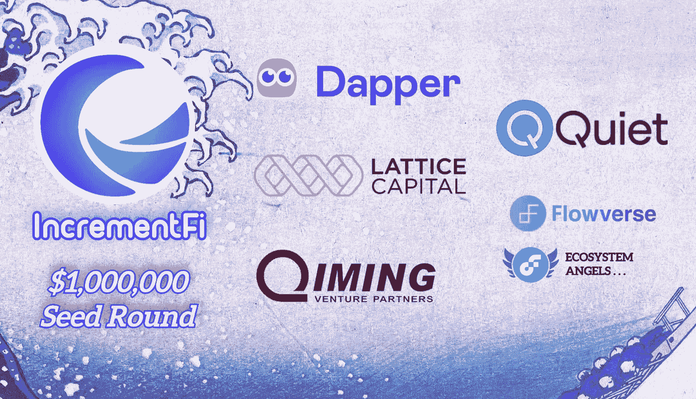

# IncrementFi 种子基金公开发布

> 原文：<https://medium.com/coinmonks/public-announcement-of-incrementfis-seed-fundraising-1f6c6b36d894?source=collection_archive---------11----------------------->

建立在流量区块链基础上的一站式 DeFi 平台 IncrementFi 已经在种子轮筹集了 100 万美元。

包括 Dapper Labs、Lattice Capital、祁鸣风险投资伙伴、Quiet Ventures 和许多其他 Flow 生态系统天使投资者在内的投资者参与了此次筹款。

IncrementFi 专注于为 Flow 区块链生态系统带来一套 DeFi 基础设施，特别是流动性和收益解决方案。两个产品， *Increment Swap* —一个完全无许可的分散式交易所，和 *Increment Earn* —一个用于可互换代币的分散式借贷&借款协议，自 2022 年 5 月以来一直在 mainnet 上运行，发布时的总 TVL 约为 250 万美元。

该公司由区块链资深人士和密码行业的长期建设者创立，来自 Web3 和 Web2 的人才包括以前来自谷歌、育碧和百度的软件工程师。联合创始人兼核心贡献者思源(Jonny)表示，这笔资金将用于“扩大团队，开展合作，以及开发进一步的产品和创新”。

> 交易新手？试试[密码交易机器人](/coinmonks/crypto-trading-bot-c2ffce8acb2a)或[复制交易](/coinmonks/top-10-crypto-copy-trading-platforms-for-beginners-d0c37c7d698c)

Flow 的可扩展性和低成本，丰富的链上资产和生态系统，除了原生加密用户之外的大量受众，使其与现有的 EVM 兼容的区块链(简单地从 go-ethereum 分叉)相比是独特和突出的。随着 7.25 亿美元的生态系统基金和 Flow 即将到来的免许可部署里程碑的宣布，一个蓬勃发展的链上令牌经济即将到来，而 IncrementFi 正在填补这一空白，并为其成为 Flow 上领先的 DeFi 平台铺平道路。

# 用增量 Fi 连接

关注 IncrementFi 的官方社交媒体账户并访问其网站，了解 IncrementFi 的最新动态。

推特:[https://twitter.com/incrementfi](https://twitter.com/incrementfi)

不和:[https://discord.gg/increment](http://discord.gg/increment)

网址:[https://app . increment . fi](https://www.increment.fi)