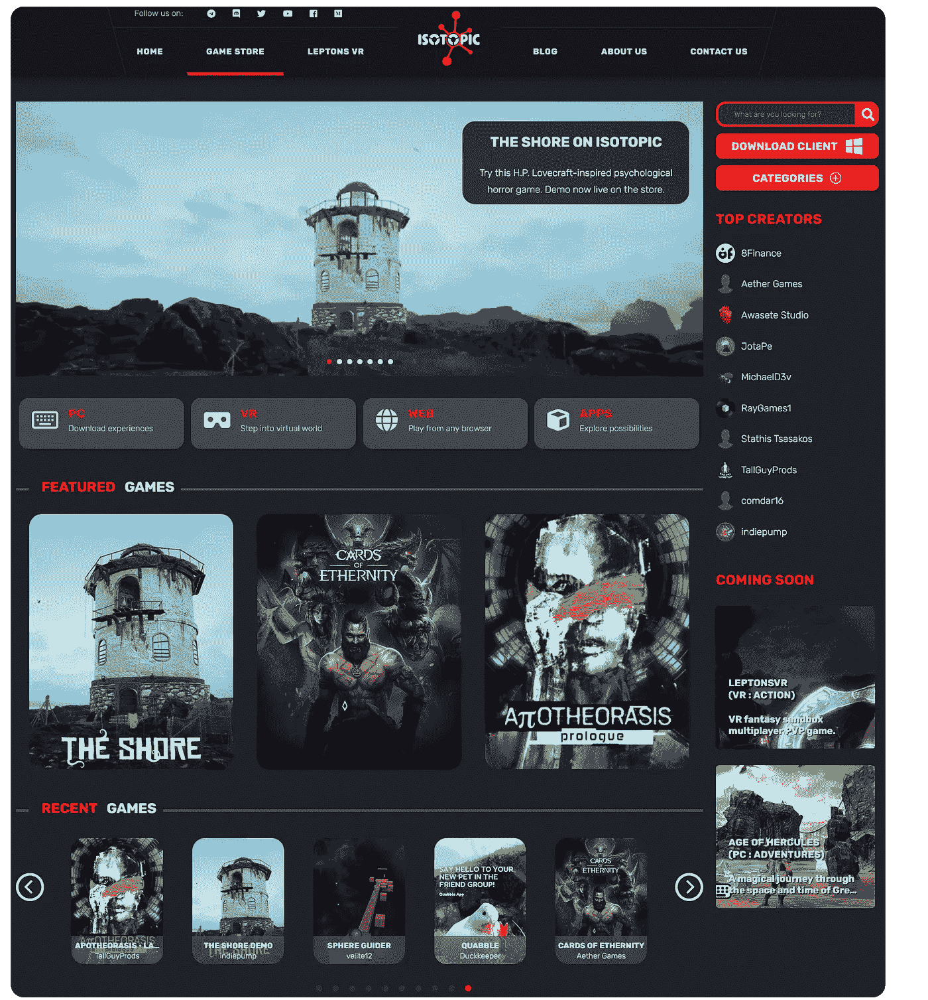
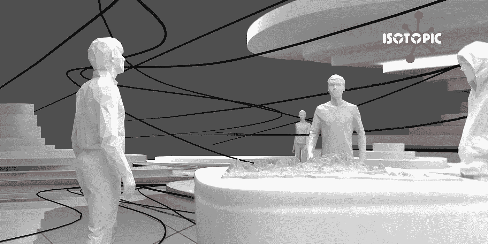
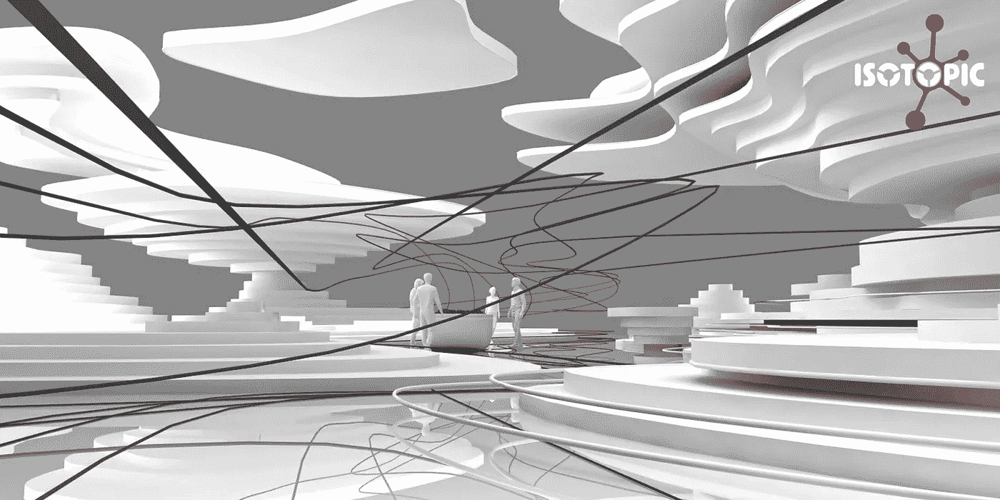
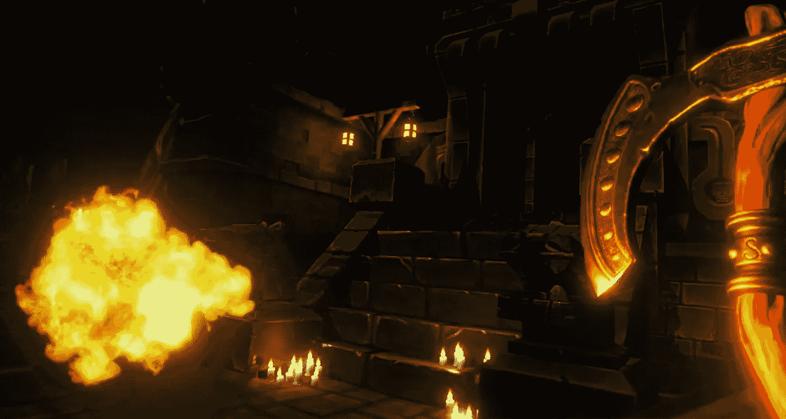
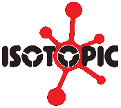

# 立即发布您的游戏！

> 原文：<https://medium.com/coinmonks/publish-your-games-today-408732d39b4d?source=collection_archive---------8----------------------->

各位独立开发者好，欢迎来到同位素！我们很高兴地宣布一个新的 [**游戏和应用程序分发平台**](https://isotopic.io/nft-game-store/) 为您量身定做！

# 同位素游戏店

今天，我们将向公众发布我们商店的 **Alpha 版本**。
**我们邀请您**成为平台上的第一批发布者，也是我们社区的第一批成员。[**免费游戏(WebGL 和可下载)从今天开始可以发布到商店！**](/@isotopic.io/publishing-on-isotopic-558f9c4c6532)

我们发现区块链现在充斥着没人玩的无聊的抓现金游戏。专注于游戏性、 [**可视化、沉浸感和设计**](https://fourthedesign.gr/en) **、**而不是过度使用不必要的 NFT 和区块链元素的优质游戏有着巨大的市场空间。

所以我们在 web3 行业建立了一个商店，它使用区块链的技术，但是**不**用没人要的 NFT 和特性填充游戏！

# 区块链的错误使用

我们随处可见这些区块链项目，它们在我们的社交媒体上传播营销活动，推广 NFT 的形象和“玩赚”游戏。

可悲的是，一项真正酷的技术如何仅仅被用作获取短期利润的方式，而不是创造一些创新和有用的东西。

# 创新和效用

但是，为什么我们是不同的，而不仅仅是另一个区块链项目努力赚取利润和倾销市场？

我们是一家完全不受区块链限制的游戏商店，这意味着平台上的游戏根本不需要使用 NFTs 或区块链。

事实上，我们完全是区块链经验不可知论者。区块链项目不吸引公众的最主要原因之一是难以使用。

使用同位素，你不必创建钱包，购买加密货币或直接与区块链互动，永远！

## 平台上的区块链技术主要用于:

*   **安全性** :
    通过智能合约的力量，我们能够创建反盗版措施，使用区块链来保护您的游戏！
*   **治理与利益相关:** 随着加密货币的使用，任何人都可以成为平台的利益相关者，并为其增长做出贡献。
*   使用 NFTs，玩家可以在游戏内容中进行交易，并从中获利。**这可以并且已经在不使用区块链**的情况下完成。但是通过分散这项技术，**我们能够更快、更安全地实现它。**这使得我们能够快速地将很酷的功能引入平台。

**Leptons VR**: A VR PVP game we are working on. (Demo environment using pre-made assets)

# 那么，你还在等什么？

你有现成的游戏吗？今天，您可以在我们的商店上完全免费地发布它，没有任何关系！

## 加入我们网络的开发者将有机会:

*   **展示他们创造游戏和内容的技能**。
*   将区块链与**创新理念和实施**结合使用。
*   让新的游戏玩家群体以及**投资者**来玩和观看他们的游戏**。**
*   与同位素形成**长期合作关系，同位素**可以提供营销、促销和活动，可以**让你的职业生涯更上一层楼**。
*   从我们经验丰富的游戏开发者团队获得帮助，他们可以帮助你开始与区块链互动，或者帮助你解决开发问题。
*   **认识游戏行业的其他创新者**。

没什么可失去的！我们的目标是**倾听独立社区的声音**和**创建一个游戏平台，将传统游戏玩家和开发者与区块链世界联合起来，接管 Web3 行业。**

## 在此了解如何自行发表同位素文章！

## 加入我们的[不和谐服务器](https://discord.gg/zZqNycn6FJ)，还有我们的[电报频道](https://t.me/+agHbqwIuW95jMzdk)！

## **关于区块链的一些常见问题:**

*   “区块链的生态环境不是很糟糕吗？”

我们正在建设币安智能链，这是利益的证明(意味着它不是由在超级计算机上采矿的用户运行的)，因此，当谈到生态危害时，它在区块链处于较低的范围。如果你在这个问题上做更多的研究，你会发现即使这对环境有害(在一定程度上)，但与其他技术和人类影响相比，这是一个小伤害。

*   “NFTs 不会给交易增加额外的交易费用吗？”

汽油费将由用户来处理，但这只是与其他用户安全交易游戏的一个小小的代价。无论如何，在大多数情况下，我们确信开发商将通过定义其 NFT 的智能合同对其游戏交易收取其他费用，这意味着与其他费用相比，汽油费将无关紧要。游戏在这个平台中是 NFT 的重要原因是，它们允许开发者通过智能合约完全定制他们游戏的发行。

最后一点，我们非常高兴见到你，即使你还没有一个游戏，我们渴望听到你的反馈和想法，以便我们把这个平台带到下一个层次！

我们把火炬传递给你！如果你已经做到了这一步，恭喜你，我希望这已经激起了你的兴趣，你已经准备好加入我们了！

[**同位素**](https://isotopic.io) **是一个支持区块链的软件分发服务，托管整合了 NFTs 和加密货币的游戏和应用。**

有问题吗？发送电子邮件至[info @ isometric . io](mailto: info@isotopic.io)

> 交易新手？在[最佳加密交易](/coinmonks/crypto-exchange-dd2f9d6f3769)上尝试[加密交易机器人](/coinmonks/crypto-trading-bot-c2ffce8acb2a)或[复制交易](/coinmonks/top-10-crypto-copy-trading-platforms-for-beginners-d0c37c7d698c)