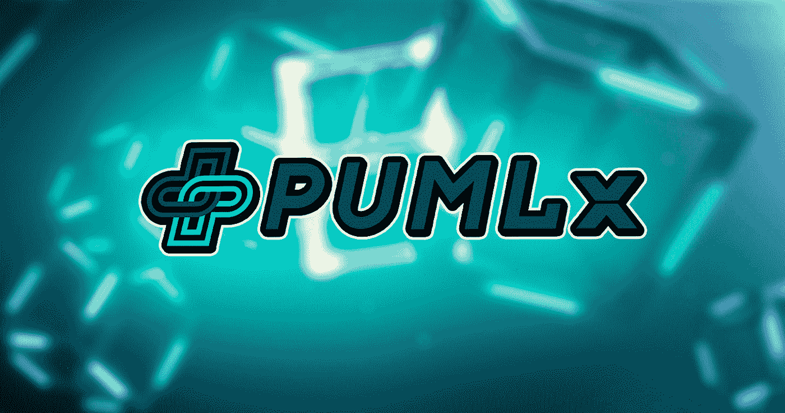
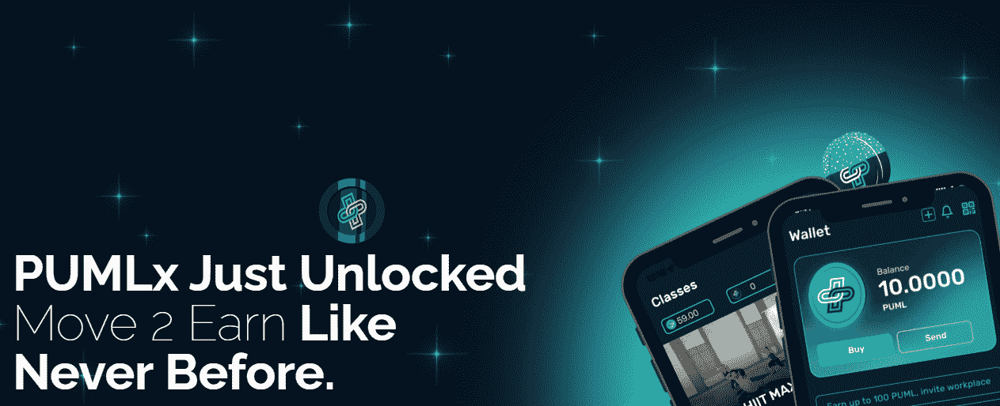
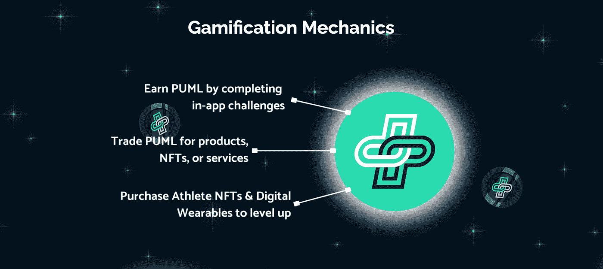
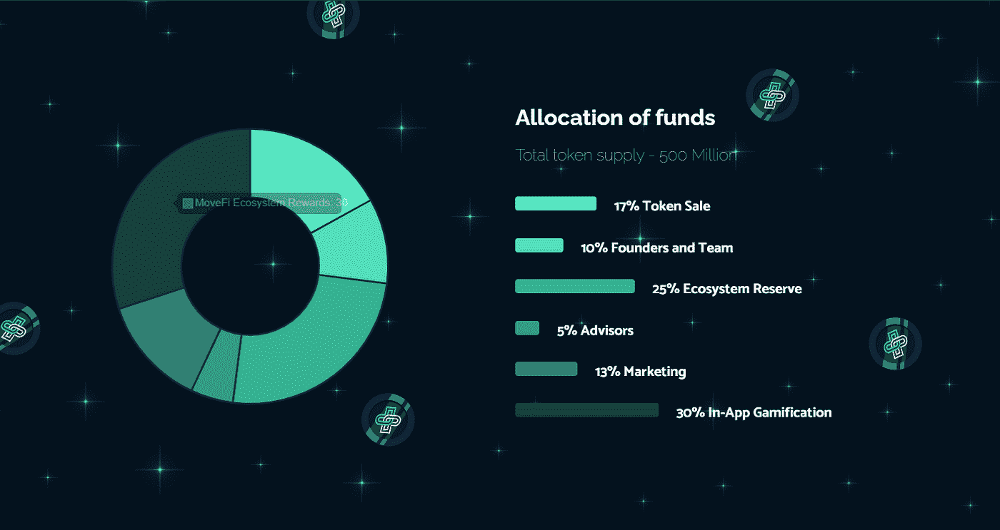
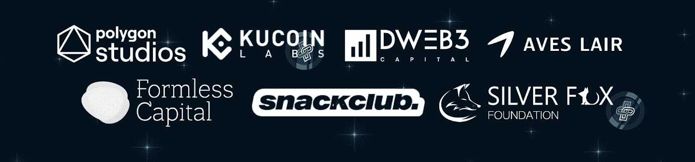

# PUMLx 更好的健康:为什么库科恩实验室领导的移动挣钱项目是不同的

> 原文：<https://medium.com/coinmonks/pumlx-better-health-why-the-kucoin-labs-led-move-to-earn-project-is-different-3b1f51ef2330?source=collection_archive---------11----------------------->

# PUMLx 是一个新的游戏化健身移动赚钱项目，由 KuCoin Labs 和其他可靠的投资者支持。我深入挖掘以了解更多，这就是我的发现。

大量的游戏赚钱和移动赚钱项目承诺了大平台甚至更多的回报，但大多数项目在推出几周后就远远没有引起投资者的兴趣。这让许多投资者对该行业缺乏品味和不确定性。

[PUMLx](https://pumlx.com/) 不一样吗？当市场比大多数密码爱好者所经历的更加悲观的时候，我们为什么要考虑投资一个移动赚钱项目呢？

PUML Better Health 是一个基于澳大利亚的游戏化 Web3 健身平台，其愿景是通过现实世界和元宇宙的虚拟挑战和社区将健康行为游戏化。

谈到健康，世界肥胖地图集[预测](https://www.worldobesity.org/resources/resource-library/world-obesity-atlas-2022#:~:text=The%20World%20Obesity%20Atlas%202022,living%20with%20obesity%20by%202030.)到 2030 年，全球将有大约 10 亿人肥胖。因此，它在现实世界中的效用听起来正是我们今天所需要的(一个 105 公斤的家伙在笔记本电脑前坐了 50 个小时)。

事实证明，著名的 launchpads 有合法的理由——ku coin Labs 是其最著名的投资者之一，顾问来自世界上一些最大的公司。(我不知道你怎么想，但是我不介意投资一个库币实验室投资的项目！)

我在[的 BullPerks](https://bullperks.com/)&[GamesPad](https://gamespad.io/)launch pads 上看到了这笔交易，作为一名投资者，我卷起袖子做了自己的研究(DMOR)。这是我发现的。

# PUMLx Better Health 平台是什么？

如果你不熟悉，移动赚钱(M2E)模式是 Web 3.0 中的一个新的利基，旨在让人们移动并奖励他们这样做。M2E 经常被比作“玩到赚”的模式，但与这种模式有很大不同，它鼓励实际的运动，并奖励用户进行诸如行走、跑步、锻炼、在智能手机上使用 GPS 等活动。

然而，该平台并不新鲜:2021 年，PUMLX 成功发布了面向企业的 Move-to-earn，这引起了德勤、路威酩轩集团和西联汇款等主要品牌的关注，大幅增加了其收入。

该平台现在正在将其 Web3 技术扩展到消费者健身、体育和游戏领域。通过这种方式，它旨在通过虚拟平台，将身体运动和心理健康挑战游戏化，并奖励完成任务的人(字面意思是变得更健康),在游戏化和基于元宇宙的环境中激发健康习惯。).

该平台在上市前就比竞争对手有优势，因为它的新生态系统 PUMLx 已经有超过 180，000 名预注册用户，这意味着他们可以通过完成挑战和与朋友竞争来获得奖励。

他们的应用程序可以在 iOS 和 Android 设备上使用，有大量的内容和鼓励促进健康生活的程序和练习。

# 是什么让 PUMLx 不同于其他的移动赚钱项目

PUMLx 有很多特点，这使得它不同于很多最近推出的、通常过饱和的“移动赚钱”项目。这些也是超过 180，000 人预注册该应用程序的合法原因。原因如下:

*   **变得更健康并获得** —该平台的主要目标是鼓励人们通过改变习惯、吃得更健康、锻炼、衡量自己的进步以及寻找需要改进的地方来过上更健康的生活，同时奖励他们前进的每一步。奖励包括移动赚取 NFT，折扣代码，现实世界的项目，PUML 和 PUMLx 硬币，等等。
*   **高回报赌注**——该平台将通过非功能性交易和代币提供慷慨的激励模式。
*   **NFT &元宇宙可穿戴市场**——整合后的市场将允许玩家买卖 NFT、元宇宙可穿戴设备和真实世界的商品(比如 Merch)，而无需寻找第三方平台。此外，它将使购买游戏中赢得的奖励。
*   与其他元宇宙游戏的互操作性——该平台计划与其他 metaverses 互操作，并允许玩家获得 PUMLx 硬币奖励。这将推动该平台的采用，对于投资者来说，这意味着令牌效用和价格的潜在增加(潜在的)。
*   **可穿戴集成**——该平台将兼容 Apple Watch、FitBit、三星等。很快，它还旨在与顶级 VR 健身和游戏应用程序集成。
*   **Stadiverse** —这是 PUMLx 元宇宙的名称，专门面向体育、游戏和健身领域的品牌和爱好者，让他们参加比赛并获得奖励。

*来源:PUMLx 网站，游戏化机制*

# PUMLx 生态系统中令牌的简要分类

PUMLX Better Health 项目将使用两种令牌:

1.  **PUML** 代币将被用作应用内奖励代币，允许用户在应用内进行购买并获得每一次体验。此外，PUML 令牌将成为非本地 Web3 用户的桥梁，因为它允许他们在没有任何加密货币知识的情况下使用该应用程序，同时他们可以在应用程序中轻松获得奖励。
2.  **PUMLx** 是一个全新的基于以太坊的 ERC20 令牌。这将是该平台的 DeFi 硬币，将用于运动员 NFTs，并可用于奖励(第一年高达 250%的 APR)。现有的 PUML 持有者可以在令牌生成事件后燃烧 PUML 以赎回 PUMLx(TGE)。

# PUMLX 代币销售详情

下面，我写了关于 PUMLX public(I do)代币销售的基本细节。

**注:细节来源于 PUMLx 即将在 BullPerks&GamesPad launch pads 上发布。*

令牌名称: **PUMLx**

区块链:**以太坊(ERC-20 令牌**)

最大供应量: **5 亿**

归属: **25%解锁 TGE (3 个月悬崖，然后 5 个月每月 15%)**

TGE 日期:**10 月 7 日**

此外，下图显示了记号组学。

*来源:PUMLx 网站，tokenomics*

# 团队、投资者和合作伙伴

PUML 团队拥有开发和推出复杂技术解决方案的经验。PUML 拥有一些世界上最大的公司的背景，包括 BBC、Virgin Media、优步等，由一些顶级的 web3 和区块链专家运营。

*资料来源:PUMLx、投资者和支持者*

谈到投资者和合作伙伴，名单看起来也很丰富:

*   KuCoin 实验室 — KuCoin 是密码世界最重要的投资和孵化项目之一，由顶级密码专家、市场研究人员、分析师和投资者领导。
*   [Aves Lair](https://aveslair.com/about-aves-lair/) — Aves Lair 是一家全球风险投资公司，由 web3 生态系统中的变革型初创公司、行业领导者和投资者组成。
*   [DWeb3](https://dweb3.io/) — DWeb3 Capital 是一家专注于 DeFi、Web3.0 和 NFTs 的数字基金。
*   [银狐基金](https://silverfox.fund/) —银狐基金会是一个总部位于硅谷的项目，在区块链行业投资方面拥有丰富的经验。
*   [DWF 实验室](https://www.dwf-labs.com/) — DWF 实验室是全球顶级数字资产做市商和多阶段 web3 投资公司。

…以及更多。他们也得到了昆士兰政府、昆士兰大学和纽约大学的支持。

# 一句话:投资 PUMLx 还是 pass？

在熊市中投资一个新项目并不是最有前途的事情。随着越来越多的赚钱项目每天上市，而大多数项目都没有兑现承诺，利基市场的形象已经受损。

然而，PUMLx 似乎是一个有前景的项目，有坚实的愿景、团队、支持者和投资者。其促进健康的理念是一个非常好的解决方案，值得投资。与 KuCoin Labs 的合作受到了其 20 万 Telegram 追随者社区的热烈欢迎。

说到底，拿钱变健康听起来不是很好吗？

这个问题的答案和最终决定是否投资 PUMLx move-to-earn，我将由您决定。

免责声明:此信息仅供参考，不得作为财务建议。在投资任何项目之前，一定要做好自己的研究(DYOR)。

> 交易新手？试试[密码交易机器人](/coinmonks/crypto-trading-bot-c2ffce8acb2a)或者[复制交易](/coinmonks/top-10-crypto-copy-trading-platforms-for-beginners-d0c37c7d698c)