# PyMLPipe:一个轻量级的 MLOps Python 包

> 原文：<https://medium.com/coinmonks/pymlpipe-a-lightweight-mlops-python-package-4c337b2f7a1f?source=collection_archive---------0----------------------->

创建一个 ML 模型和实际生产 ML 模型在本质上是非常不同的。


PyMLPipe

**PyMLPipe** 帮忙

1.  模型监控
2.  模型版本控制
3.  数据版本控制
4.  模型参数跟踪
5.  数据模式跟踪
6.  模型性能比较
7.  一键式 API 部署

## 安装(通过 [pip](https://pypi.org/project/pymlpipe/) ):

`pip install pymlpipe`

## PyMLPipe 的用法:

让我们以带有 Scikit-learn 的 Iris 数据集为例。这是分类问题的经典数据集。

第 1 行:我们正在导入`load_iris`

第 2–5 行:我们正在将虹膜数据集转换成熊猫数据帧格式

> 现在，让我们将数据分割开来进行训练测试

这里，我们将数据分为训练集和测试集

> 现在是有趣的部分！！！让我们从 Sklearn 导入我们的模型

我还导入了可以使用的指标。

## PyMLPipe 入门:

> 导入和初始化 pymlpipe:

第 1 行:我们为表格数据导入 PyMLPipe 类

第 2 行:我们正在初始化一个类的对象

第 3 行:我们正在设置一个实验名称

一个实验可以进行多次运行(稍后我会解释什么是运行)

第 4 行:我们正在设置一个模型版本

## 运行测试

我们从下面的代码块`objectname.run()`开始运行测试

`with mlp.run():`

上面为测试创建了一个惟一的 runid——您也可以指定自己的 runid `mlp.run(runid="sample_run")`

训练代码将放在“with”块中。

**设置标签-** 我们可以为相关的运行设置特定的标签，这有助于识别测试运行，也有助于过滤特定的运行。

`.set_tags(List)` —设置运行的标签列表

`.set_tag(String)` —为运行设置一个标签

**日志记录指标-**

`.log_metric(metric_name, metric_value)` —记录指标，例如:“准确性”、“精确度”

`.log_metrics({metric_name: metric_value,metric_name: metric_value})` —:一次记录多个指标

## 记录工件-

`.log_artifact(artifact_name, Pandas Dataframe)`-这将把数据框保存到工件文件夹中，用于

1.  数据版本控制
2.  数据模式日志记录——我们稍后会看到

`.log_artifact_with_path(path_of_the_file)` —这将从路径保存文件

> 交易新手？试试[加密交易机器人](/coinmonks/crypto-trading-bot-c2ffce8acb2a)或者[复制交易](/coinmonks/top-10-crypto-copy-trading-platforms-for-beginners-d0c37c7d698c)

**注册型号-**

`.sklearn.register_model(model_name, model object)` —注册用于部署和跟踪的 Scikit 学习模型

# 完整代码

根据上面的代码，我们创建了 4 个模型-

1.  逻辑回归
2.  决策图表
3.  随机森林
4.  XGboost

## 让我们启动用户界面

您可以简单地通过编写命令来启动 UI

```
pymlpipeui
```

或者

```
from pymlpipe.pymlpipeUI import start_ui

start_ui(host='0.0.0.0', port=8085)
```

在下图中，你可以在一个地方看到所有的测试

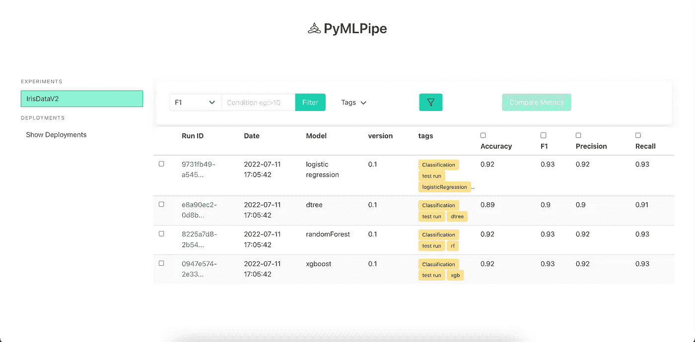

PyMLPipe UI

我们可以通过选择和比较度量来比较模型的性能

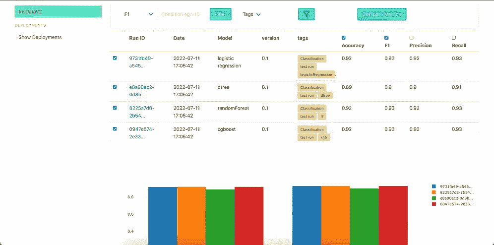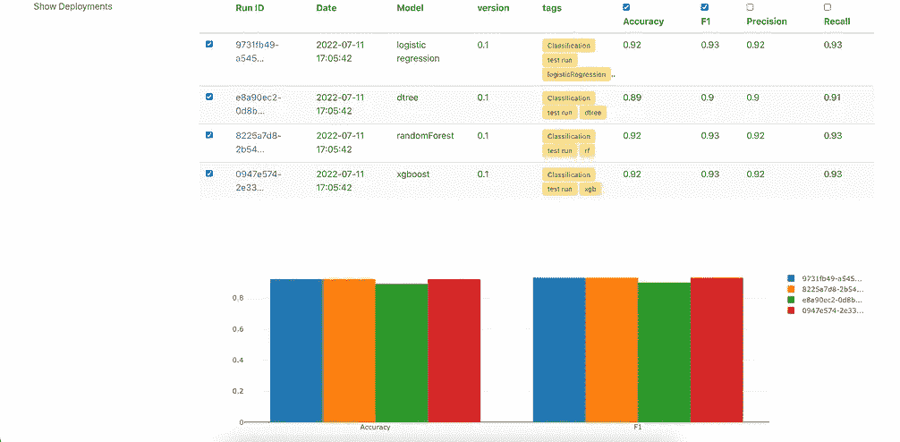

这里我们可以看到 XGB，随机森林和 Logistic 回归的结果几乎相似。所以让我们来看看

1.  我们可以看到训练细节

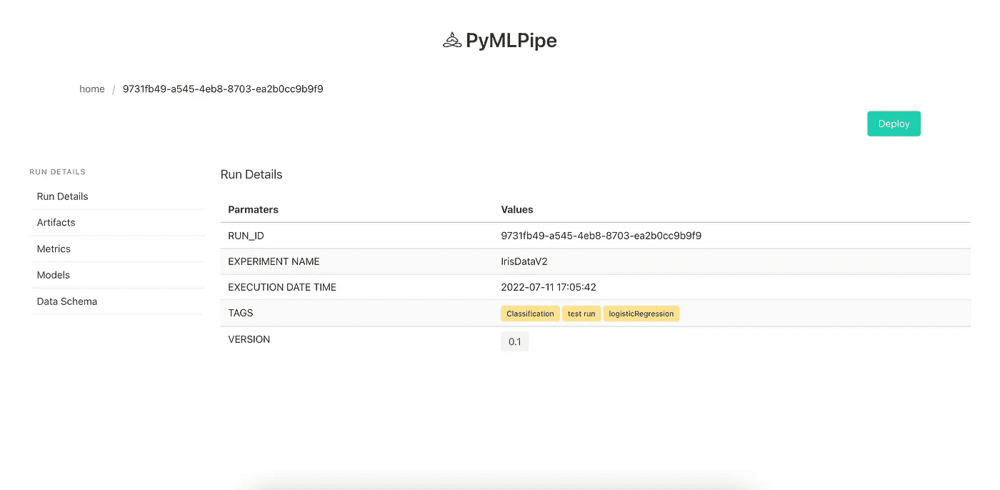

2.在工件中，我们可以看到注册工件的详细信息

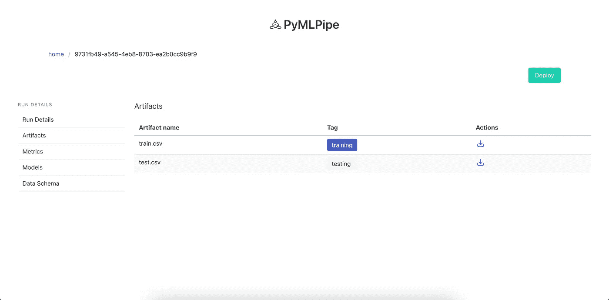

3.在 Models 选项卡中，我们可以看到模型被训练的所有参数

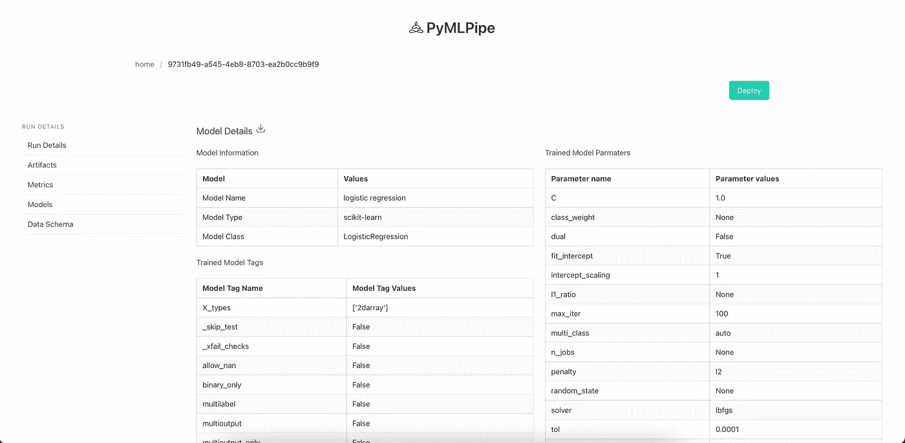

4.Data Schema 选项卡显示了我们已经注册的工件的模式。

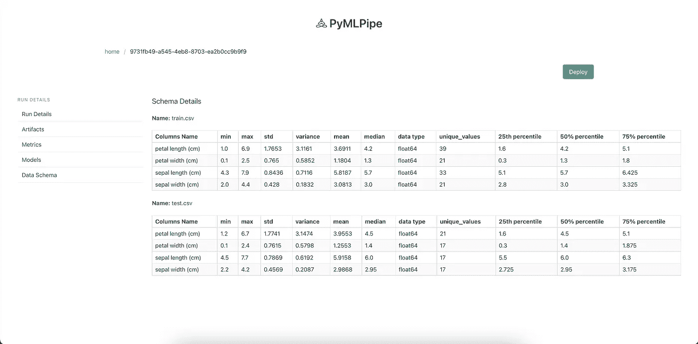

**5。让我们部署模型**

单击部署按钮进行部署

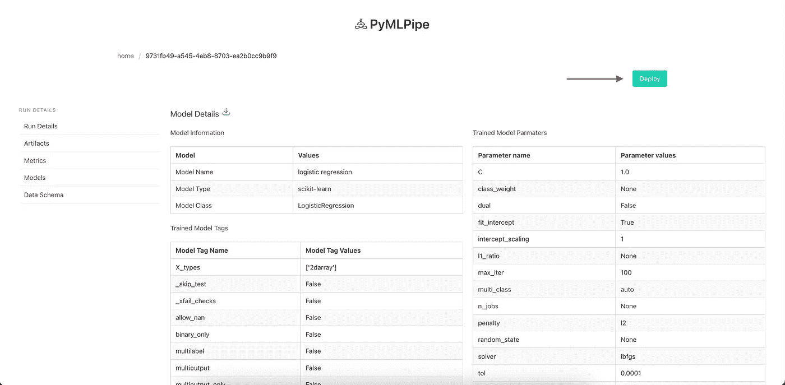

您可以在“Show Deployment tab”上看到部署的模型

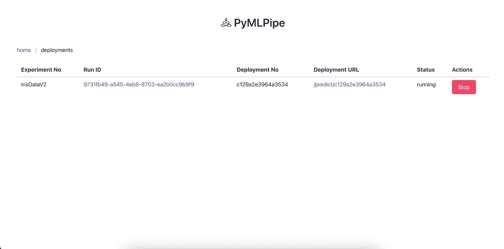

`deployment URL` —是您的端点，您可以发送 POST 请求来获得预测

你可以点击`Deployment URL`进入 API 界面

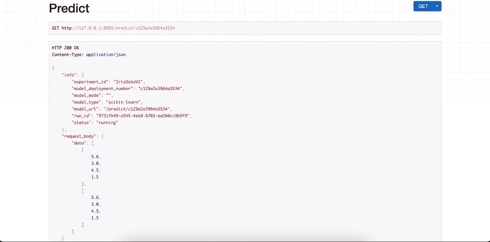

复制`request_body`并点击`post`

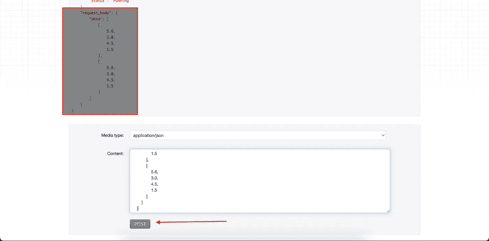

## 你得到了你的预测

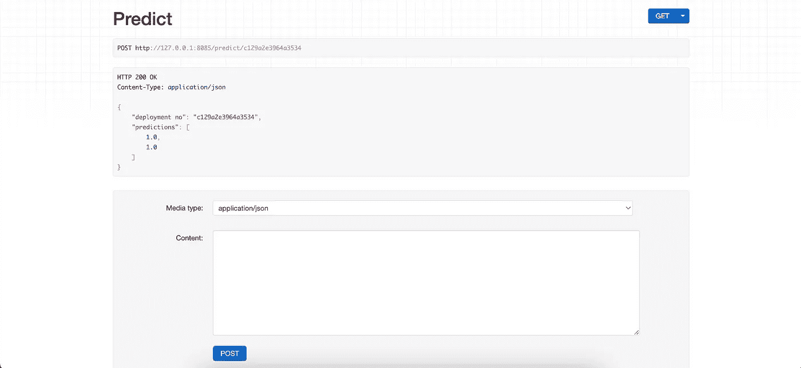

Github 链接:[https://github.com/neelindresh/pymlpipe](https://github.com/neelindresh/pymlpipe)

*贡献永远受欢迎*

文件:[https://neelindresh.github.io/pymlpipe.documentation.io/](https://neelindresh.github.io/pymlpipe.documentation.io/)

希望你喜欢这篇文章。留下一个赞，分享一下。

如果你想和我联系:[https://www.linkedin.com/in/indresh-bhattacharya/](https://www.linkedin.com/in/indresh-bhattacharya/)

> 加入 Coinmonks [电报频道](https://t.me/coincodecap)和 [Youtube 频道](https://www.youtube.com/c/coinmonks/videos)了解加密交易和投资

# 另外，阅读

*   [投资印度的最佳密码](https://coincodecap.com/best-crypto-to-invest-in-india-in-2021)|[WazirX P2P](https://coincodecap.com/wazirx-p2p)|[Hi Dollar Review](https://coincodecap.com/hi-dollar-review)
*   [加拿大最好的加密交易机器人](https://coincodecap.com/5-best-crypto-trading-bots-in-canada) | [库币评论](https://coincodecap.com/kucoin-review)
*   [用于 Huobi 的加密交易信号](https://coincodecap.com/huobi-crypto-trading-signals) | [HitBTC 审核](/coinmonks/hitbtc-review-c5143c5d53c2)
*   [TraderWagon 回顾](https://coincodecap.com/traderwagon-review) | [北海巨妖 vs 双子星 vs BitYard](https://coincodecap.com/kraken-vs-gemini-vs-bityard)
*   [如何在 FTX 交易所交易期货](https://coincodecap.com/ftx-futures-trading)