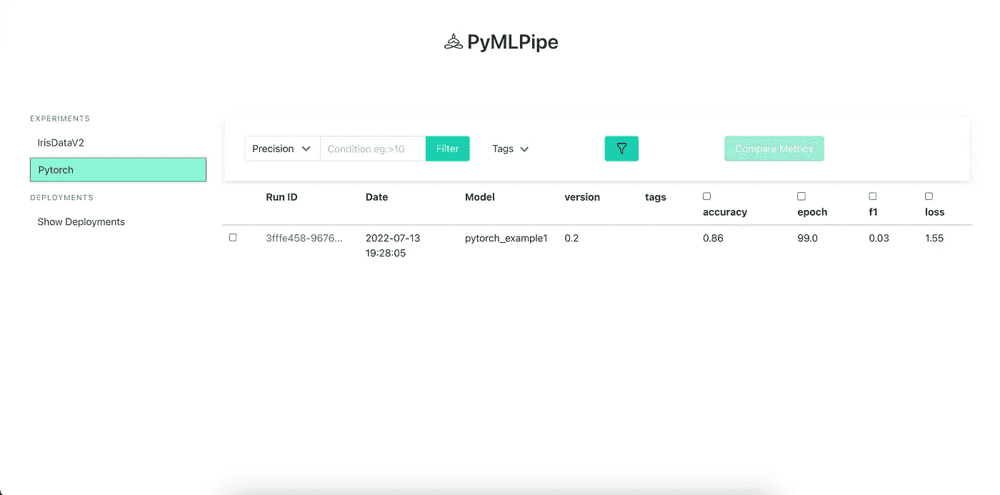
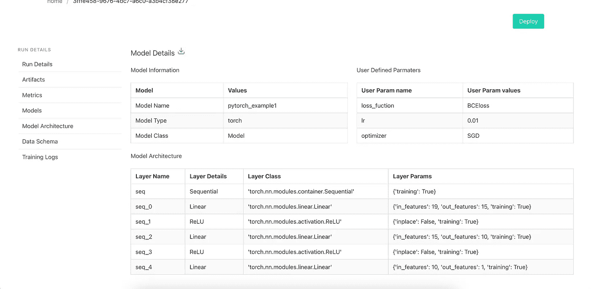
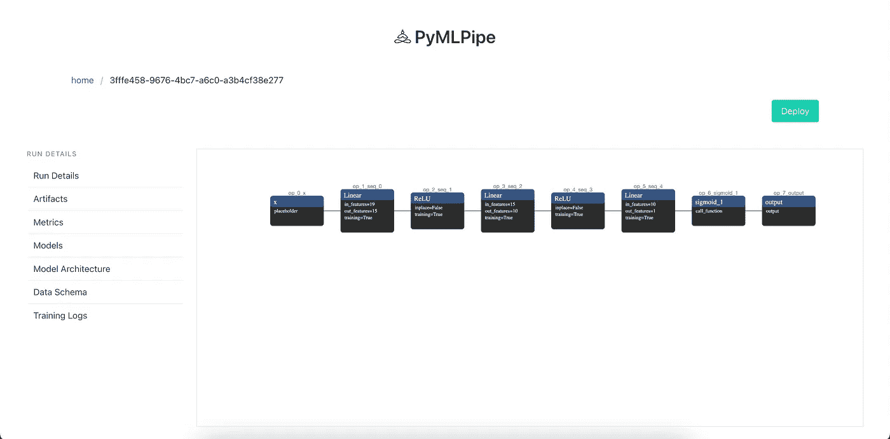
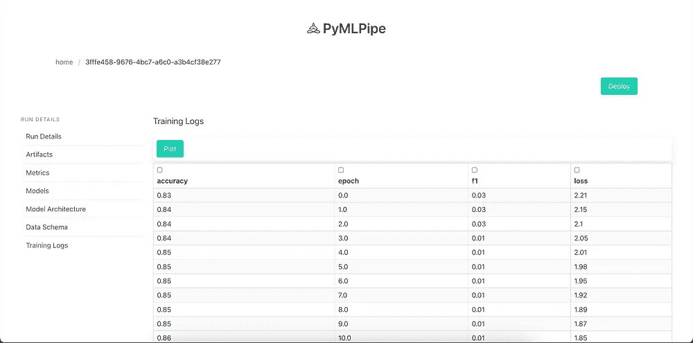
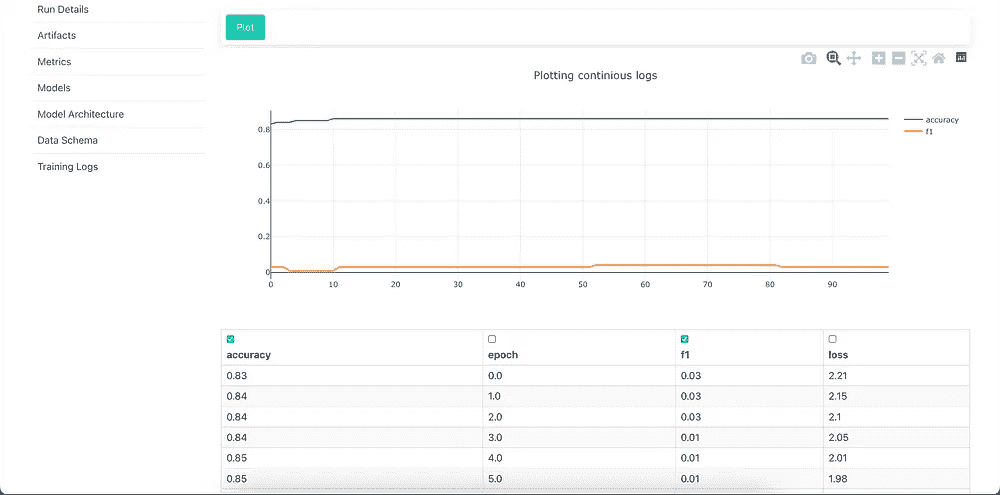
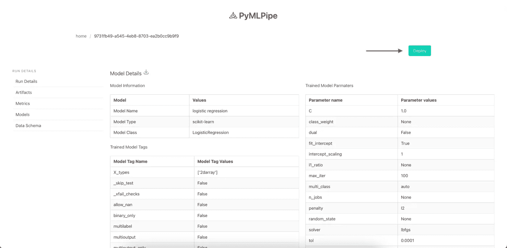
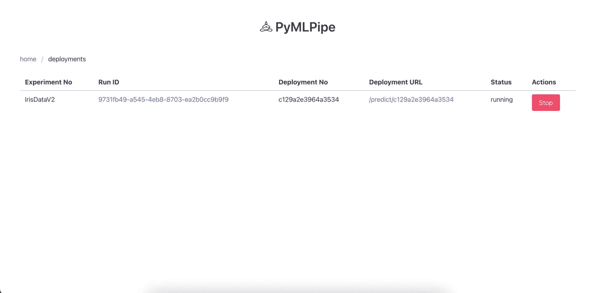
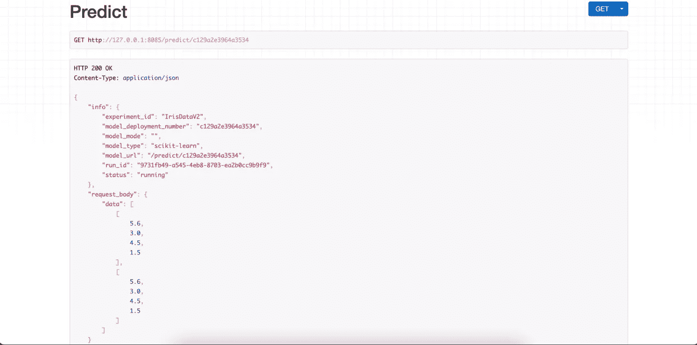

# PyMLPipe:支持 Pytorch 的 MLOPs Python 包

> 原文：<https://medium.com/coinmonks/pymlpipe-mlops-python-package-with-pytorch-support-1c9cfd528549?source=collection_archive---------4----------------------->


在上一篇文章中，我们介绍了使用 **PyMLPipe** 的基础知识

[](/@indreshbhattacharyya/pymlpipe-a-lightweight-mlops-python-package-4c337b2f7a1f) [## PyMLPipe:一个轻量级的 MLOps Python 包

### 创建一个 ML 模型和实际生产 ML 模型在本质上是非常不同的。

medium.com](/@indreshbhattacharyya/pymlpipe-a-lightweight-mlops-python-package-4c337b2f7a1f) 

在这个例子中，让我们看看如何使用 **PyMLPipe** 和 **Pytorch** 。

PyMLPipe 帮助

1.  模型监控
2.  模型版本控制
3.  数据版本控制
4.  模型参数跟踪
5.  数据模式跟踪
6.  模型性能比较
7.  一键式 API 部署

# 安装(通过 [pip](https://pypi.org/project/pymlpipe/) ):

`pip install pymlpipe`

# PyMLPipe 的用法:

为了跟进，你可以从下面的链接下载数据集

数据集:[链接](https://github.com/neelindresh/NeelBlog/blob/master/train.csv)

这是一个客户流失预测数据，它是一个非常小的数据集，仅用于演示目的

***步骤 1*** :首先让我们导入我们的库

这里我们将使用:

1.  火炬-创造我们的神经网络和训练
2.  Sklearn-用于分割训练和测试数据，不同的度量
3.  用于监控和部署的 PyMLPipe

***步骤 2*** :现在让我们读取数据集并对分类特征进行编码

1.  我们正在读取 train.csv 文件(给出上面的链接)
2.  我们正在对某些分类特征进行编码
3.  我们采用 trainX(特征/因变量)trainY(预测值/自变量)

***第三步*** :接下来我们把数据分成训练集和测试集

1.  将数据分成训练测试集
2.  将数据框转换为火炬张量，然后将它们转换为浮点型

**转换为 FloatTensor 非常重要，因为神经网络将在 Float 值上工作不久，BCELoss(用于二进制分类)也将采用 Float 值来计算损失。

***第四步*** :定义神经网络

这是一个简单的三层神经网络

第一层:密集层(29x15)

第 2 层:致密层(15x 10)

第 3 层:密集层(10x 1)

最后用一个 sigmoid 激活函数。

***第五步:*** 初始化模型和损失函数以及优化器

启动模型

我们使用 SGD 作为优化器，请随意使用任何其他像亚当

损失函数为 BSELoss(二元交叉熵损失)

> 交易新手？尝试[加密交易机器人](/coinmonks/crypto-trading-bot-c2ffce8acb2a)或[复制交易](/coinmonks/top-10-crypto-copy-trading-platforms-for-beginners-d0c37c7d698c)

***第六步:*** 创建一个验证函数【这是可选的，你可以使用自己的函数】

模型—是 Pytorch 模型，testX 是测试特征，testY 是测试预测值

我们将等级门槛设为 0.5

然后我们计算准确度分数和 f1 分数。

***第七步:*** 启动 PyMLPipe

初始化 PyMLPipe

设置实验名称和版本([详见上一篇文章](/@indreshbhattacharyya/pymlpipe-a-lightweight-mlops-python-package-4c337b2f7a1f))

第八步:训练模型

现在我们可以训练这个模型，

`mlp.run()` →启动监控实例

`mlp.log_params()` →记录用于训练的参数

`mlp.register_artifact()` →保存训练数据并生成数据模式

** [参见上一篇文章，了解有关上述功能的更多详情](/@indreshbhattacharyya/pymlpipe-a-lightweight-mlops-python-package-4c337b2f7a1f)

这里没什么新东西

`mlp.log_metrics_continious(dict)` →该功能以连续的方式存储指标，这意味着它将存储训练的每个时期的指标。

`mlp.pytorch.register_model(model_name,Pytorch_Model)` →以`torch.jit`格式注册并保存 pytorch 模型，用于服务和预测

你也可以使用

`mlp.pytorch.register_model_with_runtime(modelname, modelobject, train_data_sample)`

*   `train_data_sample` -是输入数据的样本。它可以是随机数，但需要张量维数
*   这种方法是`preferred`，因为在`future releases`中，这种模型也可以转换成其他格式，例如:“onnx”、“hd5”

完整代码:

***第八步:*** 最后我们可以启动 UI，查看细节了

使用命令`pymlpipeui`启动用户界面

或者

```
from pymlpipe.pymlpipeUI import start_ui

start_ui(host='0.0.0.0', port=8085) 
```

一旦你启动用户界面，你就可以看到实验



点击运行 ID 查看详细信息

在`Models`选项卡中，您可以看到模型的详细信息。训练参数以及用于模型的“火炬层”



在`Model Architecture` 选项卡中，您可以看到模型可视化



在`training Logs`中，您可以看到用于培训的连续指标，您也可以绘制相同的图表。



点击`Deploy Button`部署 DL 模型



您可以在`Show Deployment Tab`上看到部署的模型



`deployment URL` —是您的端点，您可以发送 POST 请求以获得预测

您可以点击`Deployment URL`进入 API 屏幕



如果您正在跟进，您可以输入以下数据来接收预测。

`dtype`是模型预期的数据类型。如前所述，该模型期望输入类型为`FloatTensor`，因此我们提供了`"dtype": "float"`

Github 链接:【https://github.com/neelindresh/pymlpipe 

*贡献永远受欢迎*

文档:[https://neelindresh.github.io/pymlpipe.documentation.io/](https://neelindresh.github.io/pymlpipe.documentation.io/)

希望你喜欢这篇文章。留下一个赞，分享一下。

如果你想和我联系:[https://www.linkedin.com/in/indresh-bhattacharya/](https://www.linkedin.com/in/indresh-bhattacharya/)