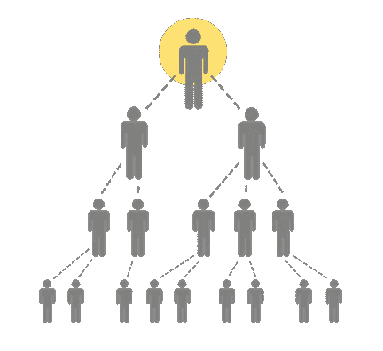
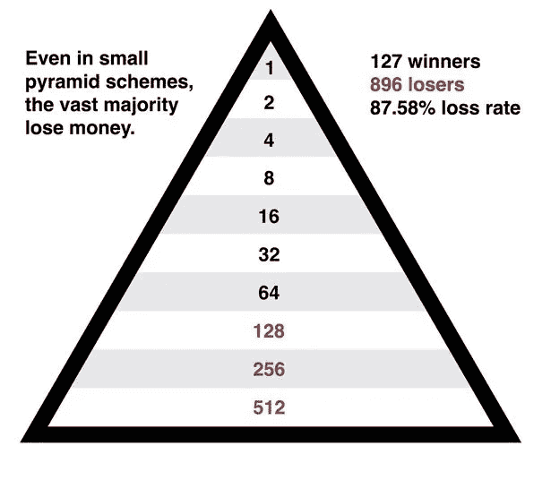

# 金字塔 vs 庞氏骗局

> 原文：<https://medium.com/coinmonks/pyramid-vs-ponzi-schemes-446ea5a23024?source=collection_archive---------24----------------------->

大多数企业投资者通常会考虑两件事。首先，投资回报率，显示他们将赚多少钱。第二个因素与投资的风险大小有关。当风险太高时，投资者更有可能失去他们的初始投资，从而导致投资回报率低。

自然，每项投资都有一定程度的风险。然而，如果投资无意中被卷入庞氏骗局或金字塔计划，风险就会大大增加。能够认识这些方法并理解它们是如何操作的是至关重要的。

**什么是庞氏骗局？**

庞氏骗局是一种投资欺诈，向客户承诺以很小甚至零风险获得高额利润。卷入庞氏骗局的公司竭尽全力吸引新的投资者。

最初投资者的回报是用这笔新收入支付的，这笔收入被指定为合法交易的利润。庞氏骗局依靠稳定的新投资流来不断给老投资者带来利润。当这个流耗尽时，计划失败。

在一个名叫查尔斯·庞兹的骗子之后，“庞氏骗局”一词在 1920 年首次被使用。尽管美国的莎拉·豪和德国的阿黛尔·斯皮策德是这种投资欺诈行为的最早已知案例的始作俑者，但它们发生在 19 世纪中后期。事实上，查尔斯·狄更斯的两部不同的作品——1844 年出版的《马丁·丘兹维特》和 1857 年出版的《小杜丽》——描述了后来被称为庞氏骗局的技术。

> 交易新手？试试[密码交易机器人](/coinmonks/crypto-trading-bot-c2ffce8acb2a)或者[复制交易](/coinmonks/top-10-crypto-copy-trading-platforms-for-beginners-d0c37c7d698c)

**庞氏骗局危险信号**

庞氏骗局的想法持续到 1920 年以后。技术和庞氏骗局都随着时间的推移而演变。伯纳德·麦道夫在 2008 年因操纵庞氏骗局被判有罪，在该骗局中，伪造交易报告，暗示客户在不存在的资产上赚钱。

*   一个投资者给投资发起人 5000 美元。承诺在一段时间(例如 30 天)后偿还初始金额加上 10%的利息
*   在 30 天结束之前，发起人能够再获得两个投资者。然后，他将从第二个和第三个投资者那里收到的 10000 美元中拿出 5500 美元分给第一个投资者。他可能会敦促初始投资者再投资 5000 美元。
*   冒名顶替者可以通过接受新投资者的资金，向早期投资者支付承诺的利润，这鼓励他们进行再投资，并邀请更多的个人。
*   随着系统的扩张，系统的发起人必须招募更多的新投资者。否则，他将无法支付承诺的回报。
*   当计划最终变得不可行时，发起人要么被捕，要么带着手中的钱消失。

**什么是传销？**

骗子承诺在短时间内获得快速、惊人的回报，并采用不稳定且不可持续的商业模式，即所谓的金字塔计划来吸引会员。它始于一小群最初的顶级会员或玩家寻找新会员，这些新会员向他们支付前期成本和费用以参与业务。

这些新成员会带来额外的新鲜血液。他们由下一级的参与者支付费用。不过，初始会员确实会收到这些额外费用的一部分。直到没有人留下来招募，费用被收集，支付，并通过漏斗进入金字塔的各个层次。由于缺乏资金，金字塔计划在那个阶段结束。大多数参与者遭受经济损失。

**传销如何运作。**

因为他们的奖励安排与金字塔非常相似，所以被称为金字塔计划。该计划在最初成员所在的顶部有一个单点，随着每一级招募吸引更多的人，该点会越来越宽。

**Upline to Downline**

**The Pyramid Form**

大多数传销不提供任何商品或服务，只是通过增加新成员赚取资金来维持运营。虽然声称提供服务或产品出售，一些传销可能伪装成合法的多级营销(MLM)业务。然而，他们通常这样做只是为了掩盖潜在的欺骗。因此，金字塔模型被道德标准可疑的 MLM 企业广泛使用，尽管并非所有 MLM 企业都不诚实。

**相似之处**

*   庞氏骗局和金字塔骗局都是金融欺诈的一种，它们通过获取高额投资回报来说服受害者投资。
*   为了成功和继续运营，两家公司都必须有新投资者的持续资助。
*   大多数时候，这些方案实际上并不提供任何商品或服务。

**差异**

*   庞氏骗局经常伪装成金融管理服务，让受害者相信他们未来的回报是明智投资的结果。本质上，冒名顶替者抢劫一方以支付另一方。
*   网络营销是传销的基础，参与者必须引入新成员才能获利。结果，在把钱送到金字塔顶端之前，每个参与者都会收到一笔佣金。

**如何保护自己**

*   愤世嫉俗。一个承诺很快或投入很少的钱就能获得巨大利润的商业提议可能是欺骗性的。尤其是在投资对你来说完全陌生或者你觉得难以理解的事物时。如果某件事看起来好得不像真的，它很可能就是真的。
*   避免冲动的机会。突然要求参与长期投资机会通常会引起关注。
*   去调查那个供应商。调查呈现投资机会的组织。值得信赖的财务顾问、经纪人或经纪公司将在适当的监管机构注册并接受监管。
*   没有信仰。验证。所有合法投资都需要合法注册。询问注册细节是第一步。如果投资机会没有登记，需要给出一个充分的理由。
*   确保你理解投资。不要把钱投入到你不完全了解的风险投资中。利用你所掌握的信息，在考虑神秘的投资前景时要格外谨慎。
*   报告。一旦投资者遇到金字塔或庞氏骗局，他们应该通知有关当局。这将降低未来投资者陷入同一骗局的风险。

> 加入 Coinmonks [电报频道](https://t.me/coincodecap)和 [Youtube 频道](https://www.youtube.com/c/coinmonks/videos)了解加密交易和投资

# 另外，阅读

*   [Bookmap 点评](https://coincodecap.com/bookmap-review-2021-best-trading-software) | [美国 5 大最佳加密交易所](https://coincodecap.com/crypto-exchange-usa)
*   [加密交易机器人](/coinmonks/crypto-trading-bot-c2ffce8acb2a) | [硬币门评论](https://coincodecap.com/coingate-review)
*   最佳加密[硬件钱包](/coinmonks/hardware-wallets-dfa1211730c6) | [Bitbns 评论](/coinmonks/bitbns-review-38256a07e161)
*   [新加坡十大最佳加密交易所](https://coincodecap.com/crypto-exchange-in-singapore) | [购买 AXS](https://coincodecap.com/buy-axs-token)
*   [红狗赌场评论](https://coincodecap.com/red-dog-casino-review) | [Swyftx 评论](https://coincodecap.com/swyftx-review)