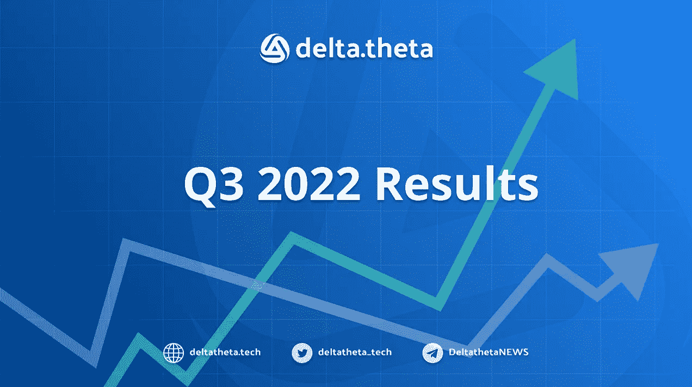
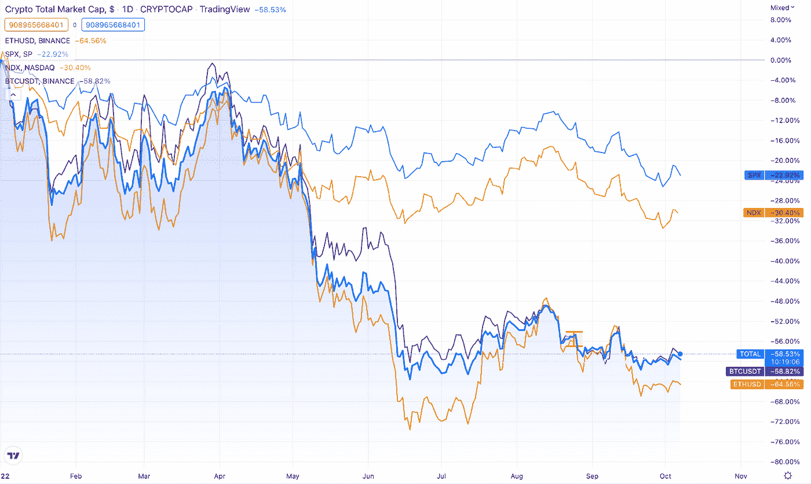
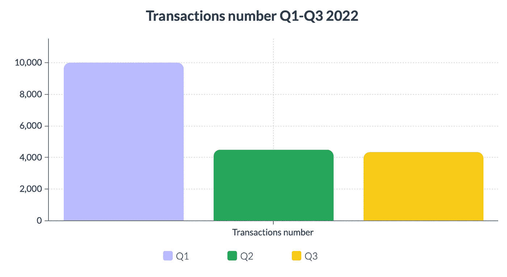
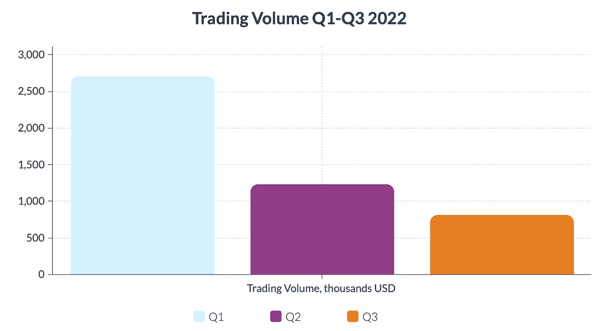
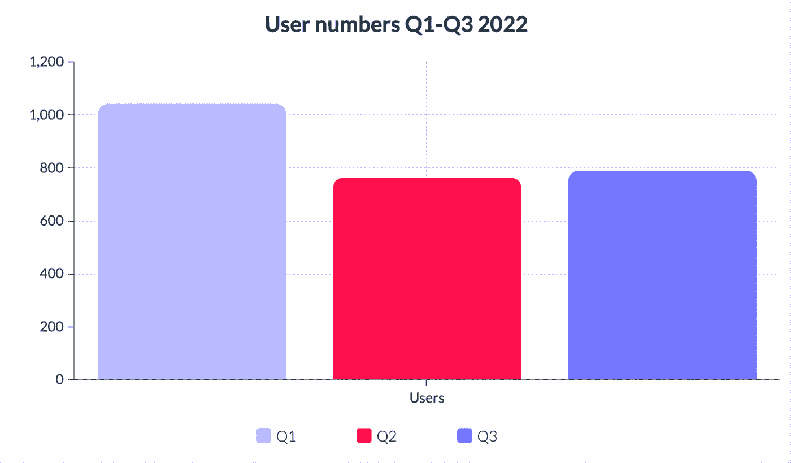

# 2022 年第三季度 delta.theta p2p 期权交易所的表现

> 原文：<https://medium.com/coinmonks/q3-2022-performance-of-the-delta-theta-p2p-options-exchange-56177d8a4d3d?source=collection_archive---------18----------------------->

今年，加密资产市场经历了几次来自外部和内部原因的严重冲击。不断恶化的全球环境、量化宽松政策的结束以及主要央行的近零利率，极大地削弱了吸引流动性进入加密领域的条件。一些地方崩溃，包括 Luna 生态系统崩溃，Voyager 和 Celsius 等主要 CeFi 公司的破产，以及加密对冲基金 3 arrows Capital 的破产，也无助于整体乐观情绪。因此，总市值自年初以来下降了 58%(明显强于股市)，目前为 9500 亿美元。

# 交易编号

在 2022 年第三季度期间，该平台上有 4366 笔交易，几乎与第二季度的 4516 笔交易持平。总体而言，尽管行业整体下滑，DeFi 服务使用率大幅下降，但该平台的利用活动保持稳定。

# 交易额

随着加密资产价格下跌，总交易量环比下降，报价的美元价值也相应下降。2022 年第三季度，交易量达到 820，535 美元。与此同时，做市商[在第二季度焚烧了](https://etherscan.io/token/0x0000000de40dfa9b17854cbc7869d80f9f98d823?a=0x0000000000000000000000000000000000000000#tokenAnalytics)42.4 万枚 DLTA 代币(占全年焚烧代币总数的 53%)。

# 用户数量

第三季度与平台交互的唯一地址总数与前一季度相比几乎保持不变，为 792 个地址(+4% Q/Q)。

# 产品开发新闻

第三季度包括与平台开发相关的关键营销活动，包括功能和与其他加密金融公司的业务互动。其中，我们要强调以下几点:

*   与 Stader LABS 平台集成，支持 BNBx & MATICx liquid stacking tokens 上的期权交易，这使得堆叠收益率每年增加高达 50%
*   参与新加坡 F10 加速器部门的加密公司孵化器
*   与全球加密市场和流动性提供商 Finery Markets 合作
*   通过期权交易推出流动性 DLTA 代币堆叠计划。

# 路标

该终端的第三个版本计划在短期内通过审核并正式启用。

面向大宗交易的功能扩展、与 AAVE (aTokens)借贷令牌的交互以及保证金交易的推出，使用户能够将加密投资组合的盈利能力提高到一个全新的水平。

遵循社交媒体上的公告，与 delta.theta 团队一起交易超声级别的选项，并使用市场上最先进的 DeFi 工具！

站点— [增量技术](https://deltatheta.tech/)

推特——https://twitter.com/deltatheta_tech

场外电报组-【https://t.me/deltatheta_TradingGroup 

> 交易新手？尝试[加密交易机器人](/coinmonks/crypto-trading-bot-c2ffce8acb2a)或[复制交易](/coinmonks/top-10-crypto-copy-trading-platforms-for-beginners-d0c37c7d698c)