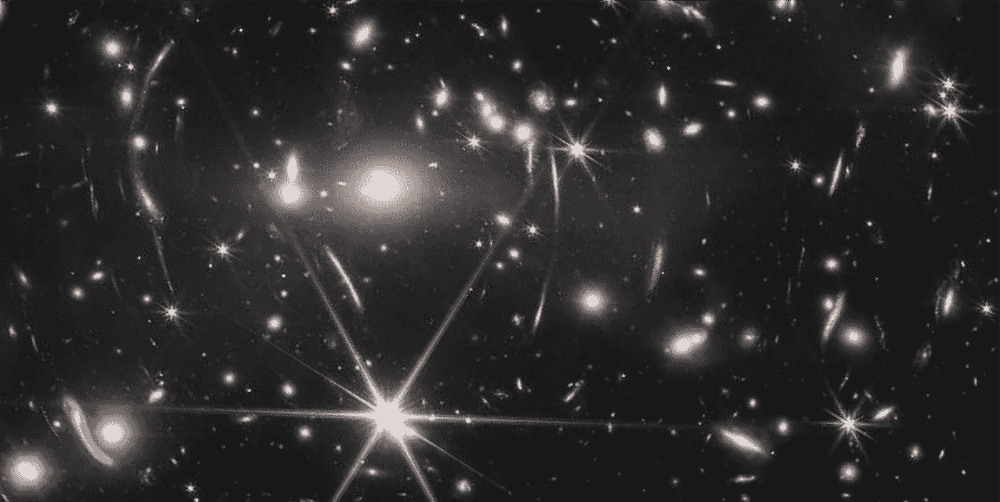

# 什么是 API3 QRNG，为什么它对 Web3 有好处？

> 原文：<https://medium.com/coinmonks/qrng-makes-web3-a-richer-ecosystem-8cd8b45ed42b?source=collection_archive---------18----------------------->

**Galaxy cluster SMACS 0723, brought to you by the Webb telescope… and the laws of physics.**

世界上最好的量子随机数发生器(QRNG)现在可以在 Web3 上使用，名称为 [API3](https://medium.com/u/9db08c25a598?source=post_page-----8cd8b45ed42b--------------------------------) [QRNG](https://api3.org/qrng) 。由于随机化的方法对这个领域来说是新的，我将深入研究量子随机数的生成，并看看它如何与 Web3 以及最受欢迎的选项 VRF 相适应。

*   qrg 简介
*   真实 vs 伪随机性— *为什么量子随机性是随机数生成的黄金标准。*
*   信任 ANU — *查看激励机制，并从源头评估操纵的长期合理性。(提示:不是真的有道理)*
*   随机性的密码证明
*   丰富 Web3 生态系统— *打破近乎垄断的局面刺激了技术创新和价格竞争力*。

# qrg 简介

将 API3 的 QRNG 与 RNG 现有的 Web3 产品——链家的 VRF——相比较，让人兴奋不已。在过去的几个月里，我一边吃着一公吨的爆米花，一边在我们的推特上占据了第一排的位置。

QRNG 背后的团队是澳大利亚国立大学(ANU)的量子光学小组。除了世界级的量子物理研究，澳大利亚国立大学的科学家们在过去的十年里一直为 Web2 提供随机数生成。然而，将第三方 oracle 节点集成到组合中的技术挑战使他们无法为 Web3 区块链项目提供相同的服务。

随着 API3 的第一方 Airnode 消除障碍，ANU 能够轻松地将其服务基础扩展到 Web3。现在，智能合约可以向其 API 发出请求，并以数字、文本、颜色等形式接收真正随机的输出。

作为一名非数学家，当我第一次听说 ANU 利用量子力学和熵的内在概率性质将 qrg 与传统的随机数生成器区分开来时，我说,”😯".

虽然我们将在文章的稍后部分讨论细节，但 TLDR 是，不是每个人都可以构建 qrg。进入的障碍包括高昂的维护成本和复杂的机械，但谢天谢地，我们都可以通过 API3 获得 qrg 的好处。

> 交易新手？尝试[加密交易机器人](/coinmonks/crypto-trading-bot-c2ffce8acb2a)或[复制交易](/coinmonks/top-10-crypto-copy-trading-platforms-for-beginners-d0c37c7d698c)

与现有的 VRF 选项相比，API3 QRNG 有一些很酷的优点:

1.  免费使用。
2.  十家连锁店的 VRF 没有，三家连锁店的 VRF 有。
3.  真正的随机性归功于熵。
4.  打破了整个生态系统对随机数生成的垄断，从长远来看，这只会让开发者和 dApp 用户受益。

# 为什么随机？

随机性对人类来说是如此重要，以至于被识别为骰子的物体在全球各地都被发现，可以追溯到几千年前的[和史前](https://en.wikipedia.org/wiki/Dice#History)。随着时间的推移，我们发现了随机性的许多用途。

[游戏和赌博](/api3/redefining-trust-truly-random-gaming-8da641ec66eb)经常采用随机的形式来选择赢家和输家(就像轮盘赌，或者吸管)，或者决定玩家的能力，就像大富翁游戏中的骰子在棋盘上移动玩家。

古代雅典的政府对其成员采用随机选择。管理重要事务的各种委员会通过从公民中随机抽取成员而定期形成和改革，就像今天陪审团的职责被分配一样。选举的想法被古代雅典人视为不符合平等原则。

随机性对于安全性来说也是至关重要的，就像比特币中使用的椭圆曲线方法生成密钥一样。

没有产生随机性的系统，我们只能得到可预测的结果或我们自己的偏见。这些会产生从无聊到破产的广泛影响。

# 什么是随机？

真正的随机性要求事件没有模式或可预测性。

但是当你使用算法来产生随机性时，它们的编程方法固有地遵循一种结构，这种结构在给定足够的时间后会产生模式；它们更接近随机，而不是真正产生随机。

抛硬币怎么样？每次你需要一个数字时，你仍然需要手动抛硬币，以保持结果与自然的随机性相关，并拥有一个真正的随机数生成器[(TRNG)。](https://www.youtube.com/watch?v=H76UiKClI_U&t=1340s)

如果您要获取数千次手动翻转的数据，并将这些数据传输到一个算法中，以便您的服务可以对许多人有用，那么您会遇到相同的编程选择问题:

*   输入是一个有限集
*   有限意味着在某一点上的重复
*   输出不是真正随机的

# 随机性的密码证明

VRF 代表“可验证的随机函数”。这些功能由三部分组成:

1.  一种生成函数，使公钥/私钥对的长度为 k 位。

**GEN(1k) = (PK，SK)**

2.一个主函数，根据密钥输出一个关于随机性的变量。

**FSK(x) = (r，π)**

3.一种验证器功能，用于验证根据公钥正确计算了随机性。

**VERPK(x，r，π) =真/假**

除了一个数字，VRFs 还输出一个关于这个数字是如何产生的加密证明。这一证明意味着计算是可重复的，从而实现了不可信的共识验证。

然而，从技术上来说，vrf 是伪随机数发生器(PRNGs)，因为有一种机制会导致数字在足够长的时间后开始重复。此外，PRNGs 的安全性依赖于计算能力的限制，因为它们是确定性算法。

为了真正的随机性，我们必须回到自然界。

# 输入熵

*“量子理论基本上告诉我们，在真空空间中，你仍然有……虚拟粒子形成和消失……这就是我们所看到的……我认为这就是为什么人们非常着迷于从无到有产生这个无限随机数序列”——澳大利亚国立大学量子光学组的 Koy Lam 教授*

*Dr Aaron Tranter with the ANU Quantum Random Number Generator | Picture: Elesa Kurtz*

在 ANU，他们通过在金盒中保持真空来创造这个真空空间，然后使用激光来检测粒子的存在和消失。测量结果被转换成二进制代码，用于生成随机数。

随机输入产生随机输出。

# 对物理学的信任

用于 API3 QRNG 的 ANU 量子随机数发生器实验经过专门优化，有利于加密，并且即使在[有对手](https://arxiv.org/abs/1411.4512)存在的情况下也是安全的。

QRNG 在真空中寻找噪音。把这种噪声想象成一种静电，由电、热和量子信息组成。有趣的是，构成噪声的比例遵循一种可预测的分布，即量子与经典噪声比，我们将看到这是所收集数据安全性的一个关键因素。

对手相对容易监测或控制热和电磁信号。然而，为了操纵量子信号，人类需要知道如何精确地远程幻影显形物质，这目前还不在讨论范围内。

因此，科学家们能够使用量子与经典噪声比来抵消对手可能预测或控制的数据，并仅基于他们的激光器检测到的量子数据来生成数字。目前，这以 5.7 千兆位/秒的速率产生随机信息位，比可用于广播数据的带宽更快。

有趣的是，你可以运行一个实验来检查 API3 QRNG 提供的数据的随机性——只需在两个独立的窗口中打开[这个链接](https://qrng.anu.edu.au/random-colours/)。将两扇窗户并排放置，你会发现每一系列的颜色都是独一无二的。如果您堆叠越来越多的打开的窗口进行比较，这种情况将会继续。

ANU API 为它收到的每个调用提供新的和唯一的随机数，并且在过去的 10 年里一直是这样做的。在请求得到满足之前，实验会产生一个任何人都不知道的答案，这是一个持续不断的数据流。

# 更丰富的 Web3 生态系统

通过 API3 QRNG，10 个新链上的开发者可以访问随机数生成。3 其他人现在可以在 API3 QRNG 和 VRF 之间进行选择。

选择是市场的基石，并通过服务提供商之间的竞争推动创新。为了获得最大份额的顾客收入，公司受到激励，通过提供最适合市场的产品来击败其他公司。这意味着他们必须不断寻求改进，不仅要针对他们过去所做的，还要针对他们的竞争对手现在正在做的或未来可能做的。

由于这种机制，服务不仅变得更好，而且变得更便宜。如果顾客不喜欢某种商品或服务的价格，他们可以选择搬到别处。有了竞争，市场力量可以诚实地平衡成本和所提供的东西。

感谢资本主义！

无疑会有批评，但我很高兴看到一个新玩家进入游戏如何改变董事会。所以，来点爆米花吧，让我们看看随机性是如何发挥其魔力的——创新是不可预测的。

*感谢梁家杰把我放进这个兔子洞。*

# 另外，阅读

*   [币安 vs FTX](https://coincodecap.com/binance-vs-ftx) | [最佳(SOL)索拉纳钱包](https://coincodecap.com/solana-wallets)
*   [如何在 Uniswap 上交换加密？](https://coincodecap.com/swap-crypto-on-uniswap) | [A-Ads 评论](https://coincodecap.com/a-ads-review)
*   [加密货币储蓄账户](/coinmonks/cryptocurrency-savings-accounts-be3bc0feffbf) | [YoBit 审核](/coinmonks/yobit-review-175464162c62)
*   [Botsfolio vs nap bots vs Mudrex](/coinmonks/botsfolio-vs-napbots-vs-mudrex-c81344970c02)|[gate . io 交流回顾](/coinmonks/gate-io-exchange-review-61bf87b7078f)
*   [CoinFLEX 评论](https://coincodecap.com/coinflex-review) | [AEX 交易所评论](https://coincodecap.com/aex-exchange-review) | [UPbit 评论](https://coincodecap.com/upbit-review)