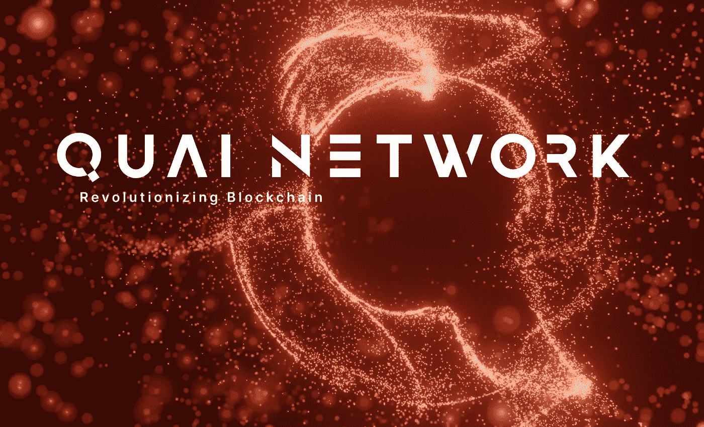

# 基于合并挖掘的区块链 Quai Network

> 原文：<https://medium.com/coinmonks/quai-network-a-blockchain-based-on-merged-mining-502bd9ee4bbc?source=collection_archive---------10----------------------->

非常好的加密读者，我们继续与新项目的检测器激活，试图为您带来有关加密空间的发展信息，在这种情况下，我们将谈论 Quai 网络，一个第 1 层兼容的 EVM 的基础上，合并挖掘作为主要引擎，试图提高可扩展性，让我们去那里！

> **什么是魁网？**