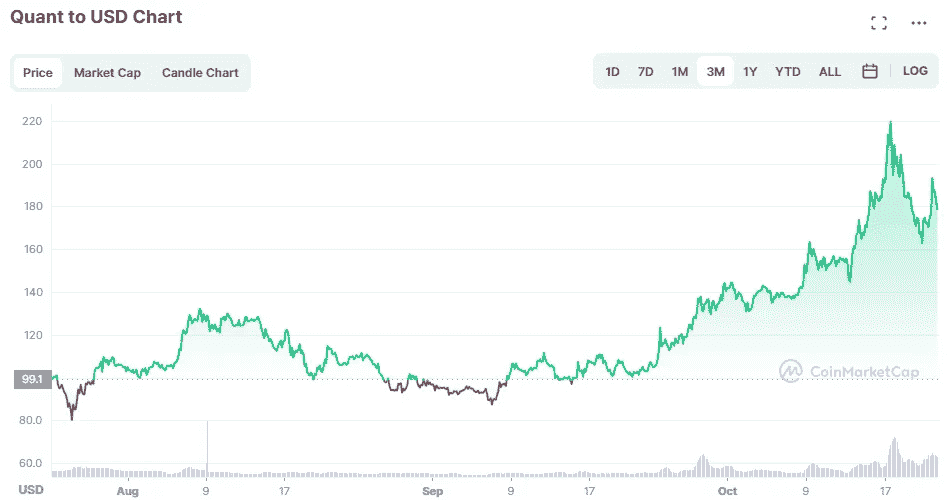

# Quant (QNT)加密进入前 30 名

> 原文：<https://medium.com/coinmonks/quant-qnt-crypto-moves-into-the-top-30-a13c403a8de?source=collection_archive---------22----------------------->

[https://coinmarketcap.com/currencies/quant/](https://coinmarketcap.com/currencies/quant/)

Quant (QNT)令牌最近一直在飙升，在 CoinMarketCap 上进入前 30 名，市值超过 20 亿美元。

Quant 令牌是 Quant 网络的本机令牌，Quant 网络是一个区块链平台，支持企业级区块链解决方案。该平台设计为可扩展、安全并与现有系统兼容。