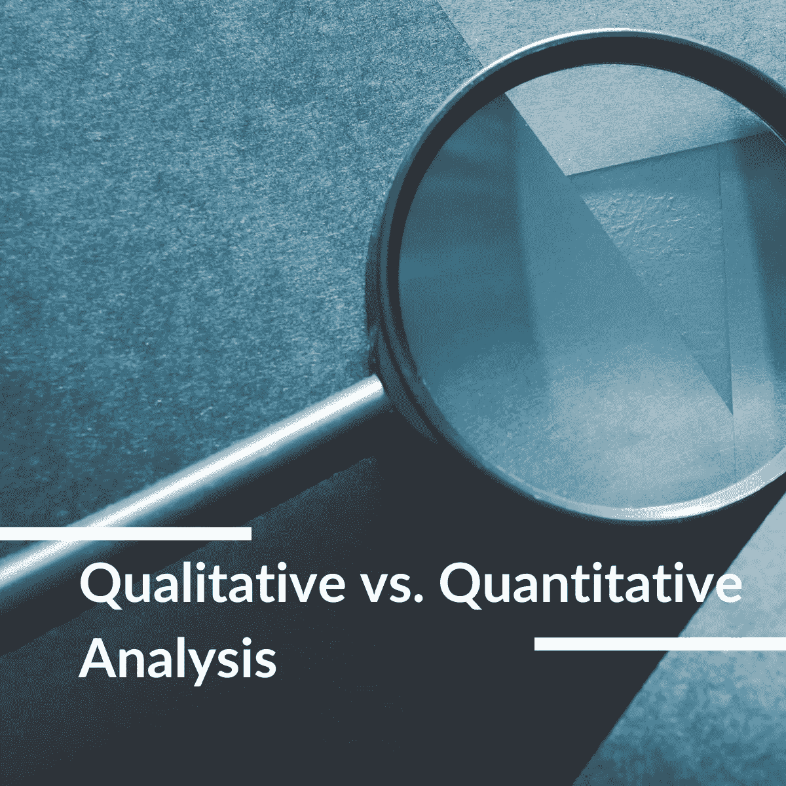

# 定量和定性分析:主要区别是什么？

> 原文：<https://medium.com/coinmonks/quantitative-and-qualitative-analysis-what-are-the-main-differences-1e50ec1db209?source=collection_archive---------13----------------------->

对许多人来说，交易或投资可能是一场游戏，但这不是一场完全靠运气就能赢的游戏。要想在金融市场获得那样的运气，需要努力工作和深入研究。赤手空拳可以做任何事，但分析的基本要素却可以！

定量分析和定性分析是许多交易者和投资者关注的两种类型。然而，有些人仍然对这些分析和他们能为自己的交易做些什么感到困惑。这个博客展示了定量分析和定性分析的主要区别，以及关于这些主题的常见问题。

# 什么是定量分析？

*Quantitative analysis helps to evaluate a company’s performance through objective database.*

**定量分析**是一种利用数学和统计建模、测量和研究来洞察市场趋势的技术。定量分析师不谈论假设，而是通过数值来展示现实。因此，这种分析在测量、性能评估、金融工具估价、真实世界事件预测等方面是有用的和受欢迎的。

这意味着定量分析就像一套工具，用于检查和分析过去、现在和预期的未来事件。它更喜欢数字值或可量化的信息，如金融分析、分析化学、有组织的运动等。赞成定量分析。那些崇拜定量分析的人被称为“定量分析师”或“定量分析师”。

特别是在金融服务行业，人们使用定量分析来分析投资机会，以指出购买或出售证券的正确时机。定量分析使用的关键财务比率包括市盈率(P/E)、每股收益(EPS)、做出投资决策的过程等。定量分析的范围很广，从简单的统计数据到复杂的计算，如现金流或期权定价。

# 什么是定性分析？

*Qualititative analysis completes the landscape of how well a company operates.*

定性分析跟踪公司的价值或不可量化信息的前景。它们可以是管理专长、研发实力、行业周期和劳资关系。

定性分析控制的方面包括属于社会和经验领域的无形的、不精确的关注，如与品牌的关联、管理可信度、客户满意度、文化变迁等。

由于不可鉴定的信息，收集数据进行定性分析有时具有挑战性。当然，首席执行官不会与散户投资者坐下来讨论公司的财务问题。这需要时间和努力，但却无法提高效率。

沃伦·巴菲特是利用定性分析的信息和见解做出大胆而有利可图的决策的大师。然而，他是沃伦·巴菲特，能够让人们贡献他们的时间和信息。我们不能像这样抓住单一因素不放，而是要使我们的来源多样化。除了人际关系，你还可以仔细阅读新闻报道和公司文件，深入了解管理者的记录、策略等。

此外，你可以通过访谈、小组讨论、档案工作、文件分析等方式获取定性分析的信息。它经常被仔细阅读和主题编码，以识别主题、模式和趋势。

# 定量分析与定性分析的主要区别

*Quantitative analysis and Qualitative analysis are not the same but not going against with each other.*

首先，定量分析和定性分析之间的基本不同点是这些分析中信息或数据库的可量化性。定量分析侧重于数值，而定性分析强调更抽象的信息，如声誉或员工士气。

随着深入研究，你会发现定性和定量分析描绘了一幅公司业绩的大图。因此，你可以对是否应该投资一家公司及其股票做出有效的决定。

定性分析就像一个有用的评估工具，定性分析强调敏感性和上下文等含义。定性分析可以帮助你回答一个公司为什么以及如何会保持增长或者容易崩溃。

# 常见问题

# 定性分析的过程是怎样的？

没有一个标准的过程，但我们下面分享的过程是大多数研究人员和分析师使用的一个流行的过程。

*   确定你的目标和目的。
*   跟踪和组合定性数据。
*   分解数据以生成初始主题代码。
*   确定代码中的模式或主题。
*   根据最初的分析修改代码。
*   保留你写作的日志。

# 定性分析师使用哪些方法？

人们使用各种方法来洞察一家公司的概念和潜在表现。常见的方法包括访谈、叙述、焦点小组、文件/档案分析等。

 [## 基本面分析和技术面分析:它们有多大区别？

### 这些术语是投资者和交易者经常谈论的术语。他们都是分析…

medium.com](/@libraryoftrader/fundamental-analysis-vs-technical-analysis-how-different-are-they-84110384e594) 

# 什么是量化交易？

量化交易包括主要由量化分析驱动的交易策略。这意味着数学计算和数字处理是识别交易机会的主要任务。价格和交易量是定量分析的常用数据输入，用于建立可靠的数学模型。

 [## 基本面分析的基本要素——第一部分

### 什么是基本面分析？

medium.com](/@libraryoftrader/the-bare-essentials-of-fundamental-analysis-part-1-b365acf6014) 

金融机构和对冲基金大多使用量化交易来交易成千上万的股票和其他证券。然而，个人投资者有使用量化交易的趋势。

 [## 基本面分析的基本要素——第二部分

### 我们讨论了基本面分析的基础和它的两种类型——定量分析和定量分析——的主要区别

medium.com](/@libraryoftrader/the-bare-essentials-of-fundamental-analysis-part-2-5f23a1a74641) 

# 为什么分析师都爱 Quant 交易？

Quant 交易，量化交易的另一个名称，是一个与情绪无关的过程。因为量化交易的主要焦点不是抽象的概念，而是模式和数字。结果，它成了买卖决策的有效原则。

除此之外，它还通过策略和投资节省了大量成本。因为计算机负责定量分析，用数字和特定的值来获得实际的洞察力。人类出错的可能性更小，从而产生对计算机性能的洞察。

# 一个人怎样才能成为 Quant？

对于一个想成为量化交易者的人来说，对所有数学事物都有兴趣和能力是很重要的。拥有数学学士学位、金融工程或定量金融建模硕士学位，或者 MBA 学位，就可以拿到奖金。此外，你应该熟悉数据挖掘、研究方法、统计分析和自动交易系统，并积累多年的经验。

# 量化交易和算法交易类似吗？

是和不是。数量交易和算法交易都依赖于数学计算和分析来洞察市场趋势以制定策略。然而，尽管定量交易部分使用计算机工作，部分使用人工管理，但算法交易大多让计算机负责。换句话说，算法交易甚至自动化了基于算法的交易决策和执行过程！

 [## ETF 算法交易盈利吗？

### 介绍

medium.com](/@libraryoftrader/is-etf-algorithmic-trading-profitable-a523e0925032) 

# 我应该通过免费课程学习量化交易吗？

不，很不幸。大多数成功的量化交易者把他们的金钱、时间和精力投入到知名金融机构或大学的正规教育中。此外，他们还投身于量化交易领域的第一手经验。自我研究和自学也是一个量化交易者成功的重要因素。但可以搜索行业资格认证、[技术分析](/@libraryoftrader/what-is-technical-analysis-9fccbfc73e9b)、量化分析等 quant 交易或相关科目的免费课程。通过可靠的消息来源！

 [## 什么是技术分析？

### 技术分析是一种投资评估的方法，通过对市场的分析来确定交易机会

medium.com](/@libraryoftrader/what-is-technical-analysis-9fccbfc73e9b) 

你可能会对我们[媒体简介](/@libraryoftrader)的其他文章感兴趣。

 [## 印度股票投资者必须知道的五大网上资源

### 如果你是印度股市的新手，你可能会发现自己对更新哪些网上资源感到困惑…

medium.com](/@libraryoftrader/top-5-online-sources-that-indian-stock-market-investors-must-know-34560186a109)  [## NFTs 的未来:幻想还是乐观？

### 非专利技术已经上升到投资者和投资者最值得考虑的投资项目

medium.com](/coinmonks/the-future-of-nfts-illusions-or-optimism-a95f7520786e)  [## 交易心理学:你可能不知道…

### 交易心理学顾名思义，心理学或思维在交易中的工作方式。你可能会发现…

medium.com](/@libraryoftrader/trading-psychology-you-might-not-know-a5288f05c1cd)  [## 如何评价一个 NFT 的价值？

### NFT 是一个新的领域，最近引起了公众的极大关注。因此，测量 NFTs 的价值是…

medium.com](/coinmonks/how-to-evaluate-the-value-of-an-nft-d4078f1a98ba) 

你也可以找到我们👇

交易者博客库:[https://libraryoftrader.net/blogs](https://libraryoftrader.net/blogs)

https://www.facebook.com/libraryoftrader[脸书](https://www.facebook.com/libraryoftrader)

推特:【https://twitter.com/libraryoftrader 

领英:[https://www.linkedin.com/company/library-of-trader/](https://www.linkedin.com/company/library-of-trader/)

https://www.reddit.com/user/Library_Of_Trader

quora:[https://www.quora.com/profile/Library-of-Trader](https://www.quora.com/profile/Library-of-Trader)

> 交易新手？尝试[加密交易机器人](/coinmonks/crypto-trading-bot-c2ffce8acb2a)或[复制交易](/coinmonks/top-10-crypto-copy-trading-platforms-for-beginners-d0c37c7d698c)