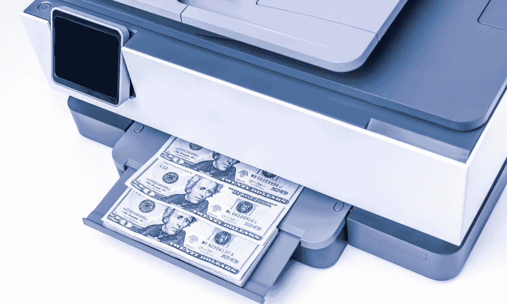

# 量化宽松——政府如何拿走你的钱

> 原文：<https://medium.com/coinmonks/quantitative-easing-how-governments-take-your-money-255a27446fc2?source=collection_archive---------29----------------------->

让我告诉你政府是如何从你口袋里偷钱的，这样你就能搞清楚了。显然，这是通过通货膨胀发生的，而这种通货膨胀不是由于战争或我们正在经历的能源危机。

这些只是放大这一过程的一些因素，但主要原因是由国家量化宽松计划产生的。