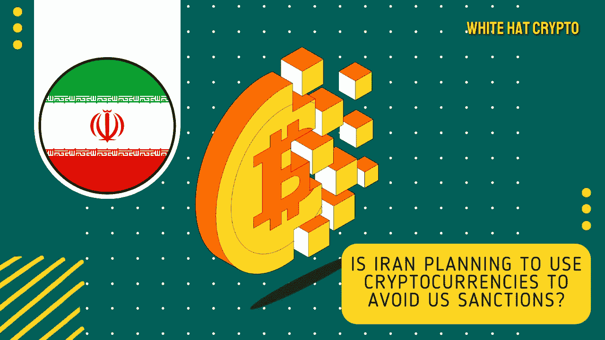

# 🚨快速事实:伊朗使用密码制作第一份进口订单！

> 原文：<https://medium.com/coinmonks/quick-fact-iran-makes-first-import-order-using-crypto-77d248b603e8?source=collection_archive---------26----------------------->

伊朗是否计划使用加密货币来避免美国的制裁？

伊朗决定使用加密货币来结算跨境商业交易，因为该国政府正在寻求美元和国际银行体系的替代品。

8 月 9 日，**伊朗贸易促进组织** (ITPO)主席阿里·雷萨·佩曼帕克在[的推特](https://twitter.com/peymanpak_ir/status/1556927239907835904)上宣布，第一笔使用加密货币的正式进口订单已经“在本周”下了

兼任工业、矿业和贸易部副部长的佩曼帕克没有具体说明购买了什么商品或服务，或者与谁购买，但表示这笔交易价值**1000 万美元**。

他继续预测，在不久的将来，加密货币和智能合约的使用将在与一些国家的“对外贸易中广泛使用”。

上个月有报道称，伊朗和俄罗斯启动了一项结算机制，利用各自的货币来限制美元在双边贸易中的使用。

伊朗中央银行于 2019 年禁止该国境内的加密货币交易。由于该国大量开采加密货币，该国的能源网络有时承受着巨大的压力，导致大范围停电。

然而，政府允许比特币和其他加密货币用于国际贸易，以避免美国的制裁。

一月份，伊朗 Mehr 通讯社[声称](https://www.mehrnews.com/news/5396149/%D8%A7%D8%B3%D8%AA%D9%81%D8%A7%D8%AF%D9%87-%D8%A7%D8%B2-%D8%B1%D9%85%D8%B2%D8%A7%D8%B1%D8%B2%D9%87%D8%A7-%D8%AF%D8%B1-%D8%AA%D8%AC%D8%A7%D8%B1%D8%AA-%D8%A8%DB%8C%D9%86-%D8%A7%D9%84%D9%85%D9%84%D9%84-%D8%AA%D8%A7-%D8%AF%D9%88-%D9%87%D9%81%D8%AA%D9%87-%D8%A2%DB%8C%D9%86%D8%AF%D9%87)ITPO 和伊朗中央银行已经达成协议，允许加密货币用于跨境交易，该系统有望“在未来两周内”投入使用

> “这些加密货币和区块链系统在商业事务中有许多实际的讨论，”Peymanpak 在一月份告诉 Mehr。"如果我们忽视了这一点，我们将失去很大一部分商业机会."他接着说，“在我们的主要市场，如俄罗斯、中国、印度和东南亚，加密货币的使用很流行。”

尽管加密货币可能对试图逃避制裁的伊朗人有利，但美国官员正在采取措施，尽可能地打击加密货币。

《纽约时报》7 月份报道称，北海巨妖加密货币交易所因涉嫌允许伊朗客户买卖数字代币而受到联邦调查。

另一个交易所币安也被 T2 指责不顾国际限制处理伊朗客户的交易。

这篇文章中提供的内容不是赞助的，据我所知是正确的。这篇文章不是金融建议，我们不对针对这篇文章采取的任何行动负责！

请随时查看我们的社交平台，了解每日加密更新，或通过以下渠道联系我们:

[YouTube](https://www.youtube.com/channel/UCjfinzatswbVaRd89zn5kJQ/featured)

[推特](https://twitter.com/whitehatcrypto)

[Instagram](https://instagram.com/white.hatcrypto?igshid=YmMyMTA2M2Y=)

[Gmail](http://cryptowhitehat@gmail.com/)

信息来源:路透社福布斯

> 加入 Coinmonks [电报频道](https://t.me/coincodecap)和 [Youtube 频道](https://www.youtube.com/c/coinmonks/videos)了解加密交易和投资

# 另外，阅读

*   [无聊猿游艇俱乐部(BAYC)回顾](https://coincodecap.com/bored-ape-yacht-club-bayc-review) | [拜比特 vs 比特币基地](https://coincodecap.com/bybit-vs-coinbase)
*   [5 款最佳加密交易终端](https://coincodecap.com/crypto-trading-terminals) | [最佳 DeFi 应用](https://coincodecap.com/best-defi-apps)
*   [比特币基地 vs 瓦济克斯](https://coincodecap.com/coinbase-vs-wazirx) | [比特鲁点评](https://coincodecap.com/bitrue-review) | [波洛涅克斯 vs 比特鲁](https://coincodecap.com/poloniex-vs-bittrex)
*   [德国最佳加密交易所](https://coincodecap.com/crypto-exchanges-in-germany) | [Arbitrum:第二层解决方案](https://coincodecap.com/arbitrum)
*   [币安交易机器人](/coinmonks/binance-trading-bots-d0d57bb62c4c) | [OKEx 评论](/coinmonks/okex-review-6b369304110f) | [阿塔尼评论](https://coincodecap.com/atani-review)