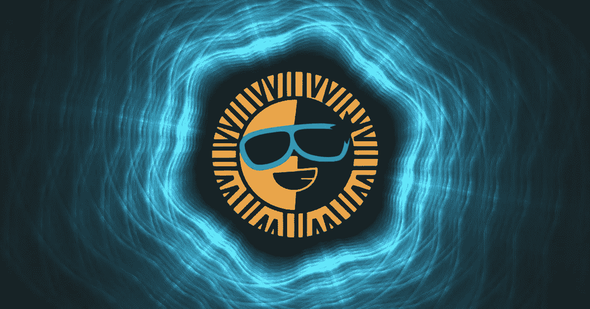

# 关于 Sun.io 及其本机令牌$SUN 的快速指南

> 原文：<https://medium.com/coinmonks/quick-guide-about-sun-io-and-its-native-token-sun-9ed753cf77ea?source=collection_archive---------58----------------------->

## SUN.io 是 TRON 的第一个一站式平台，它允许稳定的硬币互换、代币挖掘和自我管理。

# 什么是$Sun 令牌及其实用程序？

重新命名后，新的$SUN 令牌将赋予令牌持有者各种权利和利益，如社区中的投票权和治理权、价值获取、赌注奖励等。作为 SUN 平台上的多功能治理令牌(堪比曲线道的 CRV 令牌和省略号的 EPS 令牌)。

与 Curve DAO 的 [CRV 令牌](https://www.bcbitcoin.com/crypto-services/coin-guide/curve-dao-token-crv/)和 Ellipsis 的 EPS 令牌类似，重新命名后的新 SUN 令牌将作为 SUN 平台上的多用途治理令牌，赋予令牌持有者多种权利和特权。

## Sun.io 平台及其发展

到目前为止，SUN.io 已经经历了各种版本并购买了 JustSwap。更新后的 SUN.io 平台具有包括令牌交换、流动性挖掘等功能。

构建 TRON 的以去中心化交易所(DEX)为核心的 DeFi 生态系统，stablecoin 互换，以及公链上的去中心化自治组织(DAO)是其根本。

SUN.io 的原生币在平台治理中发挥着重要作用，为流动性提供者提供奖励，回购和燃烧奖励，以及其他功能。它支持 TRON 为所有用户提供共同利益的目标。

# 路标

通过利用各种交易协议，SUN.io 寻求创建一个具有高级功能、盈利能力和安全性的集成 DEX 生态系统。

参与者可以从支付给流动性做市商的交易费、LP 代币开采奖励和$SUN 代币股份奖励以及其他奖励中受益。同时，太阳的燃烧机制和持有者的投票权创造了一个闭环生态。

# 存储 Sun (SUN)的位置

您可以将 Sun (SUN)存储在多货币钱包中，如 [Exodus](https://www.bcbitcoin.com/wallet-guides/exodus-wallet-guide/) 。您可以将您的$SUN 代币存储在其桌面版本以及 iOS 和 Android 智能手机版本中。Exodus 是一个免费的用户友好平台，可以在几分钟内从其官方网站下载。

同样，保护您的$SUN 安全的用户友好选项可以包括 [MetaMask](https://www.bcbitcoin.com/wallet-guides/metamask-wallet-guide/) ，这是一个领先的浏览器钱包扩展，在 DeFi 平台中很受欢迎，并受到开发人员的高度赞扬。用户可以通过连接他们的 MetaMask 钱包来整合网络的流动性挖掘池。

# 在哪里买卖孙(孙)

你可以在 BC 比特币这里买卖孙(Sun)。

您可以前往我们网站的[购买硬币](https://www.bcbitcoin.com/buy/)页面购买 Sun 代币。Sun (SUN)可在 BC 比特币交易平台上交易主要法定货币:英镑和欧元。购买 Sun (SUN)从未如此简单，只需下订单并提供您的钱包地址。一旦您的付款到达，SUN 将直接发送到您的钱包。

如果您选择出售孙(孙)，您可以向我们发送硬币，并收到付款到您的银行帐户。详情和实时估价可以在[出售硬币](https://www.bcbitcoin.com/sell/)页面找到。

# Sun(太阳)资源

网址:【https://sun.io/#/home
区块探索者:[https://tronscan.org/#/token20/](https://tronscan.org/#/token20/TSSMHYeV2uE9qYH95DqyoCuNCzEL1NvU3S)
推特:[https://twitter.com/defi_sunio](https://twitter.com/defi_sunio)

> 免责声明:本文中提供的信息仅供参考。完成自己的研究和尽职调查是读者的责任。

> 加入 Coinmonks [电报频道](https://t.me/coincodecap)和 [Youtube 频道](https://www.youtube.com/c/coinmonks/videos)了解加密交易和投资

# 另外，阅读

*   [OKEx vs KuCoin](https://coincodecap.com/okex-kucoin) | [摄氏替代品](https://coincodecap.com/celsius-alternatives) | [如何购买 VeChain](https://coincodecap.com/buy-vechain)
*   [币安期货交易](https://coincodecap.com/binance-futures-trading)|[3 commas vs Mudrex vs eToro](https://coincodecap.com/mudrex-3commas-etoro)
*   [如何购买 Monero](https://coincodecap.com/buy-monero) | [IDEX 评论](https://coincodecap.com/idex-review) | [BitKan 交易机器人](https://coincodecap.com/bitkan-trading-bot)
*   [CoinDCX 评论](/coinmonks/coindcx-review-8444db3621a2) | [加密保证金交易交易所](https://coincodecap.com/crypto-margin-trading-exchanges)
*   [红狗赌场评论](https://coincodecap.com/red-dog-casino-review) | [Swyftx 评论](https://coincodecap.com/swyftx-review) | [CoinGate 评论](https://coincodecap.com/coingate-review)