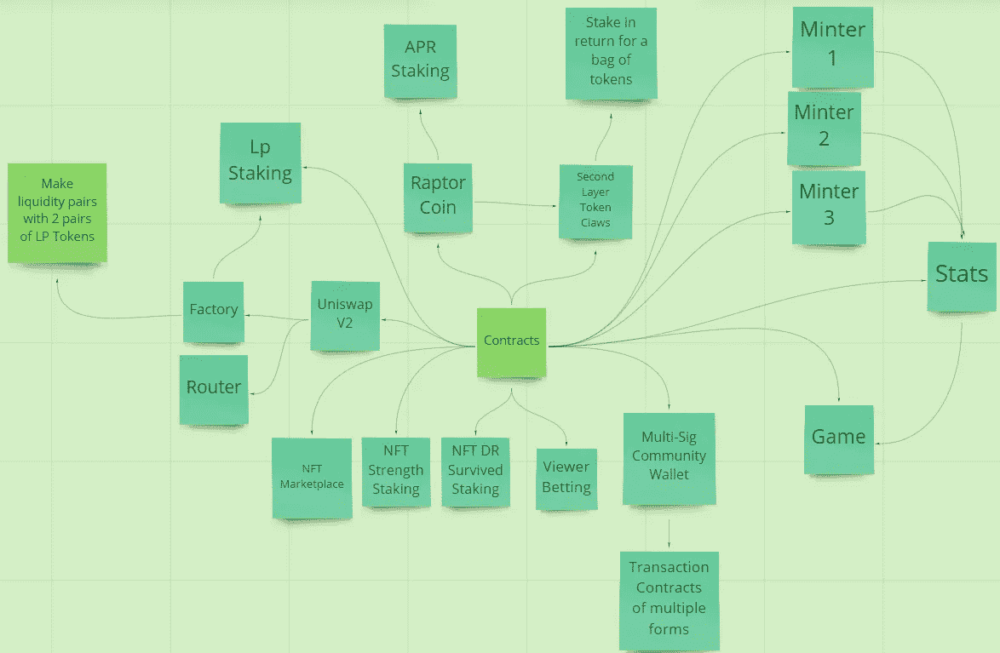

# 赛车猛龙合同架构 p1。

> 原文：<https://medium.com/coinmonks/racing-raptors-contract-architecture-p1-28a8bb064e86?source=collection_archive---------10----------------------->

这个项目仍在进行中。

这里发生了很多事情，让我们打开它。

从铸币厂开始。
Minter 1 — 10k 猛禽系列
Minter 2 — Collab 猛禽系列
Minter 3 —猛禽饲养

他们都使用相同的单一统计和游戏合同。这使得所有的统计数据都是连锁的&使用可验证的游戏逻辑获得。

有 3 种类型的可用比赛
QP——快速游戏
竞赛
博士——死亡竞赛。

每场比赛 8 名选手。每场比赛 2 名战士。

比赛的获胜者将获得速度提升。战斗的胜利者获得力量属性的提升。

在 QP/竞争中，战斗的失败者将有 12 小时的冷却时间。如果猛禽在死亡竞赛中输了，它会被烧毁。

参加比赛需要花费，从 QP 到博士的费用增加。比赛的获胜者赢得 50%的入场费，5%被发送到社区的 multi sig 钱包，用于从 NFT 的其他项目购买 NFT 给社区& 45 %的入场费被烧掉。

当游戏开始时，该合同会从 Chainlink VRFv2 中请求随机数，这可能需要几分钟才能完成，因此用户将有机会在一场比赛中打赌哪只猛禽将赢得比赛。当用户下注时，代币被烧掉&用户获得奖励的代币被铸造。

NFT 博士立桩。

在此合约中下注的每只猛禽都会获得每一格的基本奖励，每有一个你的猛禽幸存博士(最多 50 场幸存),你的猛禽奖励就会增加%,这是复利。

NFT 实力跑马圈地。

在这份合同中，所有猛龙分享的是每块的总奖励。
猛龙队在每一区块的奖励份额是基于他们的实力与所有猛龙队在赌注合同中的累积实力。本质上是一个产量农业合同，产量是基于从游戏中获得的统计数据。

用户将支付 1 美元来下注他们的猛禽，这 1 美元将与一些猛禽硬币配对&在一个锁定的流动性地址下发送到 LP。

NFT 市场。

因为我们有链上统计，Opensea 不会承认这些，所以我们需要自己的市场。交易将以猛禽币进行。所有转售的 1%将被烧毁。

Uniswap V2。

这不是最容易的一步，升级 Uniswap V2 到 solidity lol 的最新版本。这是为了与生态系统无缝互动。

低压铆接。

用户将因进入生态系统而获得猛禽币奖励&锁定他们的流动性。

猛禽硬币赌注。

用户可以用他们的猛禽币下注，获得大约 1-3%的保守回报。

爪子(二级令牌)。

用户可以用他们的猛禽币换爪子，然后他们可以用其他多边形项目的代币下注并奖励用户。

对，所以我知道那是很多。我现在就说到这里，但是如果你喜欢这个，请记得回来看 p2:)

第二部分—[https://medium.com/p/cd06bca5e541](/p/cd06bca5e541)

坚实发展研究小组—【https://discord.gg/KzbcGmrnfN 

-多边形联盟—【https://www.polygonalliance.com/ 

-多边形联盟不和—[https://discord.gg/kJKPCGQu66](https://discord.gg/kJKPCGQu66)

你喜欢这篇文章吗？想请我喝杯咖啡吗？
Polygon/Eth/Bsc—0x4a 581 E0 EAF 6b 71d 05905 e8e 6014 DC 0277 a1 b 10 ad

> *交易新手？试试* [*加密交易机器人*](/coinmonks/crypto-trading-bot-c2ffce8acb2a) *或* [*复制交易*](/coinmonks/top-10-crypto-copy-trading-platforms-for-beginners-d0c37c7d698c) *上* [*最好的加密交易*](/coinmonks/crypto-exchange-dd2f9d6f3769)

> 加入 Coinmonks [电报频道](https://t.me/coincodecap)和 [Youtube 频道](https://www.youtube.com/c/coinmonks/videos)获取每日[加密新闻](http://coincodecap.com/)

# 另外，阅读

*   [免费加密信号](/coinmonks/free-crypto-signals-48b25e61a8da) | [加密交易机器人](/coinmonks/crypto-trading-bot-c2ffce8acb2a)
*   [杠杆代币的终极指南](/coinmonks/leveraged-token-3f5257808b22)
*   [16 款最佳折叠电动自行车](/coinmonks/top-17-folding-electric-bikes-5e296f0918cb)
*   [28 款最佳电动自行车点评](/coinmonks/the-28-best-electric-bikes-review-and-buying-guide-in-2023-7bb3146cb403)
*   前三名[币安期货交易机器人](/coinmonks/top-3-binance-futures-trading-bots-e6031f84b3f9)