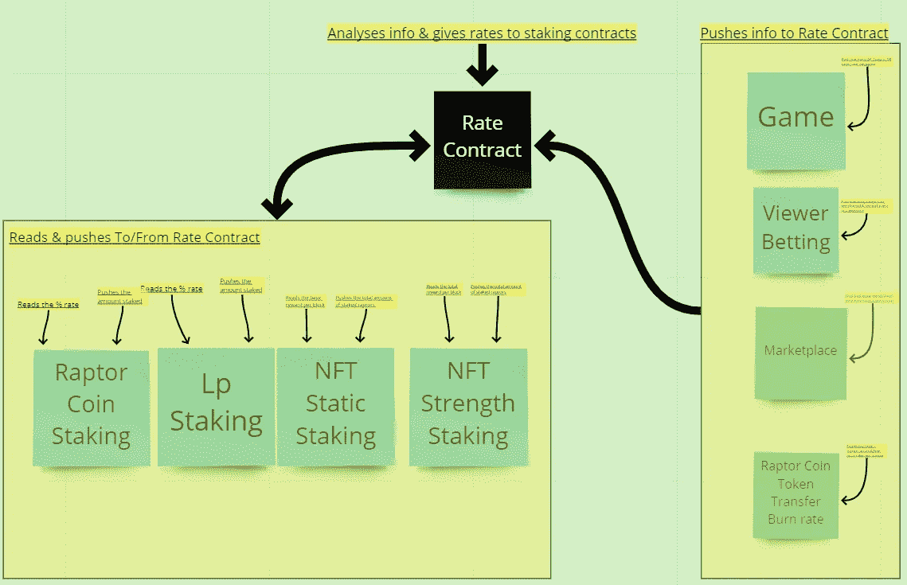
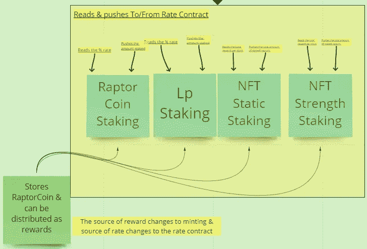

# 比赛猛龙合同架构 p2。

> 原文：<https://medium.com/coinmonks/racing-raptors-contract-architecture-p2-cd06bca5e541?source=collection_archive---------8----------------------->

首先，如果您还没有阅读第 1 部分，我建议您现在就阅读。
[https://medium.com/p/28a8bb064e86](/p/28a8bb064e86)

所以，现在我们已经对主要架构的工作原理有了一个大概的了解，让我们来看看我们是如何调节奖励比率以避免猛禽币的总供应量膨胀的。

这里我们每次都要更新一个数据分析合同:
-一场比赛结束
-一场比赛的赌注结束
-一只猛禽在市场上被转售
-一个用户转让他们的猛禽硬币

我们希望奖励合同能够更新分析合同中关于多少猛禽/猛禽币/LP 被下注的信息。一旦用户进行定标或取消定标，定标合同将更新分析合同。分析合约将返回买入合约给出的报酬率。

经过一番思考和讨论后，我们决定采用一种合同，最初奖励合同将从奖励中提取代币和比率，而不是铸造和使用分析合同。这样，我们就可以确保生态系统完全正常运行，在启用自支持功能之前，定期使用烧录机制。

代币的总供应量没有固定的上限，因此这种利率合约的目标是确保事情不会变得太疯狂。
这份合同是我的数学变得有点模糊的部分，所以我正在咨询专业数学家，以确保它以高精度完成。

谢谢你花时间阅读这篇文章。让我知道你的想法。

和平 xD

坚实发展研究小组—[https://discord.gg/KzbcGmrnfN](https://discord.gg/KzbcGmrnfN)

-多边形联盟—[https://www.polygonalliance.com/](https://www.polygonalliance.com/)

-多边形联盟不和—[https://discord.gg/kJKPCGQu66](https://discord.gg/kJKPCGQu66)

你喜欢这篇文章吗？想请我喝杯咖啡吗？
Polygon/Eth/Bsc—0x4a 581 E0 EAF 6b 71d 05905 e8e 6014 DC 0277 a1 b 10 ad

> *交易新手？试试* [*加密交易机器人*](/coinmonks/crypto-trading-bot-c2ffce8acb2a) *或* [*复制交易*](/coinmonks/top-10-crypto-copy-trading-platforms-for-beginners-d0c37c7d698c) *上* [*最好的加密交易*](/coinmonks/crypto-exchange-dd2f9d6f3769)

> 加入 Coinmonks [电报频道](https://t.me/coincodecap)和 [Youtube 频道](https://www.youtube.com/c/coinmonks/videos)获取每日[加密新闻](http://coincodecap.com/)

# 另外，阅读

*   [免费加密信号](/coinmonks/free-crypto-signals-48b25e61a8da) | [加密交易机器人](/coinmonks/crypto-trading-bot-c2ffce8acb2a)
*   [杠杆代币的终极指南](/coinmonks/leveraged-token-3f5257808b22)
*   [16 款最佳折叠电动自行车](/coinmonks/top-17-folding-electric-bikes-5e296f0918cb)
*   [28 款最佳电动自行车点评](/coinmonks/the-28-best-electric-bikes-review-and-buying-guide-in-2023-7bb3146cb403)
*   前三名[币安期货交易机器人](/coinmonks/top-3-binance-futures-trading-bots-e6031f84b3f9)