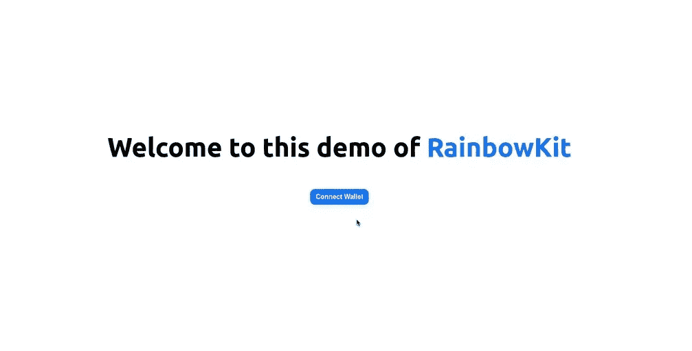
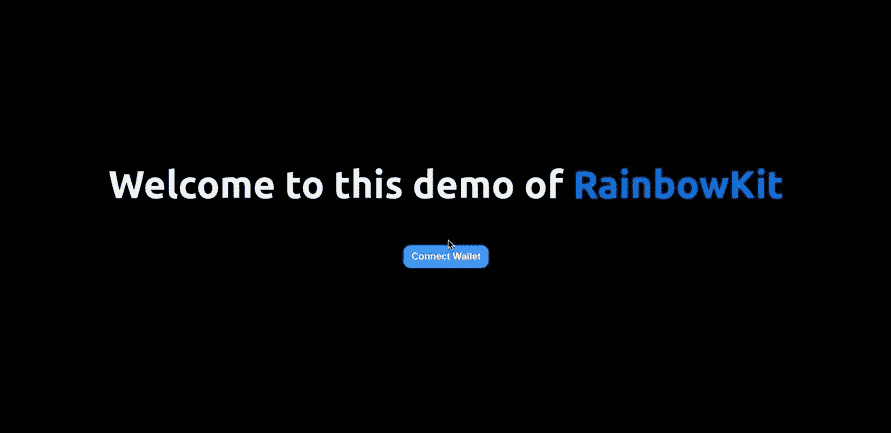

# 使用 Next.js 创建 CSC Dapp

> 原文：<https://medium.com/coinmonks/rainbowkit-implementation-on-next-js-for-csc-9dca24c020b3?source=collection_archive---------15----------------------->

Web3 中的身份验证非常容易，但是支持所有的钱包和制作一个好的 UI 可能是痛苦和耗时的。在本教程中，我们想使用 Next.js 创建一个简单的 dapp，以使用 awesome Rainbowkit 实现多个钱包连接。



## NextJS

Next.js 是一个灵活的 **React 框架**，它为你提供了创建快速 **web 应用**的构件。

但是我们这样说到底是什么意思呢？让我们花一些时间来扩展 React 和 Next.js 是什么，以及它们可以如何提供帮助。

## Web 应用程序的构建块

在构建现代应用程序时，您需要考虑一些事情。比如:

*   **用户界面**——用户将如何消费你的应用并与之互动。
*   **路由** —用户如何在应用程序的不同部分之间导航。
*   **数据获取** —您的数据存储在哪里以及如何获取。
*   **呈现** —何时何地呈现静态或动态内容。
*   **集成** —您使用什么样的第三方服务(CMS、auth、支付等)以及您如何连接到它们。
*   **基础设施** —您部署、存储和运行应用代码的地方(无服务器、CDN、Edge 等)。
*   **性能** —如何为最终用户优化您的应用。
*   **可扩展性** —您的应用如何适应您的团队、数据和流量的增长。
*   **开发者体验** —你的团队构建和维护你的应用的体验。

对于应用程序的每个部分，您需要决定是自己构建解决方案还是使用其他工具，如库和框架。

## RainbowKit

RainbowKit 是一个 React 库，它为我们提供了用几行代码构建 Connect Wallet UI 的组件。它支持许多钱包，包括 Metamask、Rainbow、比特币基地钱包、WalletConnect 等等。它也是非常可定制的，并带有一个惊人的内置主题。

RainbowKit 使用了 [Ethers.js](https://github.com/ethers-io/ethers.js) 和 [Wagmi](https://github.com/tmm/wagmi) ，这两个库都是这个领域的热门库。

还有就是漂亮的[彩虹钱包](https://rainbow.me/)背后的同一个团队开发的。

## 创建新的 Next.js 项目

运行以下命令创建一个新的 Next.js 应用程序(注意，您也可以在常规的 React 应用程序上使用它):

```
npx create-next-app rainbowkit-demo
```

如果您使用 yarn 作为包装管理器，可以按如下方式操作:

```
yarn create next-app rainbowkit-demo
```

## 将 RainbowKit 添加到 React 应用程序

运行以下命令安装 RainbowKit 及其对等依赖项-

```
# With NPM
npm install @rainbow-me/rainbowkit wagmi ethers
# With yarn
yarn add @rainbow-me/rainbowkit wagmi ethers
```

现在将以下代码添加到`pages/_app.js` -

```
import "../styles/globals.css";import "@rainbow-me/rainbowkit/styles.css";import {
  apiProvider,
  configureChains,
  getDefaultWallets,
  RainbowKitProvider,
} from "@rainbow-me/rainbowkit";
import { chain, createClient, WagmiProvider } from "wagmi";const csc: Chain = {
  id: 52,
  name: 'Coinex Smart Chain',
  network: 'Coinex Smart Chain',
  nativeCurrency: {
    decimals: 18,
    name: 'CET',
    symbol: 'CET',
  },
  rpcUrls: {
    default: 'https://rpc.coinex.net',
  },
  blockExplorers: {
    default: { name: 'Coinex Explorer', url: 'https://coinex.net' },
  },
  testnet: false,
}const { chains, provider } = configureChains(
  [csc],
  [
    jsonRpcProvider({
      rpc: (chain) => ({
        http: `https://rpc.coinex.net`,
      }),
    }),
  ],
)const { connectors } = getDefaultWallets({
  appName: "My CSC Dapp",
  chains,
});const wagmiClient = createClient({
  autoConnect: true,
  connectors,
  provider,
});function MyApp({ Component, pageProps }) {
  return (
    <WagmiProvider client={wagmiClient}>
      <RainbowKitProvider chains={chains}>
        <Component {...pageProps} />
      </RainbowKitProvider>
    </WagmiProvider>
  );
}export default MyApp;
```

接下来，让我们将连接钱包按钮添加到我们的应用程序中。用以下代码替换`pages/index.js`中的代码:

```
import { ConnectButton } from "@rainbow-me/rainbowkit";
import Head from "next/head";
import styles from "../styles/Home.module.css";

export default function Home() {
  return (
    <div className={styles.container}>
      <Head>
        <title>RainbowKit Demo</title>
        <meta
          name="description"
          content="Rainbowkit and wagmi implementation on Next.js for CSC Dapp"
        />
        <link rel="icon" href="/favicon.ico" />
      </Head>

      <main className={styles.main}>
        <h1 className={styles.title} style={{ marginBottom: "4rem" }}>
          Welcome to this demo of{" "}
          <a href="https://www.rainbowkit.com/">RainbowKit</a>
        </h1>

        <ConnectButton />
      </main>
    </div>
  );
}
```

现在运行`npm run dev`或`yarn dev`，在你的浏览器中打开 [localhost:3000](http://localhost:3000) ，你应该会看到这个:


## 使其成为黑暗模式

是时候确保我们的眼睛不再灼伤了。

前往`pages/_app.js`，从 RainbowKit 导入`midnightTheme`功能。(或者，您也可以导入`darkTheme`功能，一个午夜调光版本)

```
import {
  apiProvider,
  configureChains,
  getDefaultWallets,
  midnightTheme,
  RainbowKitProvider,
} from "@rainbow-me/rainbowkit";
```

我们还必须将我们的主题传递给`RainbowKitProvider`

```
<RainbowKitProvider chains={chains} theme={midnightTheme()}>
```

RainbowKit 支持更高级的主题化，你可以在这里看到 [RainbowKit 主题化文档](https://www.rainbowkit.com/docs/theming)了解更多信息。

此外，将这段小代码添加到`styles/globals.css`中，使我们的应用程序也处于黑暗模式-

```
body {
  background-color: #010101;
  color: #f0f0f0;
}
```

现在我们的应用程序应该是这样的:



恭喜你！

我们使用 Next.js 和 Rainbowit 实现构建了一个简单的 dapp。

> 交易新手？尝试[加密交易机器人](/coinmonks/crypto-trading-bot-c2ffce8acb2a)或[复制交易](/coinmonks/top-10-crypto-copy-trading-platforms-for-beginners-d0c37c7d698c)