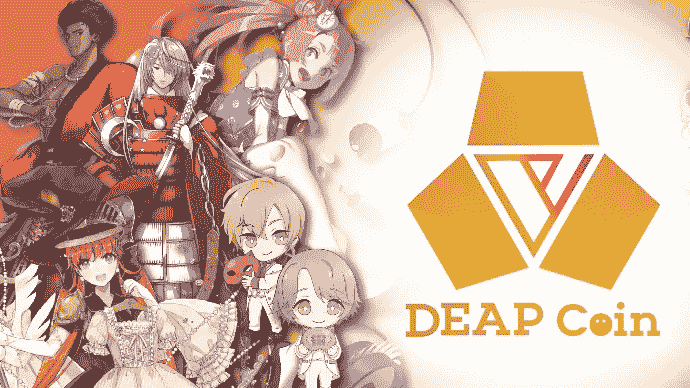

# 乐天资本投资新加坡网络 3 娱乐公司 DEA

> 原文：<https://medium.com/coinmonks/rakuten-capital-to-invest-in-singaporean-web3-entertainment-company-dea-488b0c936933?source=collection_archive---------32----------------------->

DEA 运营 PlayMining GameFi 平台，该平台以 P2E NFT 游戏目录为特色，包括 Job Tribes、Cookin ' Burger 和 Menya Dragon Ramen

总部位于新加坡的 Web3 娱乐公司 global Digital Entertainment Asset(DEA)与乐天集团签署了一份谅解备忘录，在 Web3 领域建立合作伙伴关系。

此次合作将见证美国药品管理局和乐天在各自业务中的潜在协同作用，以进一步提高他们服务的价值。

作为交易的一部分，乐天的企业风险投资部门乐天资本(Rakuten Capital)也将通过认购股份收购权对 DEA 进行少数投资。

DEA 运营着 [PlayMining](https://playmining.com/) GameFi 平台，该平台以一系列“玩赚”(P2E) NFT 游戏为特色，包括 [Job Tribes](https://jobtribes.playmining.com/en/) 、[cooking ' Burger](https://www.cookinburger.com/en/)、 [Menya Dragon Ramen](https://dragonramen.flypenguin-games.com/en/) 以及[最近](https://www.yahoo.com/news/playmining-web3-entertainment-platform-launches-090300922.html)推出的 [Graffiti Racer](https://graffitiracer.playmining.com/en/) 。

该平台有一个 NFT 市场，以日本动漫和视频游戏爱好者中家喻户晓的热门内容为特色，还有一个正在开发中的元宇宙项目。

DEA 也有它的代币 DEAPcoin ( [$DEP](https://coinmarketcap.com/currencies/deapcoin/) )，一种由日本金融厅批准的 P2E 代币。通过在一个地方拥有 NFT 市场、代币、GameFi 和元宇宙平台，PlayMining 可以向第三方游戏工作室合作伙伴提供知识产权货币化的机会。

“我们对 DEA 的愿景是成为世界顶级的 Web3 娱乐公司。DEA 的联合创始人兼联合首席执行官 Kozo Yamada 说:“我们与乐天的协议将大大有助于我们通过增加 PlayandEarn 游戏的采用来实现这一目标。

乐天集团提供超过 70 项服务，涵盖电子商务、金融科技、数字内容、移动运营商业务和其他通信服务，包括职业体育。它运营着几项 Web3 业务，包括 NFT 市场、销售平台乐天 NFT 和加密资产交易交易所乐天钱包。

乐天资本总裁 Hiroshi Takasawa 表示:“我们预计乐天的会员基础、品牌和商业经验、相关领域的专业知识，以及 DEA 在 GameFi、代币经济和元宇宙商业推广方面的经验，将有助于两家公司未来的业务增长。”

[*来源*](https://e27.co/rakuten-capital-to-invest-in-singaporean-web3-entertainment-company-dea-20221124/)

> 交易新手？试试[密码交易机器人](/coinmonks/crypto-trading-bot-c2ffce8acb2a)或[复制交易](/coinmonks/top-10-crypto-copy-trading-platforms-for-beginners-d0c37c7d698c)