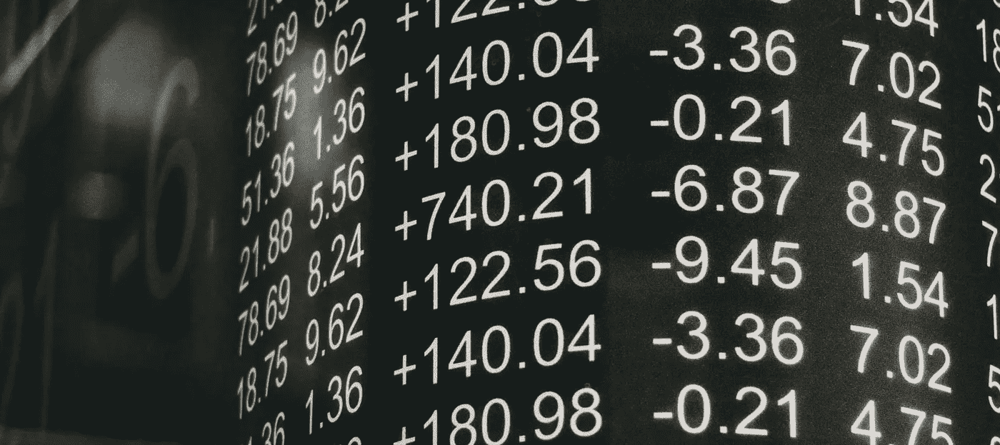

# 区块链的随机数。为什么这是一个问题？

> 原文：<https://medium.com/coinmonks/random-numbers-on-blockchain-why-is-this-an-issue-837771cde1b2?source=collection_archive---------17----------------------->

如果你已经在区块链项目上工作了一段时间，你不可能不觉得需要一个能给你随机数的生成器函数。

如果你使用过 **Python** ，你就会知道在脚本中生成随机数是多么容易。在开发我们的 smart contracts with solidity 时，这并没有跟进。

# 为什么我们使用随机数？

有多个地方需要随机数。比方说，你正在制作一个彩票 dapp，你可能需要随机数字来挑选你的完全随机的赢家，没有偏见。我们需要在用例中获得一些随机性，因为这将使我们受益。随机性也存在于选择这些数字的方式中，使得连续的随机数之间没有相关性。基本上应该是无法预测的。

> 交易新手？试试[加密交易机器人](/coinmonks/crypto-trading-bot-c2ffce8acb2a)或者[复制交易](/coinmonks/top-10-crypto-copy-trading-platforms-for-beginners-d0c37c7d698c)

# **为什么生成具有坚固性的随机数有风险？**

这是因为智能合约的确定性。为了生成随机数，输入也应该具有一定程度的随机性。这并不是说你不能做，但是如果随机数在你的 dapp 中起着重要的作用，这被认为是有风险的。

合约上生成的数字不是真的随机，而是伪随机。可用于生成这些数字的输入之一是`block.timestamp`。是分块生成的时候了。这里的风险是，如果一家矿商注意到一种模式，他们可以通过精心操纵对自己有利的输入来操纵系统。这个输出可以被影响以获得期望的和预期的输出，从而使它不再是一个随机数。

有很多方法可以生成随机数，在这些方法中，您必须使用离线的 oracles，而不是 API。如果你想知道，神谕是什么？这将在下一篇博客中讨论。

后来👋

> 加入 Coinmonks [电报频道](https://t.me/coincodecap)和 [Youtube 频道](https://www.youtube.com/c/coinmonks/videos)了解加密交易和投资

# 另外，阅读

*   [币安 vs FTX](https://coincodecap.com/binance-vs-ftx) | [最佳(SOL)索拉纳钱包](https://coincodecap.com/solana-wallets)
*   如何在 Uniswap 上交换加密？ | [A-Ads 审查](https://coincodecap.com/a-ads-review)
*   [加密货币储蓄账户](/coinmonks/cryptocurrency-savings-accounts-be3bc0feffbf) | [YoBit 审核](/coinmonks/yobit-review-175464162c62)
*   [Botsfolio vs nap bots vs Mudrex](/coinmonks/botsfolio-vs-napbots-vs-mudrex-c81344970c02)|[gate . io 交流回顾](/coinmonks/gate-io-exchange-review-61bf87b7078f)
*   [CoinFLEX 评论](https://coincodecap.com/coinflex-review) | [AEX 交易所评论](https://coincodecap.com/aex-exchange-review) | [UPbit 评论](https://coincodecap.com/upbit-review)