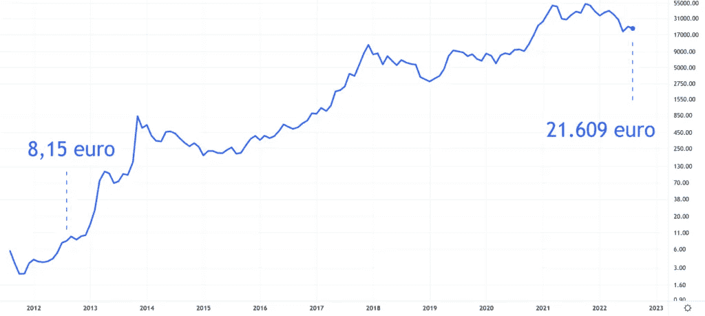
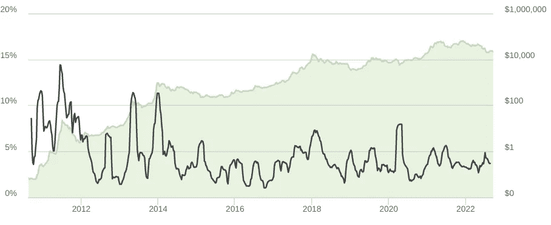

# 拉乌尔·帕尔:比特币将是未来 10 年表现最好的资产

> 原文：<https://medium.com/coinmonks/raoul-pal-bitcoin-will-be-the-best-performing-asset-over-the-next-10-years-159035701292?source=collection_archive---------28----------------------->

比特币已经存在了 10 多年，在这段时间里，它的价格上涨远远超过了任何其他可能的投资机会。

Real Vision 首席执行官拉乌尔·帕尔(Raoul Pal)表示，即使在最坏的情况下，比特币在未来 10 年仍可能是最好的资产。

# 10 年内比特币的利润

假设你在 2012 年 8 月 24 日以当时的价格 8.15 美元购买了一枚比特币。如果你将那一个比特币保留到今天，你将以当前的比特币汇率 21609 美元交易。

这 10 年的总“投资回报率”为 265，041%。此时的年化投资回报率为 120%。

说比特币也将在未来 10 年产生这些回报有点夸张，但纯粹是为了好玩:比特币届时将价值 5727 万美元。

下表中的数据是对数的，但即使如此，你也可以看到比特币的价格是波动的，可以大幅上涨和下跌。

# 比特币的波动性是优势，而非劣势

在最近 [YouTube 对 Scott Melker](https://www.youtube.com/watch?v=VO10GzR28yc) 的采访中，Raoul Pal 解释说，一种资产的内在波动性越大，其价格相对于风险较低的投资来说就越有可能上涨。

*“波动提供了报偿。因为它是 70 vol 的资产，所以它会给这些 20 倍、50 倍、100 倍的回报，这取决于你看的是哪个时期。”*

尚不完全清楚 Pal 的波动率是如何达到 70 的。大多数跟踪这一情况的指数得出的数字要低得多。此外，随着比特币的成熟和变得更有价值，波动性实际上似乎在降低。

下面的绿线是价格，黑线是前 60 天与比特币价格的平均偏差。

# 比特币的表现不同于传统资产

Pal 继续说道:

“人们不适合这样，因为他们是吝啬的复古主义者。他们认为世界是循环的，一切都会回到原来的地方，所以这就是为什么每棵树都会有一次崩溃，而每次崩溃都会让它回到开始的地方。”

其他资产可能也是如此，但比特币的表现有所不同。

*“但这里发生的不是这样。这是一个指数趋势，所以每次泡沫破裂都明显更高。我是说 4000 美元的比特币，20000 美元的比特币。这是从低点到低点，这是非同寻常的。但是人们看不到这一点。他们不习惯。他们不知道如何处理。人们必须学习。我们都做到了。”*

# 运气可以把比特币带到 100 万

帕尔继续讲述他第一次以远低于 1000 美元的价格购买比特币的时候，并表示他相信比特币至少会价值 10 万美元。运气好的话，甚至会超过 100 万。

“我从来没有意识到在指数趋势中，买入、持有和加仓是更好的选择。我回顾了从 2013 年开始交易比特币的所有时间，当时我的起点是 200 美元。我持有我的比特币，直到 1000 美元。所以两个月涨了 5 倍，然后一路跌了 85%。我只是拿着它，因为我想把它当作一种选择。我有一个 10 年的愿景。”

他说，大约在那个时候，他认识到了比特币的潜力。

*“我说过，在未来 10 到 20 年里，最坏的情况可能是 10 万美元，最好的情况是 100 万美元。”*

*原载于 2022 年 8 月 25 日 https://bitnewsbot.com***。**

> *交易新手？尝试[加密交易机器人](/coinmonks/crypto-trading-bot-c2ffce8acb2a)或[复制交易](/coinmonks/top-10-crypto-copy-trading-platforms-for-beginners-d0c37c7d698c)*