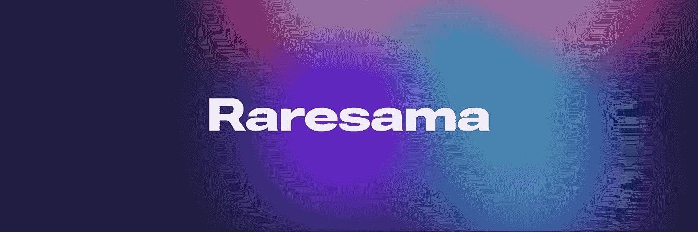

# 稀有动物:下一代 NFT 市场

> 原文：<https://medium.com/coinmonks/raresama-nextgen-nft-martketplace-b402d43ae141?source=collection_archive---------10----------------------->

aresama 是一个 NFT 市场，将在 Moonbeam Network 上推出。Raresama 的目标是成为 NFT 最大的波尔卡多特市场，并负责将艺术家引入波尔卡多特生态系统。Raresama 将自己定义为“那些想要创造、释放他们的创造力和讲述他们的故事的人的家”。

Raresama 最初将在 Moonbeam Network 上推出，但目标是在未来成为一个多连锁的 NFT 市场。确保保持 NFTs 的新颖性，同时允许用户在不同的生态系统中移动它。

Raresama 代表着:

*   **实用艺术:** Raresama 也将成为一种机制，让艺术家和创作者加入到 Raresama partners 生态系统的元诗中。这将让艺术家和创作者对他们的艺术有即时的效用。
*   **1:1 稀有艺术品:** Raresama 最初将专注于 1:1 的个人艺术品，而不是收藏品。之后，市场将向每个人开放，让他们创建自己的 1:1 和集合。
*   社区驱动:这个 NFT 市场将由 Moonsama 和 Exosama 社区通过$ POOP 管理和策划。两者都是加密领域中最有趣的 NFT 游戏和元宇宙项目之一。
*   **每周拍卖:**使用$POOP 投票决定每周拍卖哪些艺术品。为了避免平台被市场营销者-机会主义者淹没，也为了保持平台的艺术质量，并确保他们支持他们稀有的现有社区。
*   **团结非传染性疾病基金:**与稀有动物一起，非传染性疾病基金可用于创建一个可持续的食品、绝育、疫苗接种和庇护所筹资机制。他们积极开展团结运动，帮助泰国近 100 万只流浪狗。他们提出的一个解决方案包括将个别狗标记为独特的 NFT，并赋予它们效用(需求)。例如包括将独特的狗 NFTs 装备到 Exosama NFTs 上，作为一种可收集的形式。
*   **复杂的 NFTs 创作:**艺术家将能够创作可组合、可定制、多资源和分散的 NFTs。
*   **高效可交易的 NFT:**在 Moonbeam Network(L1)上开发的高速安全交易，作为 Polkadot parachain，为其提供了跨链交互和共享的安全平台。
*   **利润分享:**所有利润 100%归社区所有。

在 Gavin Wood 先生的关注下，一些有前途的合作伙伴和一个指数级增长的社区，Raresama 越来越被认为是未来 NFT 市场的基准项目。

最后，如果你在 Twitter 上关注我的 [@Mikefosk](https://twitter.com/Mikefosk) &我的[媒体简介](/@Mikefosk)，我将不胜感激！

> 交易新手？试试[密码交易机器人](/coinmonks/crypto-trading-bot-c2ffce8acb2a)或[复制交易](/coinmonks/top-10-crypto-copy-trading-platforms-for-beginners-d0c37c7d698c)