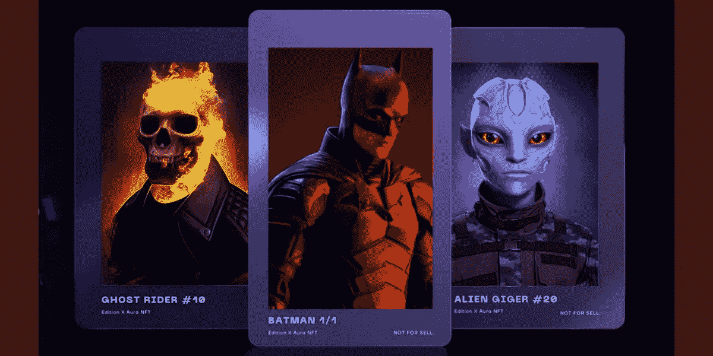

# 稀有克隆:创建 NFT 市场的综合指南

> 原文：<https://medium.com/coinmonks/rarible-clone-a-comprehensive-guide-to-create-an-nft-marketplace-d8f3296a5276?source=collection_archive---------20----------------------->

随着 NFT 空间的崛起，NFT 市场的胜利不再是秘密。这些平台允许用户铸造、购买或出售不可替代的代币，以换取数字货币。许多密码创业者正带着寻找新商业模式的愿望走向 NFT，NFT 市场发展是大多数人选择的重要模式之一。

在众多受欢迎的 NFT 市场，各种开发公司提供白标解决方案，使加密创业者能够以可承受的价格轻松启动他们在 NFT 的风险投资。 [**Rarible Clone**](https://www.appdupe.com/rarible-clone) 是白牌解决方案之一，它使其用户能够根据他们的需要和要求获得一个定制的 NFT 平台，具有与基于以太坊的 NFT 市场 Rarible 相似的特性和功能。在这篇博客中，我们将了解 Rarible marketplace 的属性，以及使用白标解决方案创建类似 Rarible 的 NFT 市场的过程。

## 📢稀有的 NFT 市场——它是什么？

Rarible 是区块链以太坊中重要的 NFT 市场之一，拥有数百万用户和大约 2.74 亿美元的交易价值。这个平台将创作者、收藏者和投资者聚集在一起，实现无缝交易。

> Rarible 被认为是丰富数字美术馆价值的平台之一，便于创作者展示他们的 NFT 收藏，以获得高度认可。这个 2019 年的特色 NFT 市场纵容了众多大公司和名人，如社交媒体网站 Twitter 著名的拳击手弗洛伊德·梅威瑟；著名女演员兼歌手林赛·罗韩；等等。

## 📢**稀有平台的优势**

🔜Rarible 促成了一个支持 DAO 的 NFT 市场。去中心化自治组织(DAO)的特征优先包括该市场的在线社区成员在使用称为 RARI 的本地令牌的平台上做出的重大决策中的投票权。

🔜这个 NFT 市场促进了各种 NFT 的交易，如收藏品、交易卡、体育 NFT、交易卡等。

🔜这个多链市场支持不同的区块链网络，如以太坊、索拉纳、Tezos、Flow 和多边形网络。

🔜Rarible 甚至可以用信用卡/借记卡进行 NFT 交易。他们与获得许可的虚拟货币提供商 Wert 合作，将交易中涉及的法定货币转换为加密货币。

## 📢**稀有市场的重要特征**

🔜**店面:**rari ble market place 允许用户创建自己的店面，展示他们的 NFT 系列。

🔜**版税系统:** Rarible 使创作者能够从每一笔提供皇室支持的数字资产销售中赚取佣金。

🔜**收藏管理:**这个市场允许用户跟踪价格、添加/删除资产、查看交易历史等。他们的数字 NFT 收藏。

🔜**钱包整合:**Rarible 与大众钱包的整合让用户可以顺畅地交易他们的 NFT。

## **Rarible Clone——创造类似 rari ble 的 NFT 市场的白标解决方案**

为了创建一个稀有的 NFT 市场，cryptopreneur 有两个选择，一个是从零开始开发平台，另一个是使用白标解决方案。许多密码创业者选择使用白标解决方案来开发平台，因为它们更加有效和简单。白标 rarible like NFT 市场解决方案是一个预先设计的解决方案，使其用户能够根据自己的需求和偏好定制平台的特性和功能。这种省时且经济高效的解决方案可以用最少的开发时间轻松启动 NFT 市场。

## 📢**如何开发像 rarible 这样的白牌 NFT 市场？**

🔔**选择合适的开发公司**

选择合适的公司会影响 NFT 平台的结果。创业者可以根据客户、演示作品、定价、评级、评论等来选择公司。他们甚至可以与领先的白色标签解决方案提供商 rarible 预约一对一的会议，并了解更多关于他们工作的信息，从而做出相应的选择。

🔔**画出平台的清晰轮廓**

一旦选择了公司，加密创业者应该在 NFT 市场上提出他们的想法，使开发者更容易相应地定制平台。密码创业者可以决定平台的特性、功能和设计，并向公司提出建议。

🔔**发展**

在 NFT 市场的轮廓被画出之后，平台的前端功能、后端功能以及 UI/UX 设计的开发都是根据战略商业计划进行的。

🔔**测试&发射**

一旦平台被开发出来，它会被多个测试用例测试，以确认它是没有错误的。在它通过所有测试案例并被确认没有错误之后，它就可以根据密码创业者的决定准备好发布了。

## 📢**白标稀有解决方案的宝贵津贴**

🔔这款白标解决方案具有高度的可扩展性，可定制新的特性和功能。

🔔许多商业头脑选择这种解决方案，因为它提供了高安全性和可靠性。它使用户能够添加数据加密等高级安全功能，并保护平台免受黑客和诈骗等安全威胁。

🔔它被认为是易于使用的，因为它允许根据个人的需要和要求进行平滑和配置的定制。

🔔这些白标标签解决方案一向以价格实惠著称。

## 📢**最后**

根据目前不可替代代币的趋势，利用稀有克隆辅助设备建立 NFT 市场是 NFT 的一个潜在风险。创建一个具有独特特性和重要功能的平台，可以让该平台在 NFT 领域蓬勃发展。尽管 NFT 的动荡性质和高度竞争，许多人都参与其中，关注它的起义。因为在蓬勃发展的 web3 技术中，NFTs 和加密货币将发挥重要作用，在这一潜在空间建立商业模式将增加风险投资的价值。

如果你是一个寻找 NFT 机会的密码创业者，这是一个合适的时机来启动你自己的 NFT 风险投资，就像 NFT 市场发展一样。

> 交易新手？试试[密码交易机器人](/coinmonks/crypto-trading-bot-c2ffce8acb2a)或[复制交易](/coinmonks/top-10-crypto-copy-trading-platforms-for-beginners-d0c37c7d698c)
> 
> 多样化的密码持有，了解[币安替代品](https://coincodecap.com/binance-alternatives)
> 
> 加入 Coinmonks [电报频道](https://t.me/coincodecap)和 [Youtube 频道](https://www.youtube.com/c/coinmonks/videos)获取每日[加密新闻](http://coincodecap.com/)

# 另外，阅读

*   [复制交易](/coinmonks/top-10-crypto-copy-trading-platforms-for-beginners-d0c37c7d698c) | [加密税务软件](/coinmonks/crypto-tax-software-ed4b4810e338)
*   [电网交易](https://coincodecap.com/grid-trading) | [加密硬件钱包](/coinmonks/the-best-cryptocurrency-hardware-wallets-of-2020-e28b1c124069)
*   [密码电报信号](/coinmonks/top-3-telegram-channels-for-crypto-traders-in-2021-8385f4411ff4) | [密码交易机器人](/coinmonks/crypto-trading-bot-c2ffce8acb2a)
*   [最佳加密交易所](/coinmonks/crypto-exchange-dd2f9d6f3769) | [印度最佳加密交易所](/coinmonks/bitcoin-exchange-in-india-7f1fe79715c9)
*   [开发者最佳加密 API](/coinmonks/best-crypto-apis-for-developers-5efe3a597a9f)
*   最佳[密码借贷平台](/coinmonks/top-5-crypto-lending-platforms-in-2020-that-you-need-to-know-a1b675cec3fa)
*   [免费加密信号](/coinmonks/free-crypto-signals-48b25e61a8da) | [加密交易机器人](/coinmonks/crypto-trading-bot-c2ffce8acb2a)
*   杠杆代币的终极指南