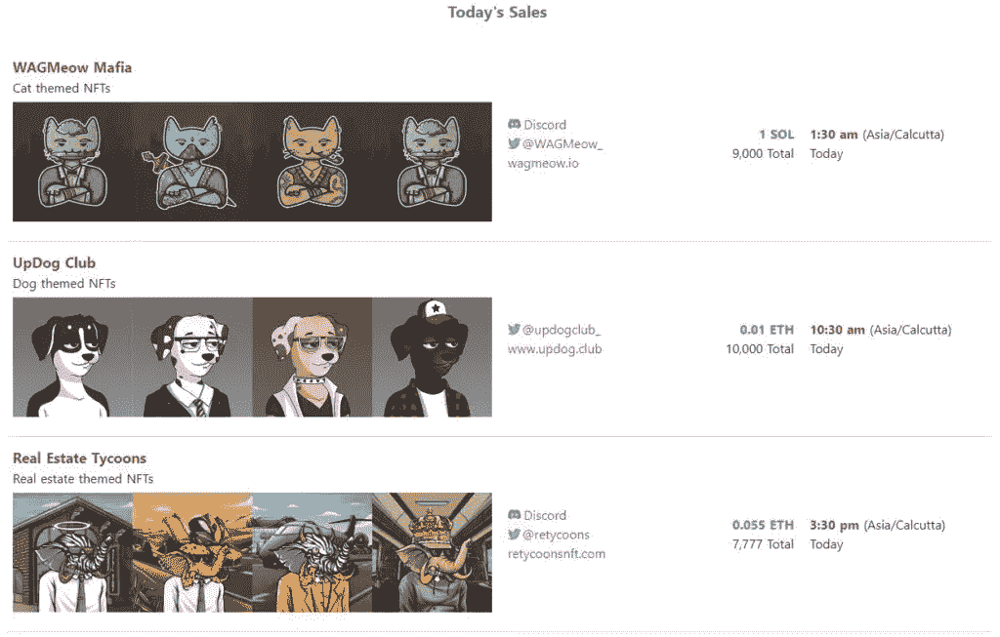
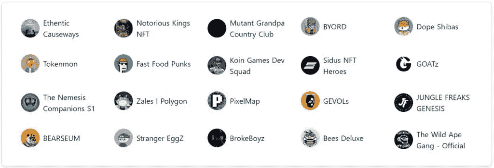
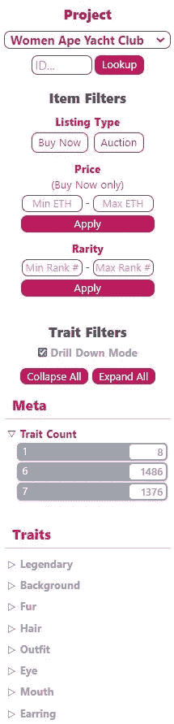
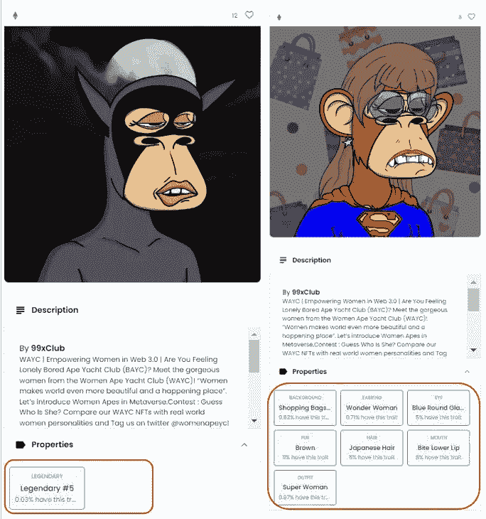
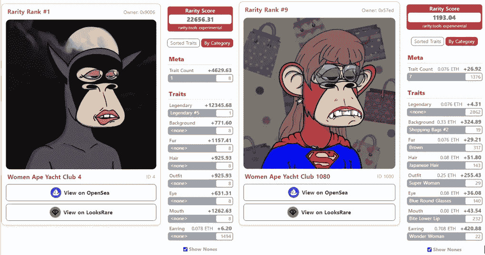
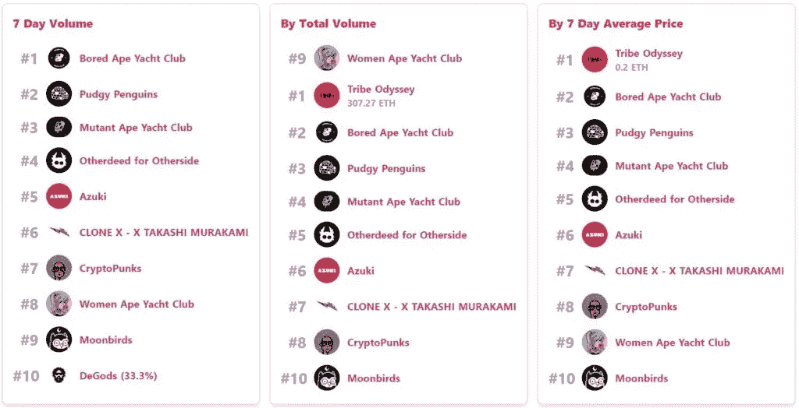
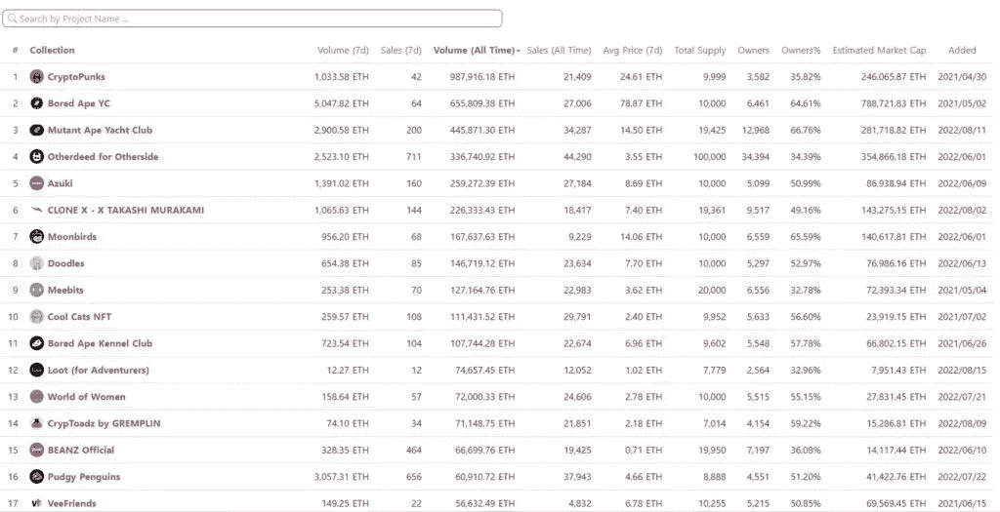

# 稀有度。工具——测量你的 NFT 有多稀有

> 原文：<https://medium.com/coinmonks/rarity-tools-measure-how-rare-your-nft-is-93c244b05f02?source=collection_archive---------25----------------------->

本指南将帮助你了解各种 NFT 排名方法。稍后，我们将解释如何使用著名的 NFT 排名工具——rarity . tools .

## 稀有。工具在一个创新的平台，你可以检查著名的 NFT 收藏品的排名。目前，只有几个 NFT 的项目被列在那里，包括一些著名的 NFT 收藏，如无聊猿游艇俱乐部，加密朋克等。项目列表正在快速增长。创作者可以通过提交网站上给出的表格并联系项目团队来列出他们的收藏品。他们需要为以太坊或多边形收藏品支付 2 ETH，或为列出索拉纳收藏品支付 20 SOL。

因此，在本文中，我们将解释如何使用[稀有度工具](https://rarity.tools/)平台来检查你的 NFT 的价值。

**概述**

一段时间以来，NFT 股市因达到一些令人难以置信的里程碑而备受瞩目。一些 NFT 卖到了数百万美元。这些数字引人注目，但这也引发了一个问题:“为什么有人愿意花这么多钱买一件艺术品？”等等。还是那件艺术品中有真正罕见的东西，使它几乎是无价的，是其他艺术品无法比拟的？

毫无疑问，区块链产业给了艺术家/创作者一种新的技术来扩展他们在数字世界中的才华。有许多市场，创作者可以列出他们的收藏品进行销售。

**问题陈述**

NFT 产业的发展见证了艺术家数量的显著增加。如果你去任何网络上的任何 NFT 市场，你会发现各种艺术家(受欢迎的和相对不知名的)出售的数以千计的数字收藏品。你可能注意到的第二件事是那些列出的非功能性食物的价格。虽然其中一些只花了你一小部分以太坊(以太坊网络非功能性交易)，但也有一些超出了你的能力。是什么决定了它的稀有性和价格？是什么因素使得它成为罕见的 NFT？

或者如果你是艺术家，你想知道你的 NFT 有多稀有。请注意，稀有性和价格密切相关。你的 NFT 越稀有，需求量就越大，价格也就越高。

**解决方案**

当你去任何市场买 NFT 时，你都要检查它的特征。每个 NFT 都有一些特征。

为了确定完全稀有性，人们必须将 NFT 的所有特征组合并简化成一些测量指标，以便人们可以根据一个参数对所有的 NFT 进行排序。

[rarity.tools](https://www.altcoinbuzz.io/nft/brief-overview-of-rarity-tools/) 平台为 NFT 提供了一个简单易懂的排名方法。你可以很容易地比较两个 NFT，并检查你的 NFT 与其他收藏相比有多稀有。

**决定 NFTs 稀有性的因素**

有几个因素可以定义 NFT 的稀有性:

*   集合中有限的 NFT
*   NFT 具有罕见的属性
*   NFT 有其历史背景
*   基于一些名人的 NFTs

**排名限制**

一个主要的关切是，每个 NFT 社区重视并优先考虑不同的方面。

例如，密码朋克社区广泛重视 NFT 的**属性计数**，因此，他们认为拥有七个属性的密码朋克是最稀有的。

同样，其他社区也重视其他特征。此外，比较来自不同集合的两个 NFT 比比较来自相同集合的两个 NFT 更容易。随着给定集合中 NFT 数量的增加，问题变得更加严重。

**不同排名车型**

我们现在将讨论用于定义 NFT 排序的各种排序方法。

*   **特质稀有模型**

这个模型根据 NFT 最稀有的特征来比较它们。它不比较 NFT 的总体数量或其他特征。这是这种排名模式的主要缺点。

让我们假设，我们有两个 NFT——A 和 B。根据这个排名模型，NFT A 可能有一个足够罕见的特征使其更优越，但当我们考虑总数或其他特征时，NFT B 可能实际上被认为更好。

*   **平均性状稀有度**

这个模型计算了 NFT 所拥有的所有稀有物品的平均值。这种方法在某种程度上计算出了比特征模型更好的等级，因为它考虑了所有的稀有特征。然而，它也有一些缺点，因为如果 NFT 拥有一些超级罕见的特征，它不会给予任何特殊的荣誉。由于这种平均计算，当混合在普通性状中时，超级稀有性状将失去一些价值。

*   **统计稀有度**

这种方法非常受欢迎，因为它通过将所有稀有性状相乘来计算 NFT 的总体稀有度。

例如，如果一只 NFT 有两个特征，一个特征占 20%，另一个特征占 50%，那么根据统计稀有度方法，分数将为(20% * 50%) = 10%

*   **稀有度评分**

所有上述方法都没有给出一个简单易读的数字，用户可以很容易地看到和理解稀有因子。此外，没有用户会有兴趣在购买前为这种复杂的计算绞尽脑汁。

我们现在将看到稀有度工具平台用来计算 NFT 稀有度分数的最后一种排名方法。

**[某一特性值的稀有度]= 1/([具有该特性值的项目数]/[收藏中的项目总数])**

该平台声称，到目前为止，这种方法给出了更准确的结果，并已被各种 NFT 市场用来计算 NFT 的稀有度。

该平台根据项目团队给出的规范，在后台计算 NFT 的总稀有度。所以，在前端，你可以检查稀有度，决定哪一个 NFT 更稀有。

我们将在下面的**如何检查稀有分数**部分举例说明如何查看稀有分数。

**即将到来的 NFT 销售**

在 rarity.tools 平台上，你可以在这里查看即将到来的 NFT 销售清单。您还可以找到项目网站、Twitter 帐户和一些强制列表细节的链接。

**新系列**

查看本节中最近列出的几个新收藏。

您还可以查看**最近收藏**部分，了解其他最近列出的收藏的更多信息。

**如何查看稀有度评分**

我们现在将解释如何检查 NFT 的稀有度。为了展示这一过程，我们选择了**女性猿类游艇俱乐部**系列，这是一个以 10，000 只女性猿类为主题的 NFT 项目。

单击它可以获得该集合中所有 NFT 的列表。

用户可以在页面的右侧找到一个过滤器选项，该选项允许您根据以下参数过滤收藏品:

*   通过给定对象 ID 进行直接搜索
*   列表类型(购买、拍卖)
*   最低和最高价格(瑞士法郎)
*   稀有度(最低和最高等级)
*   性状计数
*   根据特征

我们已经选择了以下两个 NFT，并在 OpenSea 中打开了它们的列表页面。正如你从下面的截图中看到的，这两种 NFT 都有一些罕见的特征。

然而，普通用户无法决定这些特征有多罕见。但是，当你在 rarity.tools 中打开这些 NFT 时，你可以看到一个任何人都容易理解的简单数字的稀有分数。查看下面的截图。

“

因此，只要看看 NFT 的稀有程度，你就可以很容易地说第一个 NFT 比第二个 NFT 更稀有。 **`**

**顶级收藏**

从这个部分，您可以按照七天的交易量、总交易量、七天的平均价格和拥有者数量来检查领先的收藏。

**所有收藏**

从这个标签中查看目前使用稀有等级系统的所有 NFT 项目列表。您还可以通过此选项卡查看以下关于集合的详细信息:

*   7D 音量
*   7D 销售
*   总体积
*   销售总额
*   七天内的平均价格
*   总供水量
*   所有者数量
*   所有者百分比
*   估计市值
*   上市日期

你可以点击任何一个集合来获得更详细的信息。

**稀有项目列表。工具**

正如我们前面提到的，创作者可以在稀有工具中列出他们的 NFT 收藏品，并使用排名系统。举例来说，创作者需要为以太坊或多边形系列支付 2 ETH，或为索拉纳系列支付 20 SOL。此外，你的内容不应该是淫秽或非法的。您可以访问此[链接](https://rarity.tools/list)并在提及强制细节后提交给定的表格。还有，你可以在 Twitter handle @raritytools_ls 上直接发消息。

**结论**

稀有度工具是对 NFT 收藏品进行排名的终极工具。在从二级市场购买收藏品之前，你可以查看和比较它们的稀有程度。最大的好处是，艺术家和收藏家现在都可以确定 NFT 的价值和稀有程度，然后可以毫不犹豫地轻松决定购买/出售。

***注:*** *本帖首发* [*此处*](https://www.altcoinbuzz.io/bitcoin-and-crypto-guide/rarity-tools-measure-how-rare-your-nft-is/) *同*[*ltcoinbuzz . io*](https://www.altcoinbuzz.io/)**。**

*跟我来*

***👉** [推特](https://twitter.com/rumadas123)*

***👉**[**Linkedin**](https://www.linkedin.com/in/ruma-das-a1439320/)*

> ***交易新手？尝试[加密交易机器人](/coinmonks/crypto-trading-bot-c2ffce8acb2a)或[复制交易](/coinmonks/top-10-crypto-copy-trading-platforms-for-beginners-d0c37c7d698c)***