# 稀有工具-NFT 稀有工具-更好地评估你的 NFT

> 原文：<https://medium.com/coinmonks/rarity-tools-nft-rarity-tool-value-your-nft-better-fdc596486d6?source=collection_archive---------26----------------------->

> 不可替代的代币现在在艺术界越来越受欢迎。每一个 NFT 都是独一无二的，“稀有”这个词被用来比喻每一个 NFT 最稀有的特质。

**👉跟我上** [***推特***](https://twitter.com/TheCryptoKK)***|***[***中***](/@TheCryptoKK) **让自己升职！**

**聚焦#NFT 研究员&#网路搜寻家**

**每日分享# web 3 # Crypto # NFT #比特币的真实素材**

稀有度是决定一件 NFT 价值的最重要因素之一。人们想知道他们的 NFT 有多稀有，或者他们想买的是否稀有，尤其是对新 NFT 球员来说。

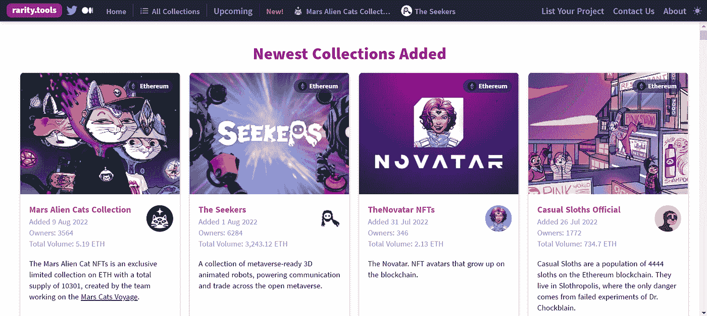

本文将介绍一个名为[稀有度的排名工具。tools](https://rarity.tools/) 提供了一个明智且易于理解的 NFT 稀有度排名，帮助你比较 NFT 的价值并做出更好的决定。

# 一.主要职能

*   **即将到来的 NFT**

最新专题*即将到来的*以日历的形式呈现新的 NFT 项目，列出可以帮助你快速形成项目认知的信息。

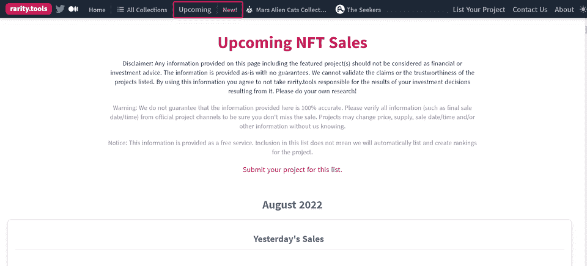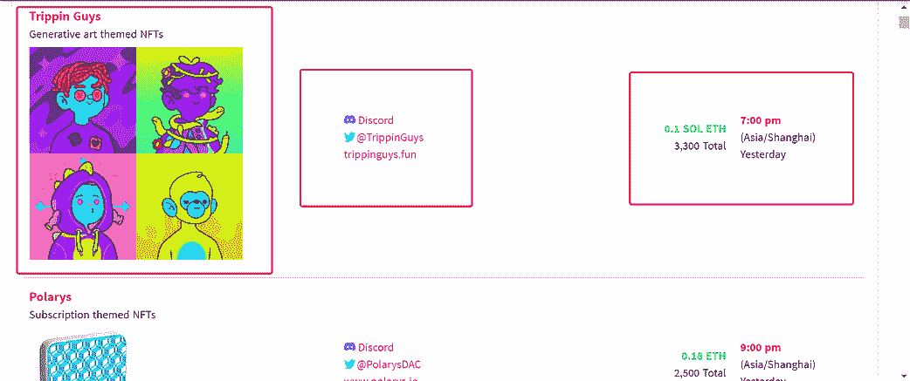

左栏显示名称、主题和图像，中间一栏显示官方网站以及 Discord 和 Twitter 等联系渠道，而右栏为您提供最终销售日期。

请注意，不能保证所提供的信息 100%准确，而且项目可能会改变价格、供应、销售日期和其他信息。这就是为什么最好从官方项目渠道核实所有信息，以确保你不会错过任何信息。

*   **稀有度**

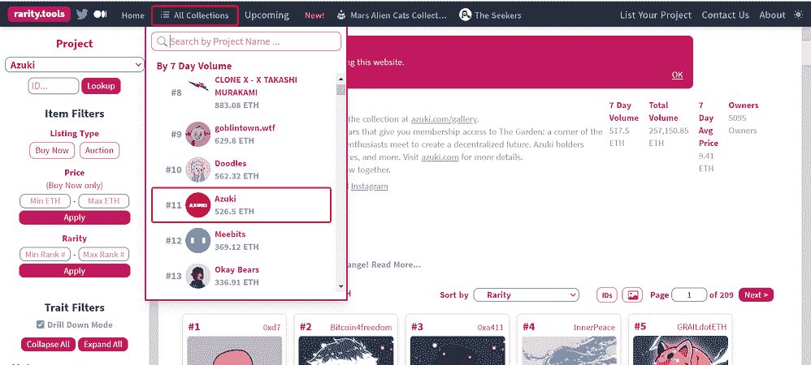

稀有工具的工作非常简单。以志那都红豆为例，向您展示这个核心特性是如何工作的。

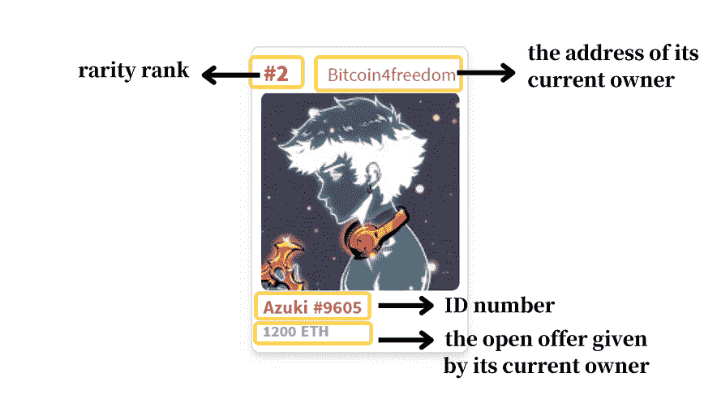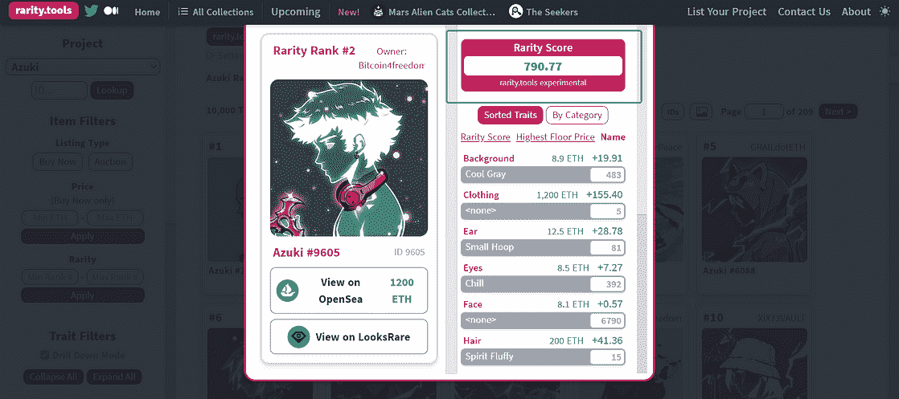

**稀有性得分:**NFT 的每个性状都有一个稀有性得分，然后将所有性状的得分相加，得到一个总的稀有性得分。

而[官方](/@raritytools/ranking-rarity-understanding-rarity-calculation-methods-86ceaeb9b98c)也提供了计算方法:

*某一特性值的稀有度=具有该特性值的物品数量/收藏中的物品总数*

自己试试吧！

*   **检查您想要的 NFT**

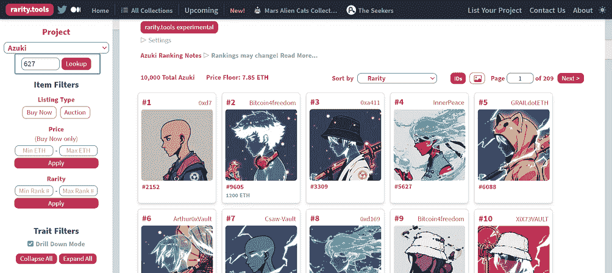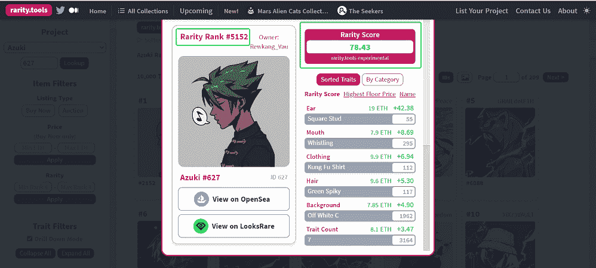

在左栏输入身份证号，点击“查找”，然后就可以查看等级和稀有度评分，看是否值得购买。

*   **项目过滤器**

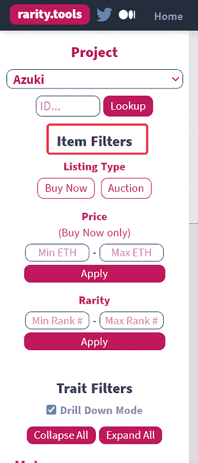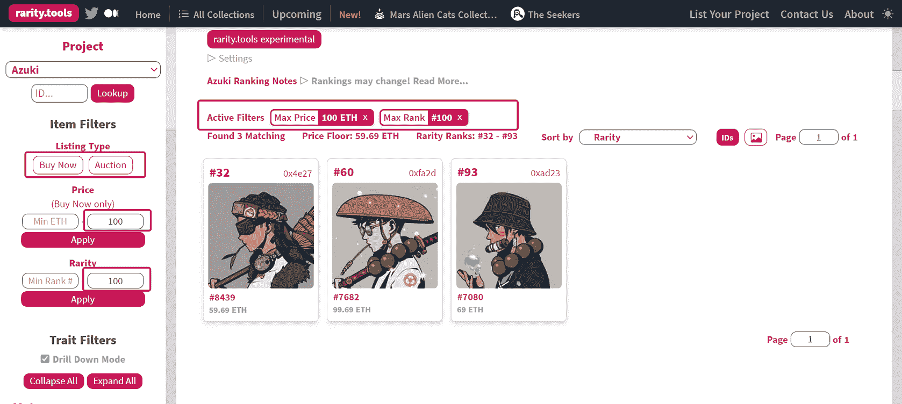

选择“立即购买”，并输入你对价格和稀有度的限制，然后过滤器会给你符合你标准的 NFT。

*   **特征过滤器**

特征过滤器由元和特征组成。

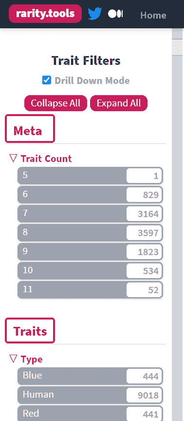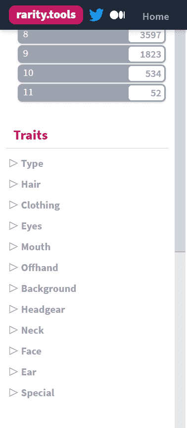

Meta 代表性状计数，即一个 NFT 包括多少性状。例如，只有一个由 5 个特征组成的 NFT，排名№1，这意味着它是如此罕见。

特征包括类型、头发、衣服等等。作为参考，一些程序为具有特定特征的非战斗人员提供二次空投，在这一点上你可以过滤你对该特征的选择。

# 二。稀有不是一切

尽管稀有性在评估 NFT 的价值时很重要，但它不是唯一应该考虑的因素。

例如，不可替代的令牌可能有独特的特征组合，不能由稀有性决定，因此，它不应该被认为是评估你的 NFT 收藏品的唯一因素。

**所以每一个的价值取决于你！**

***跟着我升职吧！***

***聚焦#NFT 研究员&#网路搜寻家***

***每日分享# web 3 # Crypto # NFT #比特币***

[***碎碎念***](https://twitter.com/TheCryptoKK)***|***[***中***](/@TheCryptoKK)

*欢迎关注我，有什么问题尽管问*

> 加入 Coinmonks [电报频道](https://t.me/coincodecap)和 [Youtube 频道](https://www.youtube.com/c/coinmonks/videos)了解加密交易和投资

# 另外，阅读

*   [币安 vs FTX](https://coincodecap.com/binance-vs-ftx) | [最佳(SOL)索拉纳钱包](https://coincodecap.com/solana-wallets)
*   [比诺莫评论](https://coincodecap.com/binomo-review) | [斯多葛派 vs 3Commas vs TradeSanta](https://coincodecap.com/stoic-vs-3commas-vs-tradesanta)
*   [Capital.com 评论](https://coincodecap.com/capital-com-review) | [香港的加密借贷平台](https://coincodecap.com/crypto-lending-hong-kong)
*   如何在 Uniswap 上交换加密？ | [A-Ads 审查](https://coincodecap.com/a-ads-review)
*   [WazirX vs coin dcx vs bit bns](/coinmonks/wazirx-vs-coindcx-vs-bitbns-149f4f19a2f1)|[block fi vs coin loan vs Nexo](/coinmonks/blockfi-vs-coinloan-vs-nexo-cb624635230d)