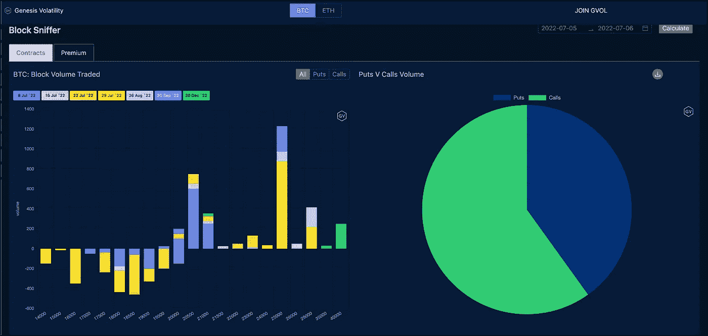
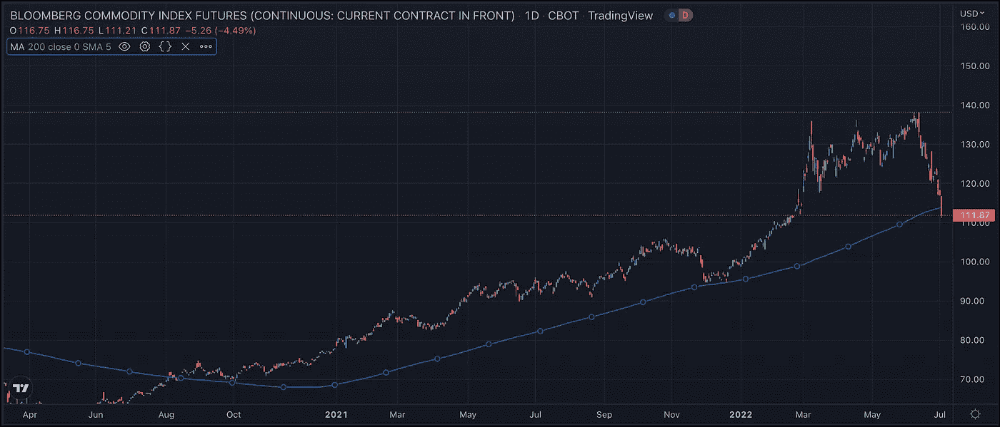

# 加息/降息…随便

> 原文：<https://medium.com/coinmonks/rate-hike-rate-cut-whatever-12d7f8326b87?source=collection_archive---------30----------------------->

BTC 25，000 个电话今天在几个月内被点亮了。7 月 29 日交易量最大，在[范式](https://www.linkedin.com/company/paradigmco/)下交易了 875 份合约。有些人会说这都是因为价格。

随着 EOY 以较低的利率对联邦基金期货进行定价，以及 10-2 收益率曲线今天一度低于 0，市场正在寻找一个更友好的货币环境。这太疯狂了。美联储还没有加息，但我们已经在价格中考虑到了降息？

> 交易新手？试试[密码交易机器人](/coinmonks/crypto-trading-bot-c2ffce8acb2a)或者[复制交易](/coinmonks/top-10-crypto-copy-trading-platforms-for-beginners-d0c37c7d698c)

当通胀怪兽已经冷却下来，原油跌破 100 美元是一件令人赏心悦目的事情时，这是有帮助的。汽油期货 RBOB 比其合约高点低了整整 1 美元。这很重要。彭博商品指数期货今天跌破了 200 天移动平均线。这有点令人震惊。大宗商品的熊市？我认为自 20 年末以来，该指数从未低于这一平均水平。有点冷。

生活节奏很快，给你的只有机会。继续磨。感觉我们进入了一个新的周期。