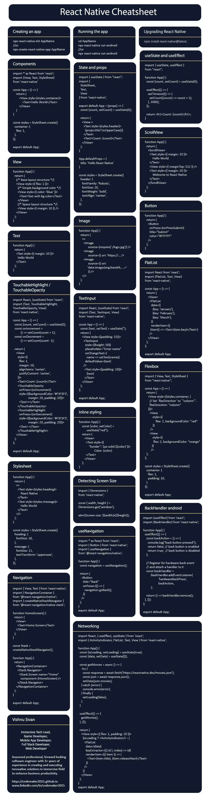

# 针对初学者的 React Native cheatsheet

> 原文：<https://medium.com/coinmonks/react-native-cheatsheet-for-beginners-ce0559365d68?source=collection_archive---------0----------------------->


React native 是由 Meta(脸书)开发的要求最高的跨平台框架之一，用于轻松创建移动应用程序。它遵循一次学习，随处编写的范式，允许用户使用 Javascript，HTML5 和 CSS 文件创建组件。

> 从顶级交易者那里复制交易机器人。免费试用。

React Native 重新定义了原生应用的功能，这些功能在早期效率低下，部署缓慢。它创建了混合应用和本地功能。它基于 React.js UI 库，可以轻松地在 web 开发人员和移动应用程序开发人员之间切换。

在本文中，我们为 react 原生开发人员提供了一个小的备忘单，使开发过程变得更加方便。

# 入门指南

## 目录

*   [创建应用](#7641)
*   [运行 app](#7814)
*   [升级 React 原生](#30e7)
*   [代码片段](#cd88)
*   [组件](#6768)
*   [状态和道具](#5e72)
*   [使用状态和使用效果](#a146)
*   [核心部件](#343b)
*   [视图](#c61e)
*   [滚动查看](#407a)
*   [正文](#92fd)
*   [图像](#ad45)
*   [按钮](#c870)
*   [可触摸高亮/可触摸不透明](#f2f7)
*   [文本输入](#d3e4)
*   [平面列表](#0069)
*   [样式表](#d3be)
*   [直列造型](#f395)
*   [柔性盒](#c3a8)
*   [检测屏幕尺寸](#1b7b)
*   [导航](#c157)
*   [使用导航挂钩](#5403)
*   [后台处理程序 android](#2a60)
*   [联网](#177d)
*   [创建示例应用](#a54a)
*   [React Native Cheatsheet](#3388)

让我们来看看 react native 的一些要点。

## 创建应用程序

要创建新的移动应用程序，请打开终端并执行以下命令。

```
npx react-native init AppName

//or

npx create-react-native-app AppName
```

## 运行应用程序

要运行该应用程序，请打开终端并执行以下命令，

```
cd AppName
npx react-native run-android

//or

npx react-native run-android
```

## 升级 React Native

要将 react native 升级到最新版本，请打开终端并执行以下命令，

```
npm install react-native@latest;
```

## 代码片段

让我们来看一些在 react 本地项目中常用的代码片段。

## 成分

组件是轻量级模块，被视为 React 和 React-Native 应用程序的核心构建块。App 组件是与 react native 中的虚拟 dom 绑定的默认组件。react native 中的每个组件都具有以下结构(提供视图和文本组件是可选的)。

```
import * as React from 'react';
import {View, Text, StyleSheet} from 'react-native'

const App = () => {
    return (
        <View style={styles.container}>
            <Text>Hello World</Text>
        </View>
    )
}

const styles = StyleSheet.create({
  container: {
    flex: 1,
  },
});

export default App;
```

## 状态和道具

*   State 是一个可变的存储，它保存了应用程序的整个状态树。
*   Props 是由父对象设置的不可变的 react 本地对象，它们在组件的整个生命周期中是固定的。

```
import { useState } from "react";
import {
  StyleSheet,
  Text,
  View
} from 'react-native';

export default App = (props) => {
  const [count, setCount] = useState(0);

  return (
    <View >
      <Text style={styles.header}>
        {props.title?.toUpperCase()}
      </Text>
      <Text>Count: {count}</Text>
    </View>
  );
}

App.defaultProps = {
  title: 'Hello React Native'
}

const styles = StyleSheet.create({
  header: {
    fontFamily: 'Roboto',
    fontSize: 20,
    fontWeight: 'bold',
    textAlign: 'center',
  },
});
```

## 使用状态和使用效果

*   `useState`钩子允许跟踪功能组件中的状态。
*   `useEffect`钩子允许用户在应用程序中执行副作用，比如获取数据、直接更新 DOM 和定时器。

```
import { useState, useEffect } from "react";

function App() {
  const [count, setCount] = useState(0);

  useEffect(() => {
    setTimeout(() => {
      setCount((count) => count + 1);
    }, 1000);
  });

  return <h1>Count: {count}</h1>;
}
```

## 核心组件

核心组件准备使用 React Native 中可用的组件，包括`<View>`、`<ScrollView>`、`<Text>`、`<TextInput>`、`FlatList`、`<Image>`、`<Button>`、`<Flexbox>`。

## `View`

组件`<View>`作为一个容器，可以从 web 翻译成`<div>`。

```
function App() {
  return (
    {/* Base layout structure */}
    <View style={{ flex: 1 }}>
      {/* Simple background color */}
      <View style={{ padding: 10, color: 'blue' }}>
        <Text>Text with background color</Text>
      </View>
      {/* Space layout structure */}
      <View style={{ margin: 10 }} />
    </View>
  );
}
```

## 滚动视图

类似于`View`，它是一个通用容器，支持滚动，为不同的设备提供响应的布局。

```
function App() {
  return (
    <ScrollView>
      <Text style={{ margin: 10 }}>Hello World</Text>
      <View style={{ marginTop: 512 }} />
      <Text style={{ margin: 10 }}>Welcome to React Native</Text>
    </ScrollView>
  );
}
```

## 文本

`<Text>`组件用于在 React Native 中显示文本。

```
function App() {
  return (
    <Text style={{ height: 20, margin: 10 }}>
      Hello World
    </Text>
  );
}
```

## 图像

`<Image>`组件用于在 react native 中渲染图像。它接受来自远程和本地来源的图像。

```
function App() {
  return (
    <>
      <Image source={require('./assets/logo.jpg')} />
      <Image source={{ uri: 'https://github.com/codemaker2015/codemaker2015/raw/main/codemaker.png' }} />
      <Image source={{ uri: 'data:image/png;base64,<base64-string>=' }} />
    </>
  );
}
```

## 纽扣

`<Button>`组件是一个用于与屏幕交互和执行操作的可触摸元件。

```
function App() {
  return (
    <Button
      onPress={onPressSubmit}
      title="Submit"
      color="#FFFFFF"
    />
  );
}
```

## 可触摸高亮/可触摸不透明

组件`<TouchableHighlight>` / `<TouchableOpacity>`是一个让视图根据触摸做出响应的包装器。按下时，包裹视图的不透明度会降低，从而允许透过参考底图显示颜色。它必须至少有一个子组件。

```
import React, {useState} from 'react';
import {Text, TouchableHighlight, TouchableOpacity, View} from 'react-native';

const App = () => {
  const [count, setCount] = useState(0);
  const onIncrement = () => setCount(count + 1);
  const onDecrement = () => setCount(count - 1);

  return (
    <View
      style={{
        flex: 1,
        margin: 20,
        alignItems: 'center',
        justifyContent: 'center',
      }}>
      <Text>Count: {count}</Text>
      <TouchableOpacity
        onPress={onIncrement}
        style={{backgroundColor: '#F3F3F3', margin: 20, padding: 20}}>
        <Text>+</Text>
      </TouchableOpacity>
      <TouchableHighlight
        onPress={onDecrement}
        style={{backgroundColor: '#F3F3F3', margin: 20, padding: 20}}>
        <Text>-</Text>
      </TouchableHighlight>
    </View>
  );
};

export default App;
```

## 文本输入

`<TextInput>`组件允许用户在应用程序中输入文本。它有一个`onChangeText`事件，每次文本改变时都会被调用。

```
import React, {useState} from 'react';
import {Text, TextInput, View} from 'react-native';

const App = () => {
  const [text, setText] = useState('');
  return (
    <View style={{padding: 15}}>
      <TextInput
        style={{height: 50}}
        placeholder="Enter name"
        onChangeText={name => setText(name)}
        defaultValue={text}
      />
      <Text style={{padding: 10, fontSize: 30}}>{text}</Text>
    </View>
  );
};

export default App;
```

## 平面列表

`<FlatList>`组件显示一个滚动的项目列表。它只呈现那些当前显示在屏幕上的元素。

`FlatList`组件需要两个道具:`data`和`renderItem`。`data`是列表的来源，`renderItem`返回一个格式化的组件来呈现。

```
import React from 'react';
import {FlatList, Text, View} from 'react-native';

const App = () => {
  return (
    <View>
      <FlatList
        data={[
          {key: 'January'},
          {key: 'February'},
          {key: 'March'},
          {key: 'April'},
        ]}
        renderItem={({item}) => <Text>{item.key}</Text>}
      />
    </View>
  );
};
```

## 样式表

`<StyleSheet>`是一个抽象，它通过使用二维 JavaScript 对象接受 CSS 样式规则来代替 CSS。

```
function App() {
  return (
    <>
      <Text style={styles.heading}>React Native</Text>
      <Text style={styles.message}>Hello World</Text>
    </>
  );
}

const styles = StyleSheet.create({
  heading: {
    fontSize: 16,
  },
  message: {
    fontSize: 11,
    textTransform: 'uppercase',
  },
});
```

## 内嵌样式

React native 允许用户使用双花括号(`{{}}`)在 HTML 元素中添加样式。

```
function App() {
    const [color, setColor] = useState("red");
    return (
       <View>
         <Text style={{"border":`1px solid ${color}`}}>Color: {color}</Text>
       </View>
    );
}
```

## Flexbox

`<Flexbox>`组件用于布局组件的子组件。

```
import { View, Text, StyleSheet } from "react-native";

const App = () => {
  return (
    <View style={[styles.container, {
      // Try setting `flexDirection` to `"column"`.
      flexDirection: "column"
    }]}>
      <View style={{ flex: 1, backgroundColor: "red" }} />
      <View style={{ flex: 2, backgroundColor: "orange" }} />
      <View style={{ flex: 3, backgroundColor: "green" }} />
    </View>
  );
};

const styles = StyleSheet.create({
  container: {
    flex: 1,
    padding: 10,
  }
});

export default App;
```

## 检测屏幕尺寸

检测设备的屏幕大小对于改变应用程序的布局、文本大小和其他方面至关重要。

```
import { Dimensions } from 'react-native';

const { width, height } = Dimensions.get('window');

alert(Screen size: ${width}x${height});
```

## 航行

React Navigation 的本机堆栈导航器为您的应用程序提供了一种在屏幕之间切换和管理导航历史的方法。

在 react-navigation 库中，所有的导航器方法都遵循类似于`create<type>Navigator()`的命名模式，它返回一个具有导航器和屏幕属性的对象。

*   `createNativeStackNavigator`是一个返回包含两个属性的对象的函数:`Screen`和`Navigator`。
*   `NavigationContainer`是管理导航树的组件，包含导航状态。
*   要安装库，请执行以下代码。

```
npm install @react-navigation/native-stack
```

*   使用

在下面的代码中，创建了一个主屏幕组件，并与堆栈导航器绑定。

```
import { View, Text } from 'react-native';
import { NavigationContainer } from '@react-navigation/native';
import { createNativeStackNavigator } from '@react-navigation/native-stack';

function HomeScreen() {
  return (
    <View style={{ flex: 1, alignItems: 'center', justifyContent: 'center' }}>
      <Text>Home Screen</Text>
    </View>
  );
}

const Stack = createNativeStackNavigator();

function App() {
  return (
    <NavigationContainer>
      <Stack.Navigator>
        <Stack.Screen name="Home" component={HomeScreen} />
      </Stack.Navigator>
    </NavigationContainer>
  );
}

export default App;
```

## 使用导航挂钩

`useNavigation`钩子提供对导航 API 的访问，可用于实现从一个屏幕到另一个屏幕的转换。

```
import * as React from 'react';
import { Button } from 'react-native';
import { useNavigation } from '@react-navigation/native';

function App() {
  const navigation = useNavigation();

  return (
    <Button
      title="Back"
      onPress={() => {
        navigation.goBack();
      }}
    />
  );
}
export default App;
```

## 后台处理程序 android

为了处理代码中的后退按钮动作，`BackHandler` API 帮助检测后退导航的硬件按钮按压，并为系统的后退动作注册事件监听器。

```
import {useEffect} from 'react';
import {BackHandler} from 'react-native';

function App() {
  useEffect(() => {
    const backAction = () => {
      console.log("back button pressed");
      return false; // back button is enabled
      return true;  // back button is disabled
    };

    // Register for hardware back event and attach a handler to it
    const backHandler = BackHandler.addEventListener(
      'hardwareBackPress',
      backAction,
    );

    return () => backHandler.remove();
  }, []);
};

export default App;
```

## 建立工作关系网

大多数移动应用程序需要从远程 URL 加载资源。React Native 提供了用于从远程数据源获取数据的[获取 API](https://developer.mozilla.org/en-US/docs/Web/API/Fetch_API) 。

```
import React, { useEffect, useState } from 'react';
import { ActivityIndicator, FlatList, Text, View } from 'react-native';

function App() {
  const [isLoading, setLoading] = useState(true);
  const [data, setData] = useState([]);

  const getMovies = async () => {
     try {
      const response = await fetch('https://reactnative.dev/movies.json');
      const json = await response.json();
      setData(json.movies);
    } catch (error) {
      console.error(error);
    } finally {
      setLoading(false);
    }
  }

  useEffect(() => {
    getMovies();
  }, []);

  return (
    <View style={{ flex: 1, padding: 20 }}>
      {isLoading ? <ActivityIndicator/> : (
        <FlatList
          data={data}
          keyExtractor={({ id }, index) => id}
          renderItem={({ item }) => (
            <Text>{item.title}, {item.releaseYear}</Text>
          )}
        />
      )}
    </View>
  );
}
export default App;
```

# 创建示例应用程序

让我们试着创建一个 profile 组件来接触 react 本地组件和其他功能。

*   使用以下命令创建一个新的 react 本地项目

```
npx react-native init MyProfileApp
```

*   打开`App.js`文件，添加以下代码。

```
import React, {useState, useEffect} from 'react';
import {
  Button,
  Image,
  StyleSheet,
  Text,
  View,
  ScrollView,
  Linking,
  Dimensions,
  ActivityIndicator,
} from 'react-native';

const {width, height} = Dimensions.get('window');

function Link(props) {
  return (
    <Text
      {...props}
      accessibilityRole="link"
      style={StyleSheet.compose(styles.link, props.style)}
    />
  );
}

function App() {
  const [logoUri, setLogoUri] = useState(
    'https://avatars.githubusercontent.com/',
  );
  const [loading, setLoading] = useState(false);

  const getLogoUri = async () => {
    try {
      setLoading(true);
      const response = await fetch(
        'https://api.github.com/users/codemaker2015',
      );
      const json = await response.json();
      setLogoUri(json?.avatar_url);
      setLoading(false);
    } catch (error) {
      console.error(error);
      setLoading(false);
    }
  };

  useEffect(() => {
    console.log('component is mounted');
    getLogoUri();
    return () => {
      console.log('component is unmounted');
    };
  }, []);

  return (
    <ScrollView contentContainerStyle={styles.app}>
      <View style={styles.header}>
        {loading ? (
          <ActivityIndicator />
        ) : (
          <Image
            accessibilityLabel="React logo"
            source={{uri: logoUri}}
            resizeMode="contain"
            style={styles.logo}
          />
        )}
        <Text style={styles.title}>Vishnu Sivan</Text>
      </View>
      <Text style={styles.subTitle}>Immersive tech lead, TCS RapidLabs</Text>
      <Text style={styles.text}>
        Seasoned professional, forward looking software engineer with 3+ years
        of experience in creating and executing innovative solutions in
        immersive field to enhance business productivity.
        {'\n\n'}
        <Link
          href="https://github.com/necolas/react-native-web"
          onPress={() => {
            Linking.openURL('https://github.com/codemaker2015');
          }}>
          Know more about me
        </Link>
      </Text>
      <Button
        onPress={() => {
          Linking.openURL('mailto:codemaker2015@gmail.com');
        }}
        title="Contact Me"
      />
    </ScrollView>
  );
}

const styles = StyleSheet.create({
  app: {
    flex: 1,
    justifyContent: 'center',
    alignItems: 'center',
    backgroundColor: '#F3F3F3',
    width: width,
    height: height,
  },
  logo: {
    width: 180,
    height: 180,
    borderRadius: 10,
  },
  header: {
    flexDirection: 'column',
    alignItems: 'center',
    justifyContent: 'center',
    padding: 10,
  },
  title: {
    fontWeight: 'bold',
    fontSize: 30,
    marginVertical: 10,
    textAlign: 'center',
  },
  subTitle: {
    fontWeight: 'bold',
    fontSize: 20,
    marginVertical: 10,
    textAlign: 'center',
  },
  text: {
    lineHeight: 20,
    fontSize: 18,
    margin: 18,
    textAlign: 'center',
  },
  link: {
    color: '#1B95E0',
  },
});
export default App;
```

*   通过执行以下命令运行应用程序

```
npx react-native run-android
```

成功运行后，您可以看到以下页面


你有它！使用 React native 的个人资料应用程序:)

# 反应本机 Cheatsheet



感谢阅读这篇文章。

感谢 [Gowri M Bhatt](https://www.linkedin.com/in/gowri-m-bhatt-85b31814b/) 审阅内容。

如果你喜欢这篇文章，请点击拍手按钮👏并且分享出来帮别人找！

本教程的完整源代码可以在这里找到，

[](https://github.com/codemaker2015/react-native-cheatsheet) [## GitHub-codemaker 2015/react-native-cheat sheet

### 此时您不能执行该操作。您已使用另一个标签页或窗口登录。您已在另一个选项卡中注销，或者…

github.com](https://github.com/codemaker2015/react-native-cheatsheet) 

这篇文章也可以在 [Dev](https://dev.to/codemaker2015/react-native-cheatsheet-for-beginners-28oa) 上找到。

这里有一些有用的链接，

[](https://reactnative.dev/) [## 反应本地学习一次，写在任何地方

### React Native 将本机开发的最佳部分与 React 相结合，React 是用于构建…

反应性发展](https://reactnative.dev/) [](https://www.codecademy.com/learn/learn-react-native/modules/core-components-react-native/cheatsheet) [## 了解 React Native:核心组件清单|代码库

### 核心组件是 React Native 提供的现成组件，包括、、、、和。

www.codecademy.com](https://www.codecademy.com/learn/learn-react-native/modules/core-components-react-native/cheatsheet) [](https://cssc.utm.utoronto.ca/resources/react-native/#what-is-react-native) [## UTM·CSSC

### React Native 是一个 JavaScript 框架，用于为 iOS 和 Android 编写真实的、本地呈现的移动应用程序…

cssc.utm.utoronto.ca](https://cssc.utm.utoronto.ca/resources/react-native/#what-is-react-native) 

> *加入 Coinmonks* [*电报频道*](https://t.me/coincodecap) *和* [*Youtube 频道*](https://www.youtube.com/c/coinmonks/videos) *了解加密交易和投资*

# 另外，阅读

*   [Bookmap 评论](https://coincodecap.com/bookmap-review-2021-best-trading-software) | [美国 5 大最佳加密交易所](https://coincodecap.com/crypto-exchange-usa)
*   [加密交易机器人](/coinmonks/crypto-trading-bot-c2ffce8acb2a) | [造币评论](https://coincodecap.com/coingate-review)
*   最佳加密[硬件钱包](/coinmonks/hardware-wallets-dfa1211730c6) | [Bitbns 评论](/coinmonks/bitbns-review-38256a07e161)
*   [新加坡十大最佳加密交易所](https://coincodecap.com/crypto-exchange-in-singapore) | [收购 AXS](https://coincodecap.com/buy-axs-token)
*   [红狗赌场评论](https://coincodecap.com/red-dog-casino-review) | [Swyftx 评论](https://coincodecap.com/swyftx-review)