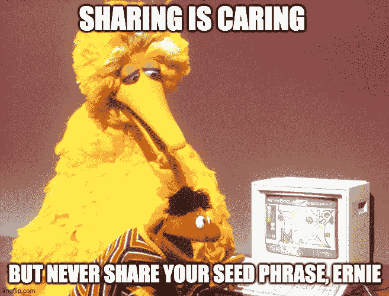

# 如果您认为私钥=种子短语，请阅读此处

> 原文：<https://medium.com/coinmonks/read-this-if-you-think-private-keys-seed-phrase-bf89ea27c5d9?source=collection_archive---------1----------------------->

不是你的钥匙，也不是你的硬币我相信你听说过这句众所周知的话，尤其是在加密领域这个不确定的时期，大型交易所一个接一个地破产。令人兴奋的是，人们对自我监护的意识最近显著提高了。查看我之前关于[为什么你应该考虑买一个冷钱包的文章。](/coinmonks/why-should-you-seriously-consider-getting-a-cold-wallet-c87e111a6a89)

