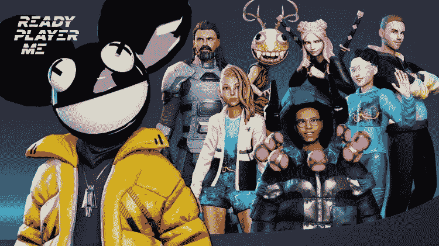
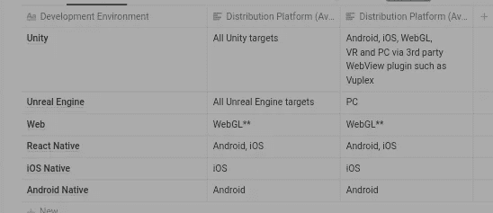

# ready Player Me:Gamefi 项目的元宇宙头像创建平台

> 原文：<https://medium.com/coinmonks/ready-player-me-a-metaverse-avatar-creation-platform-for-gamefi-projects-70630352cd64?source=collection_archive---------4----------------------->

如果 GameFi 要成为现实，头像必须成为开发者使用的关键组件。如果那些头像可以用在各种网络游戏和虚拟环境中就更好了。

Ready Player Me

[Ready Player Me](https://readyplayer.me/) (RPM)是一家在为可互换虚拟形象技术提供平台的竞赛中领先的组织。包括 [VRChat](https://hello.vrchat.com/) 、[拉&熊](https://www.pullandbear.com/)、[空间](https://spatial.io/)等在内的 3000 多名创作者已经在使用 RPM。

**Ready Player Me (RPM)** 是一个免费的跨游戏头像平台，使非商业用户和开发者能够轻松制作头像并在他们的应用程序中使用。

# Ready Player Me 的组件

Ready Player Me 由两部分组成。

首先是 **Avatar Creator** 产品，这是一个基于网络的头像生成器，每个人都可以通过 Ready Player Me 应用程序或个人 Ready Player Me 帐户访问。

Image Credit: Ready Player Me

其次是 **Ready Player Me SDK** ，程序员可以用它将 RPM，包括头像创建器，整合到他们的应用中。SDK 有不同的版本，包括对 Unity 和 Unreal Engine 的支持，这是游戏开发者的两个顶级平台。

> 重要的是要记住，Ready Player Me Avatar 和 Ready Player Me Avatar SDK 可供开发者和最终用户免费使用。

# 头像创建者

用户可以使用被称为头像创建者的基于网络的界面来数字化地创建和修改头像。各种集成技术使虚拟形象创建者变得容易接近。这包括在 [Ready Player Me](https://readyplayer.me/) 网站上注册、创建和管理头像集合。在 [Demo Ready Player Me](https://demo.readyplayer.me/) 网站上，用户也可以用头像四处游玩。

Image Credit: Ready Player Me

作为注册的开发合作伙伴，您可以访问一个独特的合作伙伴头像创建者域(如 yourapp.readyplayer.me ),它提供了各种定制的可能性。此外，您可以直接从您的应用程序中提供集成的头像创建功能。

用户和应用程序可以使用永久的特定 URL 来访问由头像创建者创建的头像，并以. glb 文件的形式存储在 Ready Player Me 服务器上。

> 然而，即使你是注册伙伴，就绪玩家我的头像也不能被铸造成 NFT。

# Real Player Me SDKs 和集成

Ready Player Me 支持众多分发平台，可以与一系列开发环境集成。

为了快速集成 Unity 和虚幻引擎，Real Player Me 提供了一个 SDK。使用 Real Player Me 的原生 web 浏览器模块，头像创建者可以直接集成到移动和 web 应用程序中。

下表列出了 Real Player Me 支持的平台。

Ready Player Me Supported Platforms

# 使用准备好的玩家我

## 1.知识共享 4.0 下的非商业使用

您使用 Ready Player Me Avatar Creator 制作的任何头像都是在 Creative Commons 4.0 许可下发布的，使您只能将其用于个人非商业目的。你可以自由地创建演示，改进你的学术作业，或者在非商业用途时，简单地尝试创建虚拟形象。

Image Credit: Ready Player Me

## 2.作为注册合作伙伴的商业用途

当你注册成为合作伙伴时，如果你想将 Ready Player Me 头像整合到盈利应用或游戏中，你可以免费在你的产品中使用它们。

# 使用 Ready Player Me 的好处

Ready Player Me 头像系统有以下好处，非商业用户和开发者都可以利用。

**1/** 虚拟形象解决方案不需要用户投入资源来设计和实现它们。

**2/** 用户可以通过他们的头像进入你的环境。

**3/**Ready Player Me 的平台、app、环境兼容性极佳。

# 创建一个现成的玩家我头像

在任何环境中使用头像之前，必须使用 Ready Player Me 头像创建器来创建头像。

有几种方法可以访问头像创建者，包括基于网络的界面、用户可以存储和管理其所有头像的用户帐户、面向所有合作伙伴的合作伙伴网站以及通过嵌入式 WebView 的应用程序。

可以使用作为其标识符的特定 URL 将化身下载或导入到环境中。

# 如何创建头像

总是从使用头像创建器来创建头像开始。

## 1.访问 RPM 头像创建页面

通过访问 [Demo Ready Player Me](https://demo.readyplayer.me/) 网站，您可以直接进入头像创建页面，或者您可以注册并使用 [ReadyPlayerMe hub](https://readyplayer.me/hub) 来跟踪您的头像收藏。

## 2.选择想要的体型

全身头像和半身头像是 Ready 玩家 Me 支持的两种体型。

> 全身化身由完整的 3D 模型来说明。
> 
> 虚拟现实应用的半身化身由头部和手组成。

## 3.上传一张图片

您可以上传现有照片或不带照片继续。如果您继续操作而不上传照片，将会提供一个初始头像列表。

Image Credit: Ready Player Me

按照说明完成创建您的头像。出现提示时，将头像 URL 复制到剪贴板。

## 4.看看你的头像

您可以下载您的头像的规格，访问它，并使用它的 URL 将其导入应用程序。下载。glb 文件，将您保存的 URL 粘贴到浏览器中。

若要查看您的头像，请打开。glb 文件。任何接受的观众。glb 规范将允许您查看您的头像。例如，在 Windows PC 上，双击文件以在预装的 3D 查看器中打开它。

## 5.与您选择的平台集成

此外，一旦你有了自己的自定义域，你可以将虚拟形象创建者集成到你的 Unity、Unreal、mobile 或 web 应用程序中。

# Ready Player Me 合作伙伴

如果开发者想在他们的付费应用或游戏中使用 Ready Player Me 头像，他们必须注册为开发合作伙伴。

# Ready Player Me 合作关系的优势

你将可以在商业应用中使用 Ready Player Me 头像。

**2/** 自由伙伴子域(如 yourappname.readyplayer.me)

你可以选择光明或者黑暗化身创造者主题。

**4/** 你可以选择全身或半身头像类型。

**5/** 高级头像配置选项包括纹理 LOD、换手、改变导出姿势、混合动画形状等等。

**6/** 独家更新和集中开发者支持

[***申请***](https://partnerships.readyplayer.me/) ***与真正的玩家我成为搭档。***

> 你觉得这篇文章怎么样？下面分享一下你的想法。
> 
> *别忘了订阅本频道，关注更多“玩到赚”项目的更新* ***。***
> 
> **仅指质量内容。**
> 
> 交易新手？尝试[加密交易机器人](/coinmonks/crypto-trading-bot-c2ffce8acb2a)或[复制交易](/coinmonks/top-10-crypto-copy-trading-platforms-for-beginners-d0c37c7d698c)