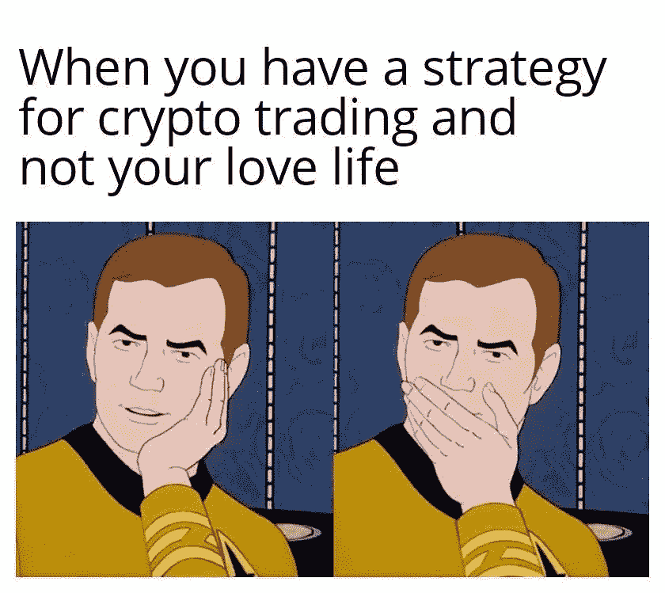

# 真正的男人会切！如何使用黄牛交易策略？

> 原文：<https://medium.com/coinmonks/real-men-do-cut-how-to-use-a-scalping-trading-strategy-287655cc808c?source=collection_archive---------34----------------------->

## 在今天的文章中，我们将分析最流行的交易策略——刷单。最成功的黄牛党会在一天内实现两位数的利润，这比很多策略都有效。如何在倒票上赚钱，所有细微差别和关键点的描述将进一步讨论。

# 什么是加密交易中的倒票？

密码市场的不稳定性为交易者提供了很多赚钱的机会。刷单是日内投机交易中最热门的策略之一，交易者进行大量低利润交易，从而获得高额总收入。

# 加密交易刷单策略概述

在倒卖加密货币时，一名交易员每天手动开立数百个头寸，它们的保留期从几秒钟到几十分钟不等。往往利润在第一次价格冲动之后就固定了。这种类型的高频交易要求交易者有良好的反应和即时做出决定的能力。黄牛可以依靠价格行为分析、市场对消息的反应、技术分析和直觉。

正是由于其高波动性，刷单已经成为密码市场中非常流行的策略。资产的波动性越高，交易者就能赚得越多。你不应该交易价格每天波动 1-2%的加密货币。黄牛在替代硬币上运作良好，其价格每天最高可达 20%，每小时最高可达 1%。

# 为什么要用头皮？

刷单，虽然不能称之为最简单的策略，但是相当容易掌握。就个人而言，作为这项交易的初学者，我在交易所的短短几个小时内就设法将我的投资组合增加了 3.7%。起初，我甚至进行了实验，实际上并没有深入研究技术分析，脑子里只保留了一条规则:“如果图表上连续出现了几根下降的蜡烛线，那么这是一个信号，很快报价将向相反的方向移动，并开始增长(反之亦然)”。也许我是幸运的，但仍然。然而，我越刷单，我获得的经验就越多，我意识到如果我正确使用技术指标，正确设置止损和止盈，我的资本就会增长。

尽管有些困难，但刷单非常适合新手。如果你已经掌握了这个策略，那么你已经通过了即兴交易这一艰难的阶段。要成为头皮交易者，你不需要对基本面分析有深入的了解。有些人在没有技术分析知识的情况下交易，但是这是非常危险的。用技术分析刷单可以让一个新手快速获得基础知识，掌握分析工具，快速开始驾驭市场，适应市场，学习反应速度，发展自己的行动算法，学会如何在几秒钟内做出决策。

# 分析模式

一般来说，刷单模式可以大致分为三类:

在这里，交易者可以等待很长时间来寻找最佳的进场点。保守的日内策略使用各种技术分析工具:移动平均线、图形模式、技术指标和振荡指标、支撑位和阻力位等。

一个黄牛党在一小时内做几十笔交易。这里留给市场分析的时间不多了，我们必须更多地依靠反应和直觉。交易员监控订单簿、市场对消息的反应以及多头和空头行为的动态。

在这种特殊情况下，开仓后几秒钟就立即平仓。这种加密货币策略包括赚取几个点的利润。由于加密交换的费用很高，不建议使用 pipsing。

# 如何识别趋势？

每次你看图表时，你都必须问自己一个主要问题:“现在谁在控制价格？”。有两种趋势:看涨和看跌。这个问题的正确答案让你成为一个成功的交易者。**看涨**(上涨趋势)可以通过看图表来确定:如果增量观察三个点以上，当图表上每一个后续的**更高的顶部** (HT)和**更高的底部** (HB)都高于前一个时，在这种情况下，交易者建立买入头寸。

反之亦然，**看跌**(下跌趋势)当每个后续**下顶** (LT)和**下** **底** (LB)都低于前一个。在这种情况下，开仓待售。

如果你想更好地理解加密图表，看看我们的博客文章[“如何阅读和分析加密货币图表？”](https://sevenb.io/blog/how-to-read-and-analyze-cryptocurrency-charts/)。

# 头皮带技术指标

指标是技术分析(TA)的工具，帮助交易者以不同的准确度预测价格的变动。它使用几分钟/几天/几个月/几年前的历史价格数据，将它们转化为易读的指标。指标是用数学方法创建的。公式中的数据被转换成图形图像，叠加在价格图表上或放在图表旁边。根据个人经验，我可以说对一个头皮交易者最有用的指标是 RSI，MA，和 Fibo 回撤。

# 确定时机

现在，当你对倒票有了基本的了解，让我们更深入地了解倒票的机制。头皮交易者倾向于 1 分钟、3 分钟、5 分钟和 15 分钟。时间范围越小，开仓和平仓的潜在时机就越多，然而，风险也就越大。

有经验的交易者对 1 分钟的时间框架感兴趣。它显示了市场对正在发生的变化的实时反应。然而，在 1 分钟的时间框架内，交易者经常被迷惑，导致错误的信号。反过来，更大的时间框架更稳定，但下降的信号更少，相应地，达成交易的机会也更少。

从个人经验来看，我可以说有两个时间框架的策略效果最好。其本质在于分析更大的时间框架，比如 15 分钟，然后切换到更小的，比如 5 分钟。

由于黄牛策略的本质是在短时间内下大量订单，交易者需要选择一个可靠的交易平台，即使对该资产的需求很高，该平台也能稳定工作。 [7b](https://play.google.com/store/apps/details?id=io.sevenb.terminal) 非常适合这项任务，因为该平台提供了一个即时、无延迟地进行大量交易的机会。

# 经济资料

新闻背景对价格走势有重大影响。因此，对于一个交易者来说，了解行业的所有消息是至关重要的。只有对正在发生的事情感兴趣，你才能够独立地调查加密社区的情绪，并预测趋势的进一步短期方向。当别人遭受损失时，一个有经验的交易者会持续关注当前和未来的新闻。

加密货币汇率以这样或那样的方式对消息做出反应，你只需要及时开仓和平仓。之前我们说过，对于新手来说，在 M1 时间框架内交易是有挑战性的。然而，从我个人的经验来看，我可以说，在这一具体案例中，M1 的时间框架是尽可能相关的。更长的时间框架可能无法反映市场对这个或那个消息的反应。为了追踪新闻，我使用了[的 CoinMarketCal](https://coinmarketcal.com/en/) 平台。该平台允许你方便地研究即将到来的新闻信息，通过各种类别进行过滤:硬币，交流，叉子，空投，等等。另外，你可以完全排除你不感兴趣的关于硬币的新闻。我还使用“简讯”功能，多亏了这个，我还可以跟踪一些有潜力出手的硬币。

# 在密码中使用头皮策略

如前所述，黄牛策略在密码市场表现得非常完美。对有利可图的刷单的主要建议如下:

1.  **选择合适的交易平台。**你应该仔细研究费用的数额，在制定有利可图的交易策略时必须将它们考虑在内。从个人经验来看，我可以说 [7b](https://sevenb.io/) 仍然是最可靠、最安全、最划算的交易。
2.  **选择一项资产。**我不建议选择鲜为人知的加密货币，因为这是一个相当冒险的冒险。在第一阶段，需要根据以下标准选择一个大写金额在前 100 名的硬币:最近 7 个交易日的跌幅超过 20%，而最后一天和最后一小时的动态应为正，但不超过 5%。最佳选择将是一枚遇到强力支撑位的硬币，其反转的可能性很大。
3.  **熟练运用技术指标。**毕竟没有指标的倒票是个马马虎虎的想法。不管怎样，至少你要学会如何确定支撑位和阻力位。这对于使用止盈和止损订单也很重要。由于黄牛相当严格地限制亏损，满足于小利润，止盈只设在进场点以上几个点，而止损设在支撑位以下。

# 风险呢？

尽管有优势，加密货币倒卖也有许多缺点:

1.  加密货币交易所收取高额费用。每笔交易，无论其结果如何，都要收取费用，在制定交易策略时必须考虑到这一点。
2.  由于交易所技术故障造成资金损失的风险。这与一些加密货币交易所的复杂操作和软件设备不足有关。
3.  由于手动模式下交易的活跃形成，以及需要持续在场以监控交易所的情况，交易者的心理承受着很高的情绪负荷。由于持续的精神压力，交易者经常进入倾斜，失去所有的资金，进行混乱的交易，希望至少夺回一些钱。

# 给新手黄牛的小贴士

黄牛党和仓位交易者犯同样的错误，但是他们的成本更高。在分析了以下错误后，你可以大大节省你的神经和钱包:

1.  **“坐实”亏损。交易者不会及时平仓亏损的交易，期望它会盈利。这是初学者最容易犯的错误。在刷单交易中，并不总是有时间设置止损，手动快速平仓的能力是成功的关键。无法弥补损失通常会导致账户的毁灭。**
2.  **取平均值。**前一个错误的恶化是当交易者在亏损的头寸上增加另一个错误。一方面，这缩短了达到盈亏平衡点的路径，另一方面，这增加了风险，因为运动的继续导致双倍的损失。建立这样一个金字塔会导致存款的快速流失。
3.  **倾斜。**这个术语指的是交易者失去对自己的控制，开始进行策略没有预见到的混乱交易时的紧张状态。遭受损失并寻求补偿的黄牛党经常发现自己处于不利地位。
4.  **早期获利回吐。虽然刷单涉及快速获利，但只有强有力的运动才能带来丰厚的利润。**
5.  **不符合资金管理制度。**使用大杠杆或计算错误的持仓量，可以把黄牛赶出游戏。

# 结果

像在密码交易所倒卖这样的话题需要谨慎对待。这种交易策略可以让你快速理解市场定价的原则，掌握下单的技巧等。主要是不要马上大量头皮。这种策略最好配置一小部分交易资金，用更保守的交易风格来管理主要部分。

倒票需要很高的反应速度和很大的心理稳定性。一些以刷单起家的交易者根据他们获得的经验转向算法交易。大多数情况下，成功是由交易者结合各种方法和技术，使之适应市场情况而实现的。

无论你打算尝试哪种交易策略，最简单有效的方法是和 7b 经纪人一起做。现在安装它，在一个应用程序中交易超过 400 枚硬币和代币。

*原载于 2022 年 8 月 2 日*[*https://seven b . io*](https://sevenb.io/blog/how-to-use-a-scalping-trading-strategy/)*。*

> 加入 Coinmonks [电报频道](https://t.me/coincodecap)和 [Youtube 频道](https://www.youtube.com/c/coinmonks/videos)了解加密交易和投资

# 另外，阅读

*   [加密复制交易平台](/coinmonks/top-10-crypto-copy-trading-platforms-for-beginners-d0c37c7d698c) | [Coinmama 评论](/coinmonks/coinmama-review-ace5641bde6e)
*   [印度的加密交易所](/coinmonks/bitcoin-exchange-in-india-7f1fe79715c9) | [比特币储蓄账户](/coinmonks/bitcoin-savings-account-e65b13f92451)
*   [OKEx vs KuCoin](https://coincodecap.com/okex-kucoin) | [摄氏替代度](https://coincodecap.com/celsius-alternatives) | [如何购买 VeChain](https://coincodecap.com/buy-vechain)
*   [币安期货交易](https://coincodecap.com/binance-futures-trading)|[3 commas vs Mudrex vs eToro](https://coincodecap.com/mudrex-3commas-etoro)
*   [如何购买 Monero](https://coincodecap.com/buy-monero) | [IDEX 评论](https://coincodecap.com/idex-review) | [BitKan 交易机器人](https://coincodecap.com/bitkan-trading-bot)