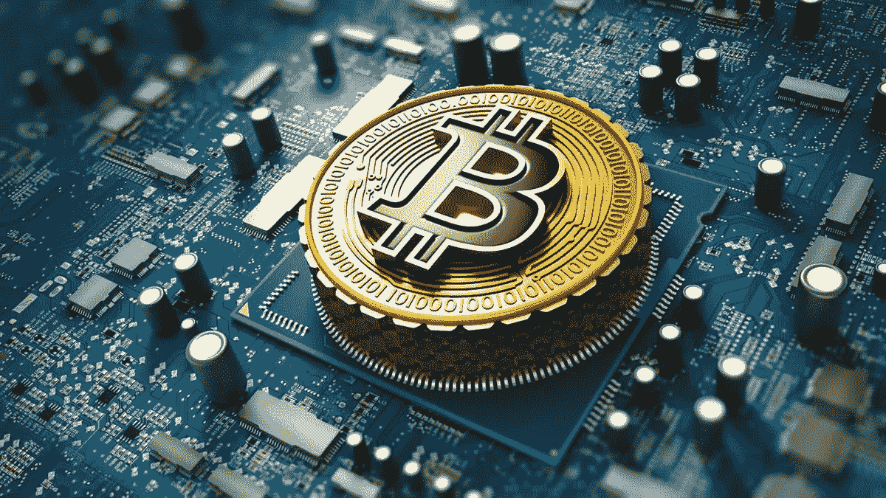
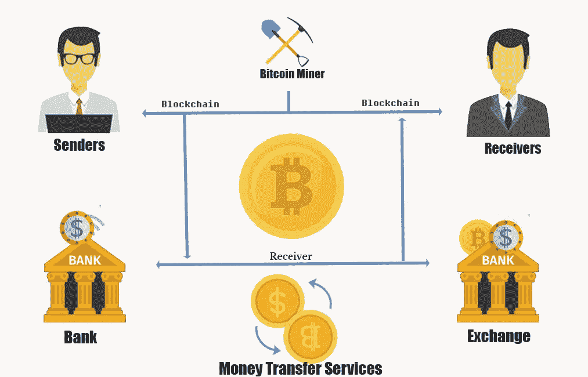
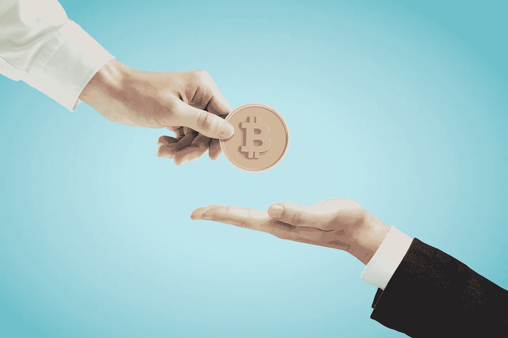
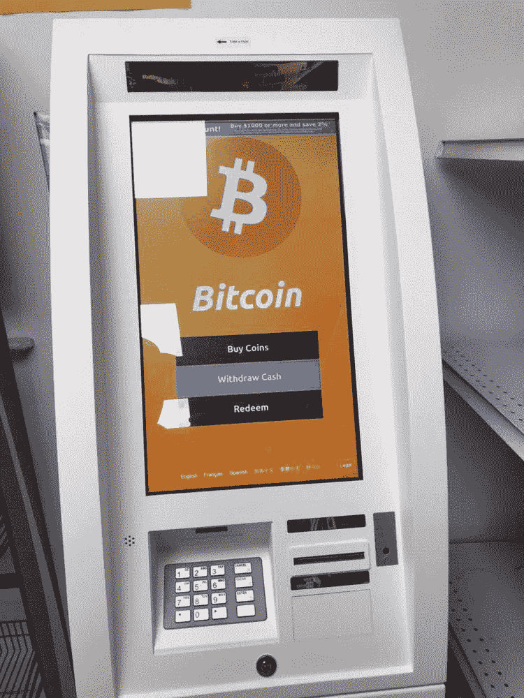
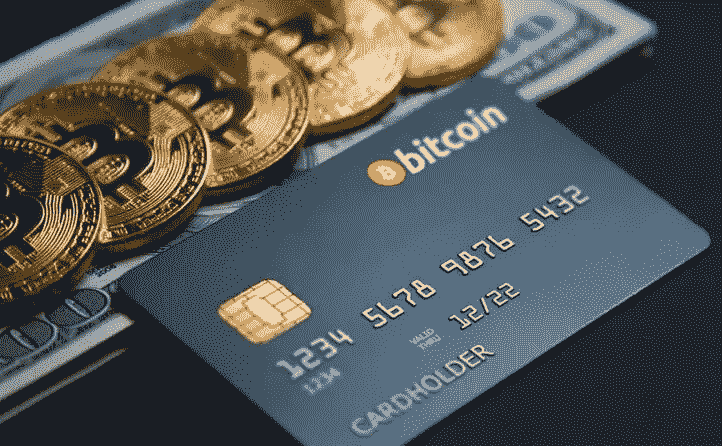

# 比特币的真实用途

> 原文：<https://medium.com/coinmonks/real-world-uses-of-bitcoin-2036d14c612?source=collection_archive---------18----------------------->

[比特币](/coinmonks/what-is-bitcoin-e98b2b77c81b) (BTC)是世界上第一种加密货币，也是第一个成功使用[区块链](/coinmonks/what-is-blockchain-a7082404caa2)技术的案例。尽管目前有数千种加密货币，其吸引力和采用程度各不相同，但比特币仍然是该领域大多数新人最受欢迎的首选加密资产。此外，多年来，老一代人一直对比特币保持信心，他们持有比特币，而不是将其变现或交易以赚取快钱。看看加密货币的真实用途将有助于理解这种持久魅力背后的原因。

**是什么赋予了比特币价值**

比特币最初是作为一种经济激励手段引入的，奖励那些通过破解密码谜题建立区块链的人。因此，被称为[矿工](https://coinsbench.com/understanding-the-architecture-of-a-blockchain-f50ad412bdc4)的人将成功验证和维护在分散环境中共享的数据，从而获得由他们的[工作证明](/coinmonks/understanding-the-role-of-consensus-in-blockchain-db724fa63a53)产生的加密货币的奖励。最初，只有矿工才能拥有比特币，但随着交易用途变得普遍，BTC 持有者的数量增加了。

[**Use of Bitcoin**](https://www.theengineeringprojects.com/2021/02/introduction-to-bitcoin-a-comprehensive-beginner-guide.html)

作为一种仅以电子形式存在的数字货币，比特币交易基本上涉及双方之间的匿名价值转移。因此，任何希望以数字方式向他人汇款的人都可以用美元、英镑或欧元等法定货币代替，转而发送比特币。该交易由比特币的[分布式公共账本](/coinmonks/what-is-blockchain-a7082404caa2)验证，不需要任何中央机构如银行或政府的参与。因此，加密货币是传统电子现金交易系统的可行替代方案。

作为一种数字资产，比特币与黄金等任何其他传统资产具有相似的属性。它具有稀缺性、持久性、可替代性和可分割性。这意味着人们可以花真金白银购买比特币(或其部分单位)，甚至出售比特币来换取法定货币。它的固定和有限的供应也增加了它的价值。此外，[比特币的高可分性](/coinmonks/what-is-bitcoin-e98b2b77c81b)(其最小单位是一亿 BTC 或一个 Satoshi)使其成为一种有价值的小额支付模式。

> 交易新手？试试[加密交易机器人](/coinmonks/crypto-trading-bot-c2ffce8acb2a)或者[复制交易](/coinmonks/top-10-crypto-copy-trading-platforms-for-beginners-d0c37c7d698c)

**比特币及其用途**

自推出以来，由于人们对加密货币的巨大兴趣，人们使用比特币的方式越来越多。如上所述，采矿的日子已经一去不复返了，因此成为区块链不可或缺的一部分，是获取比特币的最佳方式。那么，一个人还可以通过哪些方式拥有加密货币呢？如今，人们可以通过从加密货币交易所购买 BTC 来简单地拥有它。或者，他可以从另一个有一些 BTC 的人那里接受它，或者接受它作为提供商品或服务的报酬。下一个显而易见的问题是，人们还可以用加密货币做什么？看看下面的列表会有助于回答这个问题。

[**Spending Bitcoin**](https://whereyoucan.com/where-can-you-spend-bitcoin/)

● **在线零售商**

许多公司都集成了加密货币作为支付模式，BTC 是主要的选择。像 Etsy 这样的电子商务商家允许用户从他们的在线商品目录中购买商品，并可以选择在 BTC 付款。此外，像索尼和微软这样的公司让顾客通过 BTC 来支付产品和服务，如电子竞技博彩、PlayStation 和 Xbox 视频游戏，以及软件订阅。

● **购物卡**

[**Bitcoin gift cards**](https://www.smartbitcoininvestments.com/buy-bitcoin-with-gift-card/)

比特币礼品卡是加密货币的一种非常流行的用途。一些在线零售商接受他们作为一种支付方式。像 [Coinsbee](https://www.coinsbee.com/en/) 、 [Gyft](https://www.gyft.com/) 和[eg after](https://www.egifter.com/)这样的公司为用户提供购买比特币礼品卡的机会，以便在亚马逊、iTunes、谷歌、易贝等众多地方进行网上购物。

● **服务**

随着对加密货币领域的兴趣越来越大，许多行业现在都开始接受这种新形式的数字支付。作为最普遍的加密资产，BTC 因此很容易被各种服务行业接受，如在线约会、卫星电视和 VPN 服务、电子学习、在线报纸和电子杂志、旅行和旅游。在这方面欢迎 BTC 支付的公司包括电信和互联网服务的美国电话电报公司(通过第三方支付处理器 [BitPay](https://bitpay.com/) )和在线预订机票和住宿的 [Travala](https://www.travala.com/) 。

● **投资**

[**Bitcoin investment**](https://bitpapa.com/blog/how-to/how-to-trade-cryptocurrency)

在 BTC 购物并不是使用加密货币的唯一方式。许多用户认为投资比特币是一种很好的获利方式。如前所述，它和黄金一样是一种资产。因此，人们可以在加密货币交易所用法定货币或像 PayPal 这样的服务购买 BTC，并在以更高价格出售之前持有它。这种类型的加密资产利用开辟了其他金融投资渠道，如常规交易(用 BTC 交换其他加密货币)、保证金和衍生品交易、预测市场、期权和期货市场等。最适合这种操作的平台包括[币安](https://www.binance.us/en)、北海巨妖[、比特币基地](https://www.coinbase.com/)、火币、eToro 和[双子星](https://www.gemini.com/)。

● **自动取款机和卡**

[**Bitcoin ATM**](https://www.bitcoin.com/bitcoin-atm/)

在美国等加密货币采用率最高的国家，比特币已经获得了替代货币的地位，导致交易相当常规。因此，为了方便用户，安装了数千个加密专用的信息亭。它们就像自动取款机一样，BTC 的所有者可以将其持有的现金变现，或者插入资金购买 BTC 和/或其他加密货币。

[**Bitcoin card**](https://www.albawaba.com/business/how-buy-bitcoin-credit-card-1454200)

许多密码公司，如[比特币基地](https://www.coinbase.com/)、[比特币支付](https://bitpay.com/)、[Crypto.com](https://crypto.com/)等，已经与维萨等借记卡/信用卡服务提供商合作，推出了与各自[钱包](/@DC.600/learning-about-crypto-wallets-897a30f8f79a)相关的比特币卡。这些密码链接卡非常适合从接受 BTC 的商家那里购买商品和服务，也非常适合在给定的平台上进行任何基于密码的交易。

**结论**

[比特币](/coinmonks/what-is-bitcoin-e98b2b77c81b)是[区块链](/coinmonks/what-is-blockchain-a7082404caa2)技术和密码货币空间的旗手。它在人群中的持久吸引力在动荡的市场中经受住了多次估值下跌。因此，如果以上列出的比特币在现实世界中的用途可以作为参考的话，可以肯定的说，在未来的日子里，比特币的使用将会增加。

**亦称:**

[*什么是块链*？](/coinmonks/what-is-blockchain-a7082404caa2) *|* [*什么是比特币？*](/coinmonks/what-is-bitcoin-e98b2b77c81b)

跟我来:

[**LinkedIn**](https://www.linkedin.com/in/a600dc/)|[**Twitter**](https://twitter.com/dc_111)

联系人:**arnab.dc111@gmail.com**