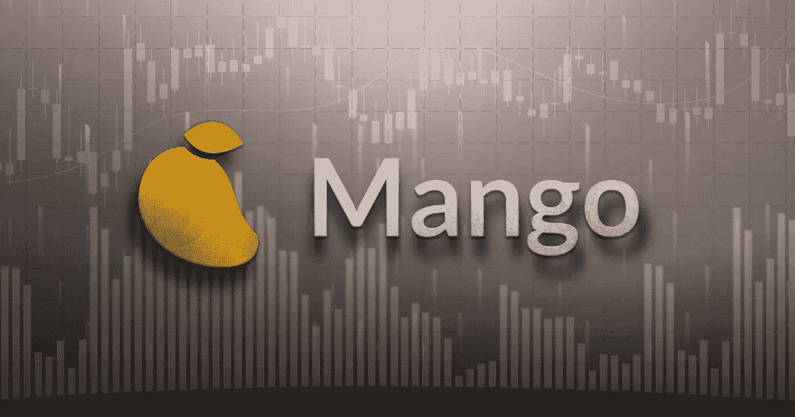

# 芒果黑客事件的反弹:社区同意向黑客支付 4700 万美元

> 原文：<https://medium.com/coinmonks/rebound-in-the-mango-hack-the-community-agrees-to-pay-the-hacker-47-million-597969c61d6d?source=collection_archive---------9----------------------->

在 Solana (SOL)区块链上开发的 Mango Markets 平台被盗走 1 . 14 亿美元后的几天，该项目的 DAO 通过了一项投票，如果黑客同意归还 6700 万美元，他将获得 4700 万美元。社区的一些成员认为这个数目太大了。

Rebound in the Mango hack: the community agrees to pay the hacker $47 million

# 芒果市场社区使…