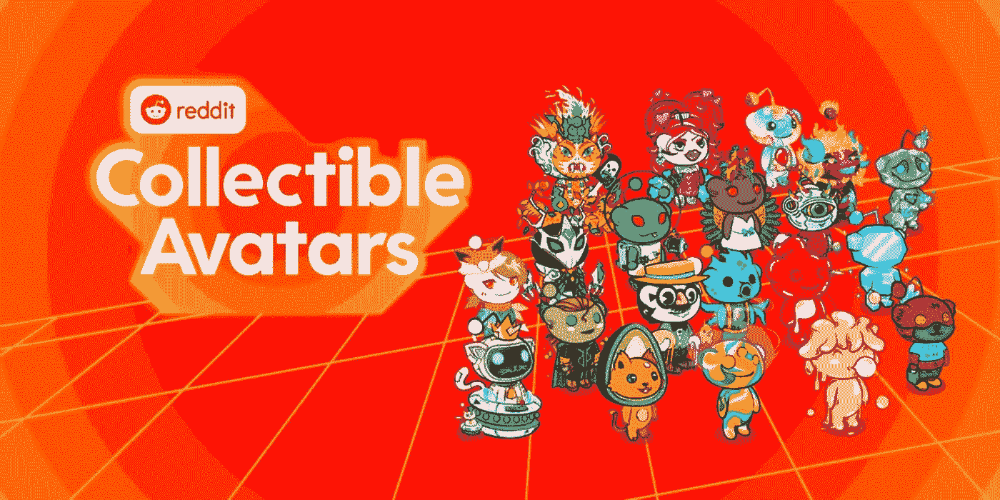

# 重塑 NFTs 品牌

> 原文：<https://medium.com/coinmonks/rebranding-nfts-927cde235ef0?source=collection_archive---------25----------------------->

在 2022 年，有一点变得很清楚，那就是很多非功能性数码产品正走在更名为“数字收藏品”的道路上。两个明显的例子，Reddit NFTs，向他们的用户出售了 300 万个 Reddit 头像。300 万 Reddit NFT 用户使其与 OpenSea 上的 NFT 持有者数量持平，这是一个惊人的壮举，因为 Reddit 的头像在几分钟内就销售一空。第二个例子是 Instagram 与 Polygon 合作，允许你在 instagram 个人资料上显示你的 NFT。再次称它们为数字收藏品。Instagram 今年早些时候宣布了这一举措，称计划很快推出铸造功能。

你问为什么要更名？几个原因，但最重要的是 NFTs 得到了一个坏名声。地毯拉是一个问题。当 NFTs 的创建者带着资金逃跑，留给 NFT 所有者一个 jpeg 和一个无用的 NFT 时，就出现了地毯拉。其次，不熟悉 web3 或对 web 3 不感兴趣的非加密用户认为术语“不可替代令牌”是笨拙而无用的。“数字收藏品”是熟悉的，不言自明的，你不需要在卖给用户之前给他们一个 NFT 101 课程。

NFTs 将在后台运行，它们是在互联网上拥有的底层技术。(数字到数字或物理到数字)。用例将成为大规模采用的驱动力。[(三杀手 NFT 用例)](https://metaversedmena.substack.com/p/3-killer-nft-use-cases-for-the-future)。这让我想起了杰夫·贝索斯在亚马逊早期的一句话。他说了一些类似于“如果你仍然可以用传统的方式做，那就用传统的方式，但是如果你可以用互联网做得更好，那就用互联网”。我认为同样的道理也适用于非功能性测试，不要把它说成不是它的东西。如果用传统方式效果更好，就保持原样。如果你能用 NFTs 做得更好，就用 NFTs。

> 交易新手？试试[密码交易机器人](/coinmonks/crypto-trading-bot-c2ffce8acb2a)或者[复制交易](/coinmonks/top-10-crypto-copy-trading-platforms-for-beginners-d0c37c7d698c)